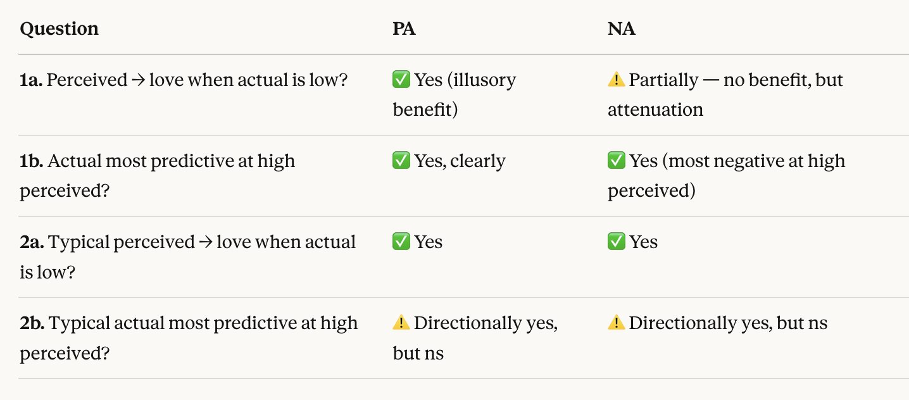

```{r setup}
#| include: false

# 1. Load packages, paths and data configurations
source(here::here("R", "00_setup.R"))

# 2. Set a global theme for plots
theme_set(theme_minimal() + theme(legend.position = "bottom"))

```

```{r ESM_setup}
#| include: false
# load data
esm_data  <- readRDS(file.path(dir_data_ana, "esm_ana.rds"))
# load data configuration file 
load_config("ESM")
# plot initialisation
plot_counter <- 1
prefix <- "ESM"
```

# Introduction

See also [OSF preregistration](https://doi.org/10.17605/OSF.IO/V7T9F){.uri}.

## Overview

Study Component 1 examines how **momentary affect similarity** in daily life relates to **momentary love toward the partner**, using experience sampling data from romantic couples.

We distinguish:

-   **Positive Affect (PA)** and **Negative Affect (NA)** (analyzed separately)
-   **Actual similarity** (self-reported affect compared to partner's self-reported affect)
-   **Perceived similarity** (self-reported affect compared to actor's perception of partner's affect)

Similarity is conceptualized as **shared, co-experienced elevated affect**, operationalized as:

-   Dyadic elevation (mean level)
-   Penalized by mismatch (absolute difference)

The main research questions are:

1.  Does momentary affect similarity predict momentary love? (H1)
2.  Is this association mediated by perceived similarity? (H2)
3.  Are these associations moderated by perceived responsiveness and event valence? (H3)

All analyses use multilevel models with moments (m) nested within persons (p) nested within dyads (d).

## Conceptualization and Operationalization

### Notation and Multilevel Structure

Let:

-   $L_{mpd}$ = momentary love
-   $A_{mpd}$ = actor affect
-   $P^{act}_{mpd}$ = partner's actual affect
-   $P^{perc}_{mpd}$ = partner affect as perceived by actor

Three-level structure:

-   Moments ($m$)
-   Persons ($p$)
-   Dyads ($d$)

### Person-Mean Centering

We person-mean center affect variables:

$$
X_{mpd} = A_{mpd} - \bar{A}_{pd}
$$

$$
Y^{act}_{mpd} = P^{act}_{mpd} - \bar{P}^{act}_{pd}
$$

$$
Y^{perc}_{mpd} = P^{perc}_{mpd} - \bar{P}^{perc}_{pd}
$$

### Similarity indices

#### Actual Similarity

Mean component:

$$
M^{act}_{mpd} = \frac{X_{mpd} + Y^{act}_{mpd}}{2}
$$

Mismatch component:

$$
D^{act}_{mpd} = |X_{mpd} - Y^{act}_{mpd}|
$$

Similarity index:

$$
S^{act}_{mpd} = M^{act}_{mpd} - D^{act}_{mpd}
$$

Actual affect similarity is symmetric within a couple at a given moment (it compares the two partners’ self-reported affect), such that $S^{act}_{mpd}$ is conceptually a dyad–moment construct that is identical for both partners.

#### Perceived Similarity

$$
M^{perc}_{mpd} = \frac{X_{mpd} + Y^{perc}_{mpd}}{2}
$$

$$
D^{perc}_{mpd} = |X_{mpd} - Y^{perc}_{mpd}|
$$

$$
S^{perc}_{mpd} = M^{perc}_{mpd} - D^{perc}_{mpd}
$$

Perceived similarity is actor-specific because it compares the actor’s affect to the actor’s perception of the partner’s affect, so $S^{perc}_{mpd}$ can differ between partners within the same dyad.

### Decomposition into Within and Between Components

We split between a between-dyad component and a within-dyad (momentary) component, to estimate and interpret separately the within-dyad time-varying association and the stable (between-dyad) association.

#### Actual Similarity

Dyad mean, and grand-mean:

$$
\bar{S}^{act}_d, \bar{\bar{S}}^{act}
$$

Within-dyad:

$$
S^{act,within}_{mpd} = S^{act}_{mpd} - \bar{S}^{act}_d
$$

Between-dyad:

$$
\bar{S}^{act,between}_d = \bar{S}^{act}_d - \bar{\bar{S}}^{act}
$$

The decomposition can be understood by specifying a model in different steps. For example, for the step 1a model (see below):

$$
L_{mpd} = b_{0,pd} + 
\beta_1 S^{act,within}_{mpd} +
\beta_2 \bar{S}^{act,between}_d +
\varepsilon_{mpd},\;\text{with}\; b_{0,pd} = \beta_0 + v_{0,d} + u_{0,pd}
$$

we could equally write

1.  Level 1 (modelling the momentary level): $L_{mpd} = \pi_{0,pd} + \beta_1 S^{act,within}_{mpd} + \varepsilon_{mpd},$

    with $\pi_{0,pd}$ the total person intercept (baseline love for person p in dyad d, averaged across moments). This is what happens within a person.

2.  Level 2 (modelling the person level, within a dyad): $π_{0,pd}​=δ_{0,d}​\;+\;u_{0,pd},$

    with $\delta_{0,d}$​ the total dyad intercept (baseline love for dyad, averaged across partners) and $u_{0,pd}$ the person-specific random effect, capturing how much a person deviates from the dyad average.

3.  Level 3 (modelling the dyad level): $δ_{0,d}​=β_0​+β_2​(\bar{S}_d^{act,between}​)+v_{0,d}​$

    with $v_{0,d}$ the dyad-specific random effect, capturing the couple effect (how much couples deviate from each other).

#### Perceived Similarity

Person mean, and grand-mean:

$$
\bar{S}^{perc}_{pd}, \bar{\bar{S}}^{perc}
$$

Within-person:

$$
S^{perc,within}_{mpd} = S^{perc}_{mpd} - \bar{S}^{perc}_{pd}
$$

Between-person:

$$
\bar{S}^{perc,between}_{pd} = \bar{S}^{perc}_{pd} - \bar{\bar{S}}^{perc}
$$

## Assumptions and Robustness Checks

### Random Effects

-   Random intercepts for dyads
-   Random intercepts for persons nested within dyads
-   No random slopes in primary models

### Temporal Dependence

#### CAR(1)

We use a continuous AR(1) residual covariance structure within persons. The preregistration specifies: "*Because beeps are unequally spaced, we will implement AR(1) using the actual time stamps (continuous-time AR(1))*". Beeps are unequally space for example because of missed beeps, no beeps during the night or during working hours, next to slight variations because of the protocol.

This means that we assume $\text{Corr}(\varepsilon_{mpd},\varepsilon_{{m'}pd})=\phi^{|\Delta t|}$ with $\Delta t$ the time difference between beeps at moment m and m'. An equivalent expression is $\text{Corr}(\varepsilon_{mpd},\varepsilon_{{m'}pd}) = \exp(-\lambda \Delta t)$ with $\lambda=-\log(\phi)$, $\lambda$ being a 'decay' parameter.

The unit/scale of the continuous time variable can be freely chosen and we have opted for **1 hour units**; the $\phi\in(0,1)$ will be estimated from the data and will reflect the correlation between residuals from observations that are one time unit apart. The choice of the time unit thus only determines the interpretation of $\phi$.

Note 1: If the time variable is chosen too small (e.g., seconds), the true $\phi$ might be effectively 0 or 1. If the likelihood surface is flat near the starting value of 0.2, the optimizer may simply return 0.2 as the final estimate without moving, leading to spurious results. If $\phi$ is estimated as 0.2, this can be a red flag. It is best to use the average time between beeps as time unit.

Note 2: Using lagged love in the equation instead of a CAR(1) residuals would model love inertia explicitly and answer a different question: does similarity predict love above prior love?

#### Time differences between beeps

Based on the columns 'time' (expressed in hours since the first beep for every person, increasing over the ESM period) and 'day_index', we can analyse how equal beeps are separated.

```{r within_dat_time_differences_between_beeps}
# time differences per person
esm_data_calc <- esm_data %>%
  group_by(person, day_index) %>%
  mutate(within_day_time_diff = time - lag(time)) %>%
  ungroup()

#  average difference per person within days
person_means <- esm_data_calc %>%
  group_by(person) %>%
  summarise(
    avg_diff_person = mean(within_day_time_diff, na.rm = TRUE)
  )

# overall grand-mean difference
grand_mean <- mean(esm_data_calc$within_day_time_diff, na.rm = TRUE)
sprintf("Overall Grand-Mean Difference: %f hours", grand_mean)

# histogram of person-average differences
plot_hist_numeric(
  data = person_means, 
  var = "avg_diff_person", 
  title = "Distribution of Person-Average Within-Day Time Intervals", 
  xlab = "Average Time Between Beeps (Hours)",
  binwidth = 1/60 # minutes
)
```

```{r overnight_time_differences_between_beeps}

# overnight differences
overnight_calc <- esm_data %>%
  group_by(person) %>%
  mutate(
    is_day_change = day_index > lag(day_index)
  ) %>%
  filter(is_day_change == TRUE) %>%
  mutate(overnight_time_diff = time - lag(time)) %>%
  ungroup()

# average overnight difference per person
person_overnight_means <- overnight_calc %>%
  group_by(person) %>%
  summarise(
    avg_overnight_diff = mean(overnight_time_diff, na.rm = TRUE)
  )

# overall grand-mean
grand_mean_overnight <- mean(overnight_calc$overnight_time_diff, na.rm = TRUE)
sprintf("Overall Grand-Mean Overnight Difference: %f hours", grand_mean_overnight)

# histogram
plot_hist_numeric(
  data = person_overnight_means, 
  var = "avg_overnight_diff", 
  title = "Distribution of Person-Average Overnight Intervals", 
  xlab = "Average Overnight Gap (Hours)",
  binwidth = 0.25 
)
```

### Sensitivity Analyses

1.  **Elevation sensitivity** (actor/partner affect covariates)

    We will in run all models with the individual affect levels as covariates to analyse what our similarity indices add above and beyond the individual affect levels. This is conceptually important because our similarity operationalization includes a level component (the mean of the individual affect scores), creating inherent overlap between similarity and individual levels.

    As an initial check, we inspected bivariate correlations on the within-person/dyad scale (i.e., between centered momentary love as(outcome) and candidate covariates, as in @selsActualPerceivedEmotional2020. These analyses (see`/scripts/05_descriptives.qmd`) indicated that momentary affect levels were small-to-moderately associated with momentary love (largest $r≈.34$) and showed substantial construct-induced overlap with the similarity indices.

    Given this overlap, models that omit affect levels would leave the similarity coefficient open to an ambiguous interpretation. Including affect levels therefore allows us to evaluate whether similarity predicts love beyond level effects.

2.  **Time-trend sensitivity**

    We tested for systematic time trends in momentary love across the ESM period by fitting $𝐿_{𝑚𝑝𝑑} = 𝑏_{0,𝑝𝑑} + 𝛽_𝑇𝑇_𝑚 + 𝜀_{𝑚𝑝𝑑}$, with $𝑇_𝑚$ the chronological order of beeps, centered at the study midpoint (see `/scripts/05_descriptives.qmd`), and found that there was a small, statistically significant but practically meaningless drift upwards (love increases over time). It is therefore **not indicated to rerun models with a time covariate**.

3.  **Random-slope robustness checks**

    We will attempt models that add random slopes for key level 1 predictors like within-dyad actual similarity or within-person perceived similarity.

## Model specification in R

We use the function `lme()` from the `nlme` package, designed for linear mixed-effects models with nested random effects, and it also allows correlated within-group residuals (see <https://rdrr.io/cran/nlme/man/lme.html>). Contrary to `lme4`, `nlme` allows easy specification of residual correlation structures. See also @pinheiroNlmeLinearNonlinear1999 and @batesFittingLinearMixedEffects2015.

The lme() formula has the core signature:

> `lme(fixed, data, random, correlation, weights, subset, method, na.action, control, ...)`

with the arguments

-   `fixed` specifying the fixed-effects regression

-   `random` specifying the random effects and how the data is nested. \~ 1 indicates random intercepts, \~ x random slopes for variable x, and what is written behind the pipe '\|', e.g., dyad/person applies this for dyad and person-within-dyad. x/y means that y is nested in x. `random` can also be specified using a list, specifiying different structures at each level of nesting.

-   `correlation` adds a residual correlation structure. We use `correlation = corCAR1(form = ~ time | dyad/person)` to define a continuous-time AR(1) structure. Because we specify the grouping dyad/person, the correlarion only applies within the same group; different groups are treated as uncorrelated. The time variable does not need to be integer-valued. By default, $\phi$ is esrtimated starting from a value of $0.2$ and then allowed to vary to be estimated from the data. See also <https://rdrr.io/cran/nlme/man/corCAR1.html>.

-   `na.action` specifies what to do with rows that have missing values. The default is `na.fail`, meaning that `lme()` will stop with an error. To allow missing beeps, we will specify `na.action = na.exclude`. Both na.omit and na.exclude drop incomplete rows for estimation (listwise deletion of rows where any variable, outcome or predictors, is NA).

-   `control` adjusts optimisation behaviour and convergence (optimiser choice, iteration limits, tolerances,...), passing a list from `lmeControl()`. The optimiser choice is passed with `opt = c("nlminb","optim")`, defaulting to `"nlminb"` (nonlinear minimization subject to box constraints; generally robust. `optim` is a general-purpose optimiser offering several algorithms, like BFGS (Broyden-Fletcher-Goldfarb-Shanno) which sometimes navigates complex surfaces better (`optimMethod = "BFGS"`, the default when choosing `opt = "optim"`).

    We will use default values and switch only in case of convergence issues. In that case, we will increase the iteration limits and/or try `opt = "optim"`.

-   `method` chooses whether the model is fitted using restricted maximum likelihood ("REML", default) or full maximum likelihood ("ML"). We will use the default method = "REML". Note however that results are then not comparable across different fixed-effects model specifications (see guidance for `lme()` on <https://stat.ethz.ch/pipermail/r-help/2006-October/115739.html>). Comparing different fixed effects should use `method = "ML"`.

    Note that lme() does not scale internally, so in case of convergence problems, data needs to be pre-scaled.

# Step 1a: Main Effects of Actual Similarity (H1.1-H1.2)

Primary multilevel model:

$$
L_{mpd} = b_{0,pd} + 
\beta_1 S^{act,within}_{mpd} +
\beta_2 \bar{S}^{act,between}_d +
\varepsilon_{mpd}
$$

Random intercept structure:

$$
b_{0,pd} = \beta_0 + v_{0,d} + u_{0,pd}
$$

-   $v_{0,d} \sim N(0, \tau_d^2)$
-   $𝑢_{0,𝑝𝑑}∼𝑁(0, 𝜏_𝑝^2)$

With continuous time AR(1) residual structure within persons.

Interpretation:

-   $\beta_1$: within-dyad association. When I (we) am (are) more similar **than usual** (moment-to-moment fluctuation), do I feel more love than usual?

-   $\beta_2$: between-dyad association. Do dyads who are generally/on average more similar report generally/on average higher levels of love?

## H1.1 – Actual PA Similarity

### Results

```{r h11_model}
#| output-fold: true
#| output-summary: "Model results"

esm_data <- esm_data %>% arrange(dyad, person, time) # should already be the case

# model in nlme
h11 <- lme(
   fixed = love ~ PA_similarity_act_w + PA_similarity_act_b,
   random = ~ 1 | dyad/person,                 # v0,d and u0,pd
   correlation = corCAR1(form = ~ time | dyad/person),  # continuous AR(1) 
   data = esm_data,
   method = "REML",   # the default but specified for transparancy
   na.action = na.exclude,
   control = lmeControl(opt = "nlminb")   # default but specified for transparancy
)

model_output(h11)
```

1.  $β_0=75.94$, $p<.001$, 95% CI: $[73.48,78.39]$ is the reported love when all predictors are zero, thus for the average dyad at an average moment (given the centering).

    The dyad random intercept has $SD = 9.82$ (26% of the variance) and person-within-dyad random intercept has $SD = 11.09$ (34% of the variance). This means that there is substantial baseline variability in `love`.

2.  **Within-person effect is significant:** $β_1=0.113$, $p<.001$, 95% CI: $[0.104, 0.122]$

    When a person has higher-than-usual actual PA similarity with their partner at a given moment (relative to the typical similarity), they also report higher love at that moment.

    Within persons, a 10 point increase in actual PA similarity was associated with a 1.13-point (CI \[1.04, 1.22\])increase in momentary love (0–100).

3.  **Between-person/dyad effect is not significant**: $\beta_2=0.214$, $p = .423$ , 95% CI $[−0.314,0.742]$.\
    only 102 dyads informing between estimate.

    So there is no reliable evidence that dyads who are (on average) more similar also have (on average) higher love.

4.  Residual $SD = 12.05$ (40% of the variance), the remaining moment-to-moment unexplained variability.

5.  $\phi=0.434$ is the estimated correlation between residuals for 1-hour time differences.

### Diagnostics

#### Heteroscedasticity and Linearity

Heteroscadasticity: normalized residuals should look like independent, uncorrelated noise (homoscedastic and without patterns).

Linearity: We add the loess curve (lowess = LOcally WEighted Scatterplot Smoother; local regression lines in a small smoothing window forming a smooth continuous line), which should be relatively flat and close to the horizontal zero line .

Note: there are three types of residuals:

-   raw (`type = "response"`**):** observed value minus predicted value; generally not useful for diagnostics in complexer multilevel model.

-   standardized or Pearson (`type = "pearson"`): raw residuals divided by the estimated standard deviation (standard error) of the errors, putting the residuals on a standard normal scale (mean =0, SD = 1). These residuals will still exhibit the autocorrelation structure that was explicitly modeled.

-   normalized (`type = "normalized"`). these are the standardized residuals but 'uncorrelated' by the specified correlation structure ("standardized residuals pre-multiplied by the inverse of the error correlation matrix").

```{r h11_residuals}
#| warning: false

# Use augment() from broom package
diag_data <- getData(h11) %>%
  as_tibble() %>%
  mutate(
    .fitted     = fitted(h11),
    .resid_norm = resid(h11, type = "normalized")
  )

# Plot residuals vs fitted
ggplot(diag_data, aes(x = .fitted, y = .resid_norm)) +
  geom_point(alpha = 0.5) +
  geom_hline(yintercept = 0, linetype = "dashed", color = "red") +
  geom_smooth(method = "loess", se = FALSE, color = "blue") +
  labs(title = "Normalized Residuals vs. Fitted Values",
       subtitle = "Check for linearity (loess) and homoscedasticity",
       x = "Fitted Values",
       y = "Normalized Residuals") +
  theme_minimal()

# residuals by dyad
ggplot(diag_data, aes(x = factor(dyad), y = .resid_norm)) +
  geom_boxplot(outlier.shape = NA, alpha = 0.5) +
  geom_hline(yintercept = 0, color = "red", linetype = "dashed") +
  labs(
    title = "Normalized Residuals by Dyad",
    subtitle = "Homoscedasticity across dyads",
    x = "Dyad",
    y = "Normalized Residuals"
  ) +
  theme_minimal() +
  theme(axis.text.x = element_text(angle = 90, hjust = 1, size = 6)) 

# residuals vs time
ggplot(diag_data, aes(x = time, y = .resid_norm)) +
  geom_point(alpha = 0.3) +
  geom_hline(yintercept = 0, color = "red", linetype = "dashed") +
  geom_smooth(method = "loess", se = FALSE, color = "blue") +
  labs(
    title = "Normalized Residuals vs. Time",
    subtitle = "Check for: Constant spread (Stationarity) and Flat Line (No missing time trends)",
    x = "Time (Beep/Day)",
    y = "Normalized Residuals"
  ) +
  theme_minimal()
```

There is **clear heteroscedasticity**, violating the constant variance assumption. This is likely because the **outcome scale is bounded to a maximum of 100** and thus compressing the variance near the ceiling. See also the histogram of outcome variable `love`.

Other observations:

-   There are some strong outliers

-   The LOESS line is smooth and close to flat

-   There seems to be a small subgroup with low predicted love

Looking at the normalized residuals per dyad:

-   No strong evidence that certain dyads are systematically over- or under-predicted. The random dyad intercept seems to be doing its job in capturing between-dyad mean differences.

-   Some variability in residual spread across dyads, but not extreme or structurally patterned. No strong dyad-specific heteroscedasticity

Looking at the residuals in function of time, we again see the small time trend, which we previously tested and found to be significant but immaterial.

#### Normality of residuals (QQ-plot)

```{r}
# QQ-plot of residuals
qqnorm(diag_data$.resid_norm, main = "Normal QQ-plot (normalized residuals)")
qqline(diag_data$.resid_norm, lwd = 2)
```

In the central part of the distribution, between quantiles -1.5 and +1.5, the points are close to the qq-line, and thus approximate normality. There are however strong deviations in the tails, especially the left tail. Again, it is likely that this is because of the bounded scale, where near the +100, the positive residuals are compressed and the residual distribution becomes naturally left-skewed (heavy negative tail).

#### Remaining autocorrelation

```{r h11_remaining_autocorrelation}
plot(ACF(h11, resType = "normalized", maxLag = 10), 
     alpha = 0.05, 
     main = "ACF of Normalized Residuals")
```

This plot suggests there is **some remaining short-term serial dependence** in the residuals that the `corCAR1(~ time | dyad/person)` does not fully absorb.

#### Prediction vs data (boundary check)

```{r h11_fit_vs_data}
#| warning: false

# conditional on all random intercepts
pred_cond <- diag_data$.fitted
# fixed-effects-only
pred_fixed <- predict(h11, level = 0)

bound_cond  <- boundary_summary(pred_cond,  name = "conditional (includes RE)")
bound_fixed <- boundary_summary(pred_fixed, name = "fixed only")

rbind(bound_cond, bound_fixed)

# visualize where violations occur - conditional
plot(pred_cond, pch = 16,
     ylab = "Mixed effect (fixed + random effects) predicitions of love",
     xlab = "Beeps",
     main = "Mixed effect fitted values with 0/100 bounds")
abline(h = c(0, 100), lty = 2)

plot(pred_fixed, pch = 16,
     ylab = "Fixed effect predictions of love",
     xlab = "Beeps",
     main = "Fixed effect fitted values with 0/100 bounds")
abline(h = c(0, 100), lty = 2)

# --- Observed vs predicted (more direct "fit vs data" check) ---
diag_plot <- diag_data %>%
  mutate(
    pred_cond  = pred_cond,
    pred_fixed = pred_fixed
  ) %>%
  pivot_longer(
    cols = c(pred_cond, pred_fixed),
    names_to = "pred_type",
    values_to = "pred"
  ) %>%
  mutate(
    pred_type = dplyr::recode(
      pred_type,
      pred_cond = "mixed effect (all RE)",
      pred_fixed = "fixed only (level = 0)"
    )
  )

ggplot(diag_plot, aes(x = pred, y = love)) +
  geom_point(alpha = 0.25) +
  geom_abline(intercept = 0, slope = 1, linetype = "dashed") +
  coord_cartesian(xlim = c(0, 100), ylim = c(0, 100)) +
  facet_wrap(~ pred_type) +
  labs(
    title = "Observed vs predicted love",
    subtitle = "Dashed line = perfect prediction; bounds shown via axis limits (0–100)",
    x = "Predicted love",
    y = "Observed love"
  ) +
  theme_minimal()

```

-   **Fixed-effect predictions:** Because only the fixed effects are used, predicted love varies little (horizontally). The large vertical scatter around these predictions mainly reflects moment-to-moment residual variation (Residual $variance = 145.17, SD = 12.05$).
-   **Mixed-effect predictions**: Adding dyad/person random intercepts shifts predictions across units, producing extra horizontal spread in predicted love due to between-unit baseline differences (Dyad $variance = 96.47, SD = 9.82$; Person-within-dyad $variance = 123.02, SD = 11.09$), while the remaining vertical scatter is still driven by the residual ($variance = 145.17, SD = 12.05$).
-   Clear boundary effects

### Robustness/Sensitivities

There are no estimation changes when re-estimating the model with

-   `control = lmeControl(opt = "optim")`

-   `method = "ML"`

-   with `correlation = corCAR1(form = ~ time | dyad/person/day_index)`, which makes that the correlation between residuals from the last beep on a day and the first beep of the next day are explicitly set to 0.

#### Random slopes

```{r h11_model_random_slopes}
#| output-fold: true
#| output-summary: "Model results"

# model in nlme
h11_rs <- lme(
  fixed = love ~ PA_similarity_act_w + PA_similarity_act_b,
  random = list(
    dyad   = ~ 1 + PA_similarity_act_w,  # dyad-specific intercept + slope
    person = ~ 1+ PA_similarity_act_w    # person-specific intercept
  ),
  correlation = corCAR1(form = ~ time | dyad/person),
  data = esm_data,
  method = "REML",
  na.action = na.exclude,
  control = lmeControl(opt = "nlminb")
)

model_output(h11_rs)
```

```{r h11_rs_random_effects}
#| echo: false
#| output-fold: true
#| output-summary: "Random effects"

ranef(h11_rs)
```

1.  $β_0=75.94$, $p<.001$, 95% CI: $[73.48,78.40]$, which is nearly identical to the fixed slope model `h11`.

    The dyad random intercept $SD = 9.87$ and person-within-dyad random intercept $SD = 11.09$ are also nearly identical to `h11`. This means that adding the random slopes did not materially change the intercept structure: there remains a substantial baseline variability in `love` between dyads and between persons within dyads.

2.  **Within-person effect is significant:** $β_1=0.134$, $p<.001$, 95% CI: $[0.113,0.155]$, slightly higher than $0.113$ from the `h11` model.

    When a person has higher-than-usual actual PA similarity with their partner at a given moment (relative to the typical similarity), they also report higher love at that moment.

    Within persons, a 10 point increase in actual PA similarity was associated with a $+1.34$-point increase in momentary love (0–100).

    The dyad-level SD for this slope is $0.082$, and the person-level SD for this slope is $0.067$, which means there is meaningful heterogeneity in how strongly momentary PA similarity relates to momentary `love`. Looking at `ranef(h11_rs)`, for some dyads/persons the momentary actual PA similarity-love association is close to zero and even negative, despite being positive on average.

    Both intercept-slope correlations are negative (dyad: $-0.409$, person: $-0.752$), meaning dyads/persons with higher baseline love tend to show a weaker similarity-love association and/or those with lower baseline love show a stronger coupling between similarity and love. This is a plausible ceiling effect.

3.  **Between-person/dyad effect is not significant**: $\beta_2=0.456$, $p = .061$ , 95% CI $[-0.021,0.932]$. The wide CI reflects limited power, as this is a between-dyad effect with only 102 dyads.

    So there is no reliable evidence that dyads who are (on average) more similar also have (on average) higher love.

4.  The residual $SD = 11.785$ is down from $12.049$ in `h11` since allowing slopes to vary removes some residual variance.

5.  $\phi=0.420$ drop slightly from the $0.434$ in model `h11`. This suggests that the random slopes absorb a small amount of what was previously captured by autocorrelation.

Overall, the sensitivity analysis supports the fixed-slope model's `h11` conclusions but adds nuance: **the within-dyad similarity effect is real on average but varies considerably across persons and dyads**.

```{r compare_h11_h11_rs}
anova(h11, h11_rs)
```

There is no "ML" refit needed (with for example `h11_rs_ml <- update(h11_rs, method="ML")`), since `h11` and `h11_rs` only differ in random effects structure. so the REML results are comparable.

Model `h11_rs` has 4 more parameters (2 random slopes + 2 intercept-slope covariances). The likelihood ratio test $314.89$ on 4 df, with $p<.0001$, shows that the random slopes model fits better than the random intercepts only model. Also AIC and BIC favor `h11_rs`.

#### Time trend

```{r h11_rs_time_trend}
#| output-fold: true
#| output-summary: "Model results"

# model in nlme
h11_time <- lme(
   fixed = love ~ PA_similarity_act_w + PA_similarity_act_b + time,
   random = list(
    dyad   = ~ 1 + PA_similarity_act_w,  # dyad-specific intercept + slope
    person = ~ 1+ PA_similarity_act_w    # person-specific intercept
  ),                # v0,d and u0,pd
   correlation = corCAR1(form = ~ time | dyad/person),  # continuous AR(1) 
   data = esm_data,
   method = "REML",   # the default but specified for transparancy
   na.action = na.exclude,
   control = lmeControl(opt = "nlminb")   # default but specified for transparancy
)

model_output(h11_time)
```

Adding a time trend to the random slopes `h11_rs` model, improves this model slightly. However, as discussed earlier, this time trend does not seem material, although it is significant.

#### Elevation sensitivity

```{r h11_elevation}
#| output-fold: true
#| output-summary: "Model results"

h11_elevation <- lme(
   fixed = love ~ PA_similarity_act_w + PA_similarity_act_b + cPA_own + cPA_part_act,
   random = ~ 1 | dyad/person,            # v0,d and u0,pd
   correlation = corCAR1(form = ~ time | dyad/person),  # continuous AR(1) 
   data = esm_data,
   method = "REML",   # the default but specified for transparancy
   na.action = na.exclude,
   control = lmeControl(opt = "nlminb")   # default but specified for transparancy
)

model_output(h11_elevation)
```

When controlling for both partners' individual PA levels, the elevation component of similarity is largely absorbed by these individual predictors, since elevation is algebraically their mean. What remains in the similarity measure is primarily the component tied to the actor–partner difference, because the elevation component is already captured by the individual PA predictors. This is not unexpected given the design of the similarity measure, which intentionally combines elevation (how high both partners are in PA on average) and a distance penalty (how far apart they are). The theoretical interest was in shared co-experienced positive affect, being 'up' in PA together, but not too far apart. The slightly negative coefficient on this residual ($β_1=-0.053$, $p<.0001$) was surprising and suggests at first sight that being close in PA above and beyond how positively each partner feels does not contribute to momentary love, and may even slightly suppress it.

To better understand this negative coefficient, we estimated an exploratory model predicting momentary love from **(a)** the dyadic PA mean (`PA_elevation_act`) and **(b)** the signed actor–partner PA difference (`PA_diff_act`). This model showed that, at the same dyadic mean PA, actor-reported love was higher when the actor’s PA exceeded the partner’s PA, and lower when the partner’s PA exceeded the actor’s PA. In other words, the association between PA and love appears to be asymmetric: who feels more positive matters. Concretely, love increases by $0.075$ when actor PA (\>partner PA) increases by one, while partner PA remains the same.

```{r h11_decomposed_level_direction}
#| output-fold: true
#| output-summary: "Directional analysis"

esm_data <- esm_data %>%
    mutate(PA_diff_act = cPA_own - cPA_part_act)

h11_decomposed <- lme(love ~ PA_diff_act + PA_elevation_act,
                      data = esm_data,
                      random = ~ 1 | dyad/person,
                      correlation = corCAR1(form = ~time | dyad/person),
                      na.action = na.exclude,
                      method = "REML")

model_output(h11_decomposed)
```

The absolute difference in our similarity index removes the directional information that proved to be important in the exploratory model. Because increases in the actor–partner difference are associated with higher love when the actor is more positive, but with lower love when the partner is more positive, a symmetric absolute-difference term (which removes information about who is higher) cannot adequately represent this asymmetric pattern. The resulting negative coefficient for the residualized similarity term therefore reflects this directional asymmetry rather than evidence that positive affect mismatch is indiscriminately beneficial for love. More flexible modeling approaches that allow actor and partner affect to relate to love in a non-symmetric manner (e.g., response surface analysis) may capture such directional patterns more directly.

Ceiling effects in the love measure appear to contribute modestly to the pattern. Analyses excluding the upper range of love ratings (\>85) attenuated the negative coefficient (from $-0.053$ to $-0.03$) but did not eliminate it, indicating that ceiling compression alone does not account for the effect.

```{r h11_elevation_love_level_restricted}
#| output-fold: true
#| output-summary: "Ceiling effect"

# Keep only moments where love is below 85
esm_low_love <- esm_data[esm_data$love < 85, ]

h11_elevation_low <- lme(love ~ PA_similarity_act_w + PA_similarity_act_b
                              + cPA_own + cPA_part_act,
                         data = esm_low_love,
                         random = ~ 1 | dyad/person,
                         correlation = corCAR1(form = ~time | dyad/person),
                         na.action = na.exclude,
                         method = "REML")
model_output(h11_elevation_low)
```

To be fully complete, in the `h11` model, the correlation between the coefficient estimates for the individual PA levels and the within-person similarity estimate was $−0.656$, indicating moderate multicollinearity. The corresponding VIF for `PA_similarity_act_w` was 3.05, implying that its standard error is inflated by a factor of $√3.05 ≈ 1.75$. Although this reflects non-trivial overlap among predictors (as expected given the algebraic relation between similarity and its components), the coefficient remained precisely estimated with a narrow confidence interval. Thus, collinearity does not materially undermine the model, but it further reinforces that the residualized similarity term should be interpreted cautiously.

```{r h11_elevation_vif}
#| output-fold: true
#| output-summary: "VIF"
vif(lm(love ~ PA_similarity_act_w + PA_similarity_act_b + cPA_own + cPA_part_act, 
       data = esm_data))
```

In the preregistration we mentioned also attempting models with random slopes. We therefore include random slopes for this predictor at both the person and dyad level. The between-dyad actual similarity is a dyad-level predictor: it takes a single fixed value for each dyad that does not vary across moments or persons within that dyad. A person-level random slope is therefore not estimable, as there is no within-dyad variation in this predictor for persons to differ in their response to. A dyad-level random slope is equally problematic: since each dyad contributes only one value on this predictor, a dyad-specific slope cannot be distinguished from the dyad-specific intercept (the two would be completely confounded). The slope of the between-dyad actual similarity is therefore kept fixed.

```{r h11_elevation_rs}
#| eval: false
#| include: false

h11_elevation_rs <- lme(
   fixed = love ~ PA_similarity_act_w + PA_similarity_act_b + cPA_own +cPA_part_act,
   random = list(
    dyad   = ~ 1 + PA_similarity_act_w,  # dyad-specific intercept + slope
    person = ~ 1+ PA_similarity_act_w    # person-specific intercept
  ),
   correlation = corCAR1(form = ~ time | dyad/person),  # continuous AR(1) 
   data = esm_data,
   method = "REML",   # the default but specified for transparancy
   na.action = na.exclude,
   control = lmeControl(opt = "nlminb")   # default but specified for transparancy
)

model_output(h11_elevation_rs)
```

#### Love ceiling sensitivities

As discussed in `05_descriptives.qmd`, we will run two sensitivity analyses based on the degree to which individual participants show love ceiling-dominated response patterns. Participants with very few love-ratings at lower than 100 contribute almost no within-person variability in the outcome, providing little information for estimating the within-person associations. We therefore identify participants whose non-ceiling beep count fell at or below a threshold of 5, 10, and 20 and exclude the corresponding dyads entirely from each sensitivity dataset. Exclusion at the dyad level is appropriate given the dyadic structure of the data: the key predictors (including within-dyad similarity) are computed from both partners' scores simultaneously, so removing one partner renders the dyadic predictors undefined for all shared moments, making dyad-level exclusion more coherent than person-level exclusion.

The primary model was fitted on the full dataset. The three sensitivity models were fitted on the datasets excluding dyads with at least one partner falling below the non-ceiling threshold of 5 (in the `h11_5` model), 10 (in the `h11_10` model), and 20 beeps (in the `h11_20` model), respectively. Consistency of the fixed-effect estimates across `h11`, `h11_5`, `h11_10`, and `h11_20` would indicate that the ceiling responses do not materially distort the primary conclusions.

```{r persons_at_love_cutoff}
esm_data <- esm_data %>%
  mutate(is_ceiling = love == 100)

person_summary <- esm_data %>%
  group_by(person, dyad) %>%
  summarise(
    n_obs          = n(),
    n_answ         = sum(!is.na(love)),
    n_ceiling      = sum(is_ceiling, na.rm = TRUE),
    not_ceiling    = sum(!is.na(love)) - sum(is_ceiling, na.rm = TRUE),
    pct_ceiling    = mean(is_ceiling, na.rm = TRUE) * 100,
    .groups = "drop"
  ) %>%
  arrange(desc(pct_ceiling), desc(n_answ))

print(person_summary, n = 15)
```

##### h11_5 model

```{r h11_5_model}
#| output-fold: true
#| output-summary: "Model results"

# identify dyads to exclude
cutoff_no <- 5   # cutoff in number of beeps NOT at ceiling of 100  

# exclude dyads
persons_to_exclude <- person_summary %>% filter(not_ceiling <= cutoff_no)
dyads_to_exclude <- persons_to_exclude$dyad

esm_data_5 <- esm_data %>%
  filter(!dyad %in% dyads_to_exclude)

# model in nlme
h11_5 <- lme(
   fixed = love ~ PA_similarity_act_w + PA_similarity_act_b,
   random = ~ 1 | dyad/person,                 # v0,d and u0,pd
   correlation = corCAR1(form = ~ time | dyad/person),  # continuous AR(1) 
   data = esm_data_5,
   method = "REML",   # the default but specified for transparancy
   na.action = na.exclude,
   control = lmeControl(opt = "nlminb")   # default but specified for transparancy
)

model_output(h11_5)
```

```{r h11_5_diagnostics}
#| warning: false
#| output-fold: true
#| output-summary: "Diagnostics"

lme_diagnostics(h11_5)
```

##### h11_10 model

```{r h11_10_model}
#| output-fold: true
#| output-summary: "Model results"

# identify dyads to exclude
cutoff_no <- 10   # cutoff in number of beeps NOT at ceiling of 100  

# exclude dyads
persons_to_exclude <- person_summary %>% filter(not_ceiling <= cutoff_no)
dyads_to_exclude <- persons_to_exclude$dyad

esm_data_10 <- esm_data %>%
  filter(!dyad %in% dyads_to_exclude)

# model in nlme
h11_10 <- lme(
   fixed = love ~ PA_similarity_act_w + PA_similarity_act_b,
   random = ~ 1 | dyad/person,                 # v0,d and u0,pd
   correlation = corCAR1(form = ~ time | dyad/person),  # continuous AR(1) 
   data = esm_data_10,
   method = "REML",   # the default but specified for transparancy
   na.action = na.exclude,
   control = lmeControl(opt = "nlminb")   # default but specified for transparancy
)

model_output(h11_10)
```

```{r h11_10_diagnostics}
#| warning: false
#| output-fold: true
#| output-summary: "Diagnostics"

lme_diagnostics(h11_10)
```

##### h11_20 model

```{r h11_20_model}
#| output-fold: true
#| output-summary: "Results"

# identify dyads to exclude
cutoff_no <- 20 # cutoff in number of beeps NOT at ceiling of 100  

# exclude dyads
persons_to_exclude <- person_summary %>% filter(not_ceiling <= cutoff_no)
dyads_to_exclude <- persons_to_exclude$dyad

esm_data_20 <- esm_data %>%
  filter(!dyad %in% dyads_to_exclude)

# model in nlme
h11_20 <- lme(
   fixed = love ~ PA_similarity_act_w + PA_similarity_act_b,
   random = ~ 1 | dyad/person,                 # v0,d and u0,pd
   correlation = corCAR1(form = ~ time | dyad/person),  # continuous AR(1) 
   data = esm_data_20,
   method = "REML",   # the default but specified for transparancy
   na.action = na.exclude,
   control = lmeControl(opt = "nlminb")   # default but specified for transparancy
)

model_output(h11_20)
```

```{r h11_20_diagnostics}
#| warning: false
#| output-fold: true
#| output-summary: "Diagnostics"

lme_diagnostics(h11_20)
```

##### Effect on outcome distribution

```{r h11_k_effects}
#| warning: false
#| output-fold: true
#| output-summary: "Plots"

p    <- plot_hist_numeric(esm_data, "love", "h11", "love (0-100)",2)
p_5  <- plot_hist_numeric(esm_data_5, "love", "h11_5", "love (0-100)",2)
p_10 <- plot_hist_numeric(esm_data_10, "love", "h11_10", "love (0-100)",2)
p_20 <- plot_hist_numeric(esm_data_20, "love", "h11_20",2)

print(wrap_plots(p, p_5, p_10, p_20, ncol = 2, nrow = 2))
```

##### Conclusion

The normality and heteroscedasticity concern does not come from the higher concentration of beeps with love = 100, but from the boundary itself. Even after removing the dyads with the most ceiling-dominated participants, the remaining participants still cannot score above 100. So whenever the model predicts a fitted value near the upper range, the residuals are necessarily truncated on the positive side. A participant with a fitted value of 85 for example can only have a residual of at most +15, whereas they can have a residual of -85. This asymmetry is structural.\
\
**The central limit theorem gives LMM estimates reasonable validity even under non-normality.** The point estimates and standard errors are likely more reliable than the diagnostic plots suggest. The sensitivity analyses showing consistent conclusions across different subsets is arguably more persuasive evidence of robustness than perfect residual diagnostics would be.

*Note:* The dyad random intercept decreases significantly, because dyads with high average love are removed, thereby also making the between-dyad similarity component more significant.

##### Beta regression

```{r h11_beta}
#| output-fold: true
#| output-summary: "Results"

df <- esm_data %>%
  mutate(
    love_01     = love / 100,
    n_obs       = n(),
    love_beta   = (love_01 * (n_obs - 1) + 0.5) / n_obs # squeeze transformation
  )

h11_beta <- glmmTMB(
  love_beta ~
    PA_similarity_act_w +
    PA_similarity_act_b +
    (1 | dyad / person),
  data   = df,
  family = beta_family(link = "logit"),
  REML   = TRUE                       # use ML for model comparison if needed
)

mu <- mean(df$love_beta, na.rm = TRUE)
within <- fixef(h11_beta)$cond["PA_similarity_act_w"] * mu * (1 - mu) * 100
n <- nrow(df)
b0 <- fixef(h11_beta)$cond["(Intercept)"]
mu0 <- plogis(b0)  # mean of love_beta when predictors = 0, RE = 0
intercept <- 100 * (mu0 * n - 0.5) / (n - 1)

cat(paste(capture.output({ 
  print(summary(h11_beta))
  cat("\n---------------\n\n")
  print(within)
  cat("\n---------------\n\n")
  print(intercept)
}), collapse = "\n"))
```

A beta regression after using the squeeze transformation to scale the outcome variable in the open interval (0,1) (@smithsonBetterLemonSqueezer2006 @verkuilenMixedMixtureRegression2012) yielded consistent conclusions: within-person PA similarity was again positively associated with love ($b = 0.007$ on the logit scale, backtransformed to ≈ 0.13 on the 0–100 scale), while the between-person effect remained non-significant (p = .817). The intercept backtransforms to about $80.6$. Beta regression is designed exactly for this situation: bounded continuous outcomes where variance is a function of the mean (@geller1BetaWay).

## H1.2 – Actual NA Similarity

### Results

```{r h12_model}
#| output-fold: true
#| output-summary: "Model results"

h12 <- lme(
   fixed = love ~ NA_similarity_act_w + NA_similarity_act_b,
   random = ~ 1 | dyad/person,                 # v0,d and u0,pd
   correlation = corCAR1(form = ~ time | dyad/person),  # continuous AR(1) 
   data = esm_data,
   method = "REML",   # the default but specified for transparancy
   na.action = na.exclude,
   control = lmeControl(opt = "nlminb")   # default but specified for transparancy
)

model_output(h12)
```

1.  $β_0=75.91$, $p<.001$, 95% CI: $[73.54,78.27]$ is the reported love when all predictors are zero, thus for the average dyad at an average moment (given the centering).

2.  **Within-person effect is significant:** $β_1=-0.152$, $p<.001$, 95% CI: $[-0.167, -0.136]$

    When a dyad has higher-than-usual actual NA similarity at a given moment (relative to the typical similarity), partners report lower love at that moment.

    Within persons, a 10 point increase in actual NA similarity was associated with a $-1.52$-point (CI $[-1.67, -1.36]$) increase in momentary love (0–100).

3.  **Between-person/dyad effect is significant**: $\beta_2=0.621$, $p < .01$ , 95% CI $[0.197,1.045]$.

    Dyad that are higher on average in actual NA similarity, report **higher** love at that moment. A 10-point increase in actual similarity leads to a 6.2 point increase in love.

4.  The dyad random intercept $SD = 9.22$ and person-within-dyad random intercept $SD = 11.09$. Residual $SD = 12.18$, the remaining moment-to-moment unexplained variability.

5.  $\phi=0.447$ is the estimated correlation between residuals for 1-hour time differences.

Because our similarity index reflects co-elevated negative affect (both partners high together), the negative within-dyad effect likely captures acute distress episodes during which love temporarily decreases, whereas the positive between-dyad effect may reflect stable couple differences (e.g., assortative mating, convergence, shared-stressor context and/or stronger communal coping among dyads that frequently experience and coordinate around shared distress).

### Diagnostics

```{r h12_diagnostics}
#| echo: false
#| warning: false
#| output-fold: true
#| output-summary: "Diagnostics"

lme_diagnostics(h12)
```

### Robustness/Sensitivities

#### Random slopes

```{r h12_model_random_slopes}
#| echo: false
#| output-fold: true
#| output-summary: "Model results"

# model in nlme
h12_rs <- lme(
  fixed = love ~ NA_similarity_act_w + NA_similarity_act_b,
  random = list(
    dyad   = ~ 1 + NA_similarity_act_w,  # dyad-specific intercept + slope
    person = ~ 1+ NA_similarity_act_w    # person-specific intercept
  ),
  correlation = corCAR1(form = ~ time | dyad/person),
  data = esm_data,
  method = "REML",
  na.action = na.exclude,
  control = lmeControl(opt = "nlminb")
)

model_output(h12_rs) 
```

#### Elevation sensitivity

```{r h12_elevation}
#| output-fold: true
#| output-summary: "Model results"

h12_elevation <- lme(
   fixed = love ~ NA_similarity_act_w + NA_similarity_act_b + cNA_own + cNA_part_act,
   random = ~ 1 | dyad/person,            # v0,d and u0,pd
   correlation = corCAR1(form = ~ time | dyad/person),  # continuous AR(1) 
   data = esm_data,
   method = "REML",   # the default but specified for transparancy
   na.action = na.exclude,
   control = lmeControl(opt = "nlminb")   # default but specified for transparancy
)

model_output(h12_elevation)

```

In contrast to PA, the NA elevation analysis did not produce a sign reversal. When decomposing NA into the dyadic mean and the signed actor–partner difference, both components were negatively associated with love. At the same dyadic mean NA, actor-reported love was lower when the actor’s NA exceeded the partner’s NA. Thus, the directional effect for NA operates in the same direction as a general mismatch penalty rather than opposing it. Because the absolute difference term in the similarity index removes direction but does not contradict the underlying association in this case, controlling for individual NA levels does not induce a coefficient reversal. The absence of a sign flip therefore reflects the fact that, for NA, elevation and directional difference act coherently in undermining love.

```{r h12_decomposed_level_direction}
#| output-fold: true
#| output-summary: "Directional analysis"

esm_data <- esm_data %>%
    mutate(NA_diff_act = cNA_own - cNA_part_act)

h12_decomposed <- lme(love ~ NA_diff_act + NA_elevation_act,
                      data = esm_data,
                      random = ~ 1 | dyad/person,
                      correlation = corCAR1(form = ~time | dyad/person),
                      na.action = na.exclude,
                      method = "REML")

model_output(h12_decomposed)
```

# Step 1b: Additive Model (H1.3)

$$
L_{mpd} =
b_{0,pd} +
\beta_1 S^{act,within}_{mpd} +
\beta_2 \bar{S}^{act,between}_d +
\beta_3 S^{perc,within}_{mpd} +
\beta_4 \bar{S}^{perc,between}_{pd} +
\varepsilon_{mpd}
$$

Goals:

-   Test whether perceived similarity predicts love above actual similarity

-   Examine attenuation of actual similarity coefficients

Interpretation:

-   $𝛽_3$ indicates whether at moments when an actor perceives more similarity than they typically do (i.e., higher $S^{perc, within}_{mpd}$), they report higher/lower love over and above what can be explained by actual similarity at that moment.

-   $𝛽_4$ indicates whether persons who tend to perceive more similarity on average report higher/lower love overall, controlling for the dyad’s average actual similarity. As noted in the preregistration, this between-person component combines differences between dyads and stable differences between partners within dyads.

If $𝛽_3$ and $𝛽_4$ are comparable in direction to the corresponding actual-similarity effects in Step 1a, and the actual-similarity association with love are being reduced in magnitude when perceived similarity is included, this is consistent with H1.3.

## H1.3 – Adding Perceived Similarity

### H1.3 - PA

#### Results

```{r h13_model_PA}
#| output-fold: true
#| output-summary: "Code results"

h13_PA <- lme(
   fixed = love ~ PA_similarity_act_w + PA_similarity_act_b + PA_similarity_perc_w + PA_similarity_perc_b,
   random = ~ 1 | dyad/person,                 # v0,d and u0,pd
   correlation = corCAR1(form = ~ time | dyad/person),  # continuous AR(1) 
   data = esm_data,
   method = "REML",   # the default but specified for transparancy
   na.action = na.exclude,
   control = lmeControl(opt = "nlminb")   # default but specified for transparancy
)

model_output(h13_PA)
```

1.  $\beta_0 =75.92$, $p<.001$, 95% CI: $[73.52,78.31]$

2.  **Within-person effects (momentary deviations from one’s/one dyad’s typical level)**

    -   **Actual PA similarity:** statistically significant, $β_1 = 0.032$, 95% CI $[0.020, 0.043]$.

        When partners are more actually similar in PA than usual at a given moment, love is slightly higher at that moment (net of perceived similarity).

        A 10-point increase in momentary actual PA similarity $\rightarrow$ $+0.32$ points in love (0–100).

    -   **Perceived PA similarity:** statistically significant, $β_3 = 0.149$, 95% CI $[0.137, 0.161]$.

        When someone perceives higher-than-usual PA similarity with the partner, love is higher at that moment (net of actual similarity).

        A 10-point increase in momentary perceived PA similarity $\rightarrow$ $+1.49$ points in love.

3.  **Between-person/dyad effects (stable differences in typical levels across the study period)**

    -   **Actual PA similarity**: not statistically significant, $β_2 = −0.355$, 95% CI $[-0.962, 0.252]$.

        People in dyads who are typically higher in actual PA similarity do not show reliably different overall love, as in the model without perceived similarity.

    -   **Perceived PA similarity:** statistically significant, $β_4 = 0.859$, 95% CI $[0.370, 1.349]$.

        Persons who typically perceive more PA similarity report higher overall love across moments.

        A 10-point higher typical perceived PA similarity $\rightarrow$ $+8.59$ points higher love on average.

This is consistent with our hypothesis: $𝛽_3=0.149$ has the same direction as $β_1=0.113$ from H1.1 and $𝛽_4=0.859$ has the same direction as $\beta_2=0.214$ from H1.1 (although that wasn't significant) and the $\beta_1=0.032$ and $\beta_2=−0.355$ (not significant) here are reduced in magnitude.

#### Diagnostics

```{r h13_PA_diagnostics}
#| echo: false
#| warning: false
#| output-fold: true
#| output-summary: "Diagnostics"

lme_diagnostics(h13_PA)
```

#### Robustness/Sensitivities

##### Random Slopes

```{r h13_PA_random_slopes}
#| echo: false
#| output-fold: true
#| output-summary: "Model results"

# model in nlme
h13_PA_rs <- lme(
  fixed = love ~ PA_similarity_act_w + PA_similarity_act_b + PA_similarity_perc_w + PA_similarity_perc_b,
  random = list(
    dyad   = ~ 1 + PA_similarity_act_w + PA_similarity_perc_w, 
    person = ~ 1+ PA_similarity_act_w + PA_similarity_perc_w
  ),
  correlation = corCAR1(form = ~ time | dyad/person),
  data = esm_data,
  method = "REML",
  na.action = na.exclude,
  control = lmeControl(opt = "nlminb", maxIter = 500, msMaxIter = 500, niterEM = 100)
)
 
model_output(h13_PA_rs)
```

1.  $\beta_0 = 75.92$, $p<.001$, 95% CI: $[73.51, 78.32]$. This is virtually identical to the base model `h13_PA`.

2.  **Within-person effects**:

    -   **Actual PA similarity**: statistically significant, $\beta_1 = 0.042$, 95% CI $[0.024, 0.059]$. When partners are more actually similar in PA than usual at a given moment, love is slightly higher. The effect is slightly larger than in the base model ($0.032$), with wider CIs reflecting added random slope variance. A 10-point increase in momentary actual PA similarity $\rightarrow$ $+0.42$ points in love.

    -   **Perceived PA similarity**: statistically significant, $\beta_3 = 0.165$, 95% CI $[0.143, 0.188]$. When someone perceives higher-than-usual PA similarity, love is higher. Slightly larger than the base model ($0.149$). A 10-point increase in momentary perceived PA similarity $\rightarrow$ $+1.65$ points in love.

3.  **Between-person/dyad effects**:

    -   **Actual PA similarity**: not statistically significant, $\beta_2 = -0.191$, 95% CI $[-0.725, 0.342]$. The sign remains negative as in the base model ($-0.355$), and the estimate attenuates toward zero (unlike the NA counterpart, there is no sign flip here, which suggests better stability).

    -   **Perceived PA similarity**: statistically significant, $\beta_4 = 0.913$, 95% CI $[0.502, 1.324]$. Persons who typically perceive more PA similarity report higher overall love, essentially unchanged from the base model ($0.859$). A 10-point higher typical perceived PA similarity $\rightarrow$ $+9.13$ points higher love.

4.  **Random slopes**:

    -   At the **dyad level**, both slope SDs are modest but non-negligible: actual PA similarity ($SD = 0.050$) and perceived PA similarity ($SD = 0.045$) vary across dyads. Both intercept-slope correlations are negative (actual: $-0.436$; perceived: $-0.273$\$): dyads with higher baseline love tend to show weaker positive effects of both actual and perceived PA similarity on love, suggesting ceiling-type pattern at the dyad level. The positive slope-slope correlation ($0.460$) indicates that the two pathways reinforce each other across dyads.

    -   At the **person level**, variability in the perceived PA similarity slope is more pronounced ($SD = 0.111$) than for actual PA similarity ($SD = 0.057$). The intercept-slope correlation for perceived similarity is notably negative ($-0.598$): persons with higher baseline love show a weaker perceived similarity effect on momentary love. The slope-slope correlation is mildly negative ($-0.212$), suggesting a slight substitutability between the two pathways at the person level, though this substitutability is less pronounced than in the NA model ($-0.582$).

5.  **Comparison with h13_PA**

    **Fixed effect conclusions are highly consistent across both models.** Both within-dyad effects and the between-dyad perceived similarity effect survive in sign, magnitude, and significance, with slightly larger point estimates in the random slopes model. The between-dyad actual similarity estimate attenuates toward zero but remains non-significant and retains its sign, unlike the NA counterpart (see further) where the sign flipped, suggesting the PA model is somewhat more stable in this respect. The residual SD drops from $11.74$ to $11.32$, and Phi decreases from $0.416$ to $0.398$, indicating the random slopes absorb some residual variance and autocorrelation. **Overall, the random slopes model confirms the robustness of the base model conclusions while revealing meaningful person- and dyad-level heterogeneity, particularly in how perceived PA similarity translates into momentary love.**

##### Elevation

```{r H13_PA_elevation}
#| echo: false
#| output-fold: true
#| output-summary: "Elevation"

h13_PA_elevation <- lme(
   fixed = love ~ 
     PA_similarity_act_w + PA_similarity_act_b + 
     PA_similarity_perc_w + PA_similarity_perc_b +
     + cPA_own + cPA_part_act +cPA_part_perc,
   random = ~ 1 | dyad/person,                 # v0,d and u0,pd
   correlation = corCAR1(form = ~ time | dyad/person),  # continuous AR(1) 
   data = esm_data,
   method = "REML",   # the default but specified for transparancy
   na.action = na.exclude,
   control = lmeControl(opt = "nlminb")   # default but specified for transparancy
)

model_output(h13_PA_elevation)

```

### H1.3 - NA

#### Results

```{r h13_model_NA}
#| output-fold: true
#| output-summary: "Code results"

h13_NA <- lme(
   fixed = love ~ NA_similarity_act_w + NA_similarity_act_b + NA_similarity_perc_w + NA_similarity_perc_b,
   random = ~ 1 | dyad/person,                 # v0,d and u0,pd
   correlation = corCAR1(form = ~ time | dyad/person),  # continuous AR(1) 
   data = esm_data,
   method = "REML",   # the default but specified for transparancy
   na.action = na.exclude,
   control = lmeControl(opt = "nlminb")   # default but specified for transparancy
)

model_output(h13_NA)
```

1.  $\beta_0 = 75.92$, $p<.001$, 95% CI: $[73.58,78.27]$

2.  Within-person effects (momentary deviations from one’s/one dyad’s typical level)

    -   **Actual NA similarity**: statistically significant, $\beta_1 = -0.094$, 95% CI $[-0.112, -0.077]$.

        When partners are more actually similar in NA than usual at a given moment, love is lower at that moment (net of perceived similarity).

        A 10-point increase in momentary actual NA similarity $\rightarrow$ $-0.94$ points in love (0–100).

    -   **Perceived NA similarity**: statistically significant, $\beta_3 = -0.127$, 95% CI $[-0.144, -0.110]$.

        When someone perceives higher-than-usual NA similarity with the partner, love is lower at that moment (net of actual similarity).

        A 10-point increase in momentary perceived NA similarity $\rightarrow$ $-1.27$ points in love.

3.  Between-person/dyad effects (stable differences in typical levels across the study period)

    -   **Actual NA similarity**: not statistically significant, $\beta_2 = 0.010$, 95% CI $[-0.547, 0.567]$.

        People in dyads who are typically higher in actual NA similarity do not show reliably different overall love once perceived similarity is included.

    -   **Perceived NA similarity**: statistically significant, $\beta_4 = 0.893$, 95% CI $[0.358, 1.428]$.

        Persons who typically perceive more NA similarity report higher overall love across moments.

        A 10-point higher typical perceived NA similarity $\rightarrow$ $+8.93$ points higher love on average.

#### Diagnostics

```{r h13_NA_diagnostics}
#| echo: false
#| warning: false
#| output-fold: true
#| output-summary: "Diagnostics"

lme_diagnostics(h13_NA)
```

#### Robustness/Sensitivities

##### Random slopes

```{r h13_NA_random_slopes}
#| echo: false
#| output-fold: true
#| output-summary: "Model results"

# model in nlme
h13_NA_rs <- lme(
  fixed = love ~ NA_similarity_act_w + NA_similarity_act_b + NA_similarity_perc_w + NA_similarity_perc_b,
  random = list(
    dyad   = ~ 1 + NA_similarity_act_w + NA_similarity_perc_w, 
    person = ~ 1+ NA_similarity_act_w + NA_similarity_perc_w
  ),
  correlation = corCAR1(form = ~ time | dyad/person),
  data = esm_data,
  method = "REML",
  na.action = na.exclude,
  control = lmeControl(opt = "nlminb", maxIter = 500, msMaxIter = 500, niterEM = 100)
)

model_output(h13_NA_rs)
```

To achieve convergence for the `h13_NA_rs` model, we needed to increase the maximum number of iterations for the lme optimization alogorithm (`maxIter`), the maximum number of iterations for the optimization step inside the `lme` optimization (`msMaxIter`), and the number of iterations for the EM algorithm used to refine the initial estimates of the random effects variance-covariance coefficients (`niterEM`).

**Random slopes model (h13_NA_rs)**

1.  $\beta_0 = 75.92$, $p<.001$, 95% CI: $[73.57, 78.26]$. This is virtually identical to the base model `h13_NA`.

2.  **Within-person/dyad effects**:

    -   **Actual NA similarity**: statistically significant, $\beta_1 = -0.081$, 95% CI $[-0.116, -0.046]$. When partners are more actually similar in NA than usual at a given moment, love is lower. The effect is only slightly attenuated compared to the base model ($-0.094$), with wider CIs reflecting the added random slope variance. A 10-point increase in momentary actual NA similarity $\rightarrow$ $-0.81$ points in love.

    -   **Perceived NA similarity**: statistically significant, $\beta_3 = -0.119$, 95% CI $[-0.150, -0.089]$. When someone perceives higher-than-usual NA similarity, love is lower. Effect is nearly identical to the base model ($-0.127$). A 10-point increase in momentary perceived NA similarity $\rightarrow$ $-1.19$ points in love.

3.  **Between-person/dyad effects**:

    -   **Actual NA similarity**: not statistically significant, $\beta_2 = -0.130$, 95% CI $[-0.670, 0.410]$. Sign has flipped compared to the base model (where it was $+0.010$) but remains non-significant with very wide CIs, so this should not be over-interpreted.

    -   **Perceived NA similarity**: statistically significant, $\beta_4 = 0.882$, 95% CI $[0.357, 1.406]$. Persons who typically perceive more NA similarity report higher overall love, essentially unchanged from the base model ($0.893$). A 10-point higher typical perceived NA similarity $\rightarrow$ $+8.82$ points higher love.

4.  **Random slopes**:

    -   At the **dyad level**, there is meaningful variability in the actual NA similarity slope across dyads ($SD = 0.128$), with a positive intercept-slope correlation ($0.422$): dyads with higher baseline love tend to show a weaker (less negative) actual NA similarity effect. So dyads that are high in baseline love, have lower negatove impact from momentary higher actual NA similarity. The perceived similarity slope varies much less across dyads ($SD = 0.024$), suggesting this effect is relatively uniform across dyads.

    -   At the **person level**, there is meaningful variability in the perceived NA similarity slope across persons ($SD = 0.161$), with a negative slope-slope correlation ($-0.582$) suggesting some substitutability between the two pathways. The actual similarity slope varies less across persons ($SD = 0.083$).

5.  **Comparison with `h13_NA`**

    -   Worth flagging is that $\beta_2$ (between-dyad actual similarity) flips sign from $+0.010$ in `h13_NA` to $-0.130$, though it remains non-significant in both models. This instability likely reflects multicollinearity between the between-dyad actual and perceived similarity predictors (their coefficient correlation is $-0.664$ in both models) combined with the added complexity of the random slopes structure redistributing variance. It should not be interpreted substantively.

    -   The fixed effect conclusions are highly consistent across both models. The two within-dyad effects and the between-dyad perceived similarity effect survive in sign, magnitude, and significance. This stability is reassuring. The key added information from the random slopes model is:

        -   The negative effect of momentary actual NA similarity on love varies substantially across dyads. For some dyads, sharing negative affect may matter much more than for others.

        -   The negative effect of momentary perceived NA similarity varies substantially across persons. Individual differences in how perceived similarity relates to love are considerable.

        -   The residual SD drops modestly from $12.05$ to $11.67$, suggesting the random slopes absorb some within-person variance.

##### Elevation

```{r H13_NA_elevation}
#| echo: false
#| output-fold: true
#| output-summary: "Elevation"

h13_NA_elevation <- lme(
   fixed = love ~ 
     NA_similarity_act_w + NA_similarity_act_b + 
     NA_similarity_perc_w + NA_similarity_perc_b +
     + cNA_own + cNA_part_act +cNA_part_perc,
   random = ~ 1 | dyad/person,                 # v0,d and u0,pd
   correlation = corCAR1(form = ~ time | dyad/person),  # continuous AR(1) 
   data = esm_data,
   method = "REML",   # the default but specified for transparancy
   na.action = na.exclude,
   control = lmeControl(opt = "nlminb")   # default but specified for transparancy
)

model_output(h13_NA_elevation)
```

# Step 1c: Actual × Perceived Interaction

For both PA and NA, we estimate the model

$$
L_{mpd} =
b_{0,pd} +
\beta_1 S^{act,within}_{mpd} +
\beta_2 \bar{S}^{act,between}_d +
\beta_3 S^{perc,within}_{mpd} +
\beta_4 \bar{S}^{perc,between}_{pd}
$$$$
+ \beta_5 (S^{act,within}_{mpd} \times S^{perc,within}_{mpd})
+ \beta_6 (\bar{S}^{act,between}_d \times \bar{S}^{perc,between}_{pd})
+ \varepsilon_{mpd}
$$

Predicted values will be probed at −1 SD, mean, and +1 SD.

### PA

```{r interaction_model_PA}
#| output-fold: true
#| output-summary: "Model results"

im_PA <- lme(
   fixed = love ~ 
     PA_similarity_act_w + PA_similarity_act_b +
     PA_similarity_perc_w + PA_similarity_perc_b+
     PA_similarity_act_w:PA_similarity_perc_w +
     PA_similarity_act_b:PA_similarity_perc_b,
   random = ~ 1 | dyad/person,                 # v0,d and u0,pd
   correlation = corCAR1(form = ~ time | dyad/person),  # continuous AR(1) 
   data = esm_data,
   method = "REML",   # the default but specified for transparancy
   na.action = na.exclude,
   control = lmeControl(opt = "nlminb")   # default but specified for transparancy
)

model_output(im_PA)
```

$\beta_0 = 74.19$

Within-person effects (momentary deviations from one’s/one dyad’s typical level)

Actual PA similarity: statistically significant, $\beta_1 = 0.045$, 95% CI $[0.033, 0.057]$.

When partners are more actually similar in PA than usual at a given moment, love is higher at that moment (net of perceived similarity and their within-person interaction).

A 10-point increase in momentary actual PA similarity $\rightarrow$ $+0.45$ points in love (0–100), evaluated at the typical (i.e., zero-deviation) level of perceived PA similarity.

Perceived PA similarity: statistically significant, $\beta_3 = 0.173$, 95% CI \$\[0.160, 0.186\]\$.

When someone perceives higher-than-usual PA similarity with the partner, love is higher at that moment (net of actual similarity and their within-person interaction).

A 10-point increase in momentary perceived PA similarity $\rightarrow$ $+1.73$ points in love, evaluated at the typical (i.e., zero-deviation) level of actual PA similarity.

Within-person interaction (actual $\times$ perceived PA similarity): statistically significant, $\beta_5 = 0.00146$, 95% CI $[0.00121, 0.00171]$.

The positive association between actual PA similarity and love is stronger at moments when perceived PA similarity is also higher than usual (and vice versa). Equivalently, the effect of perceived PA similarity on love becomes more positive when actual PA similarity is higher than usual.

Because the interaction is small in raw units, an intuitive scaling is: a 10-point higher-than-usual perceived PA similarity increases the momentary effect of actual PA similarity by $10 \times 0.00146 = 0.0146$ love-points per 1-point of actual similarity (i.e., by $0.146$ love-points per 10-point change in actual similarity).

Between-person/dyad effects (stable differences in typical levels across the study period)

Actual PA similarity: not statistically significant, $\beta_2 = -0.310$, 95% CI $[-0.899, 0.278]$.

People in dyads who are typically higher in actual PA similarity do not show reliably different overall love once perceived similarity and the between-person interaction are included.

Perceived PA similarity: statistically significant, $\beta_4 = 1.209$, 95% CI $[0.670, 1.748]$\$

Persons who typically perceive more PA similarity report higher overall love across moments.

A 10-point higher typical perceived PA similarity $\rightarrow$ $+12.09$ points higher love on average, evaluated at the typical (centered) level of typical actual PA similarity.

Between-person interaction (actual \$\\times\$ perceived PA similarity): statistically significant, $\beta_6 = 0.0929$, 95% CI $[0.0239, 0.1619]$.

The between-person association between perceived PA similarity and average love is stronger in dyads/persons who are typically higher in actual PA similarity (and vice versa). That is, when couples are on average higher in actual PA similarity, the link between typically perceived PA similarity and overall love is more positive.

A 10-point higher typical perceived PA similarity increases the between-person effect of typical actual PA similarity by $10 \times 0.0929 = 0.929$ love-points per 1-point of actual similarity (or $9.29$ love-points per 10-point change in actual similarity).

### PA — Within-person interaction probes (β5)

```{r im_PA_within_probe}
#| output-fold: true
#| output-summary: "Predicted love — within PA interaction (3×3 grid)"

# ── 1. Probe points (−1 SD, 0, +1 SD) ──────────────────────────
act_w_sd  <- sd(esm_data$PA_similarity_act_w,  na.rm = TRUE)
perc_w_sd <- sd(esm_data$PA_similarity_perc_w, na.rm = TRUE)

within_grid_PA <- list(
  PA_similarity_act_w  = c(-act_w_sd,  0, act_w_sd),
  PA_similarity_perc_w = c(-perc_w_sd, 0, perc_w_sd),
  PA_similarity_act_b  = 0,   # held at grand-mean (0 after centering)
  PA_similarity_perc_b = 0
)

# ── 2. Predicted means on the 3×3 grid ──────────────────────────
emm_within_PA <- emmeans(
  im_PA,
  specs = ~ PA_similarity_act_w * PA_similarity_perc_w,
  at    = within_grid_PA
)

emm_within_PA_df <- as.data.frame(summary(emm_within_PA, infer = TRUE))

# ── 3. Label levels ─────────────────────────────────────────────
# emmeans cycles the first specs variable slowest (each=3) and the second fastest (times=3)
level_labels <- c("Low (−1 SD)", "Average (0)", "High (+1 SD)")

# emmeans cycles the first `at` variable fastest (like expand.grid);
# act_w is listed first → cycles fast → needs rep(..., times=3).
# perc_w is listed second → cycles slow → needs rep(..., each=3).
emm_within_PA_df$act_level  <- rep(level_labels, times = 3)
emm_within_PA_df$perc_level <- rep(level_labels, each  = 3)
# ── 4. Wide-format 3×3 table ────────────────────────────────────
tbl_within_PA <- reshape(
  emm_within_PA_df[, c("act_level", "perc_level", "emmean")],
  idvar     = "perc_level",
  timevar   = "act_level",
  direction = "wide"
)
# Rename columns
names(tbl_within_PA) <- c(
  "Perceived PA sim (rows) \\ Actual PA sim (cols)",
  "Low (−1 SD)", "Average (0)", "High (+1 SD)"
)
# Order rows: Low → Average → High
tbl_within_PA <- tbl_within_PA[match(level_labels, tbl_within_PA[[1]]), ]
# Round
tbl_within_PA[, 2:4] <- lapply(tbl_within_PA[, 2:4], function(x) sprintf("%.2f", x))

kable(tbl_within_PA,
  align    = c("l", "c", "c", "c"),
  booktabs = TRUE,
  row.names = FALSE,
  caption  = "Predicted love at combinations of low, average, and high within-person actual and perceived PA similarity (im_PA). Between-person components held at 0."
) %>%
  kable_styling(
    bootstrap_options = c("striped", "hover"),
    full_width = FALSE,
    position   = "left"
  ) %>%
  footnote(
    general = paste0(
      "Probe values: actual PA similarity (within) at −1 SD = ",
      sprintf("%.2f", -act_w_sd), ", 0, +1 SD = ",
      sprintf("%.2f",  act_w_sd), "; perceived PA similarity (within) at −1 SD = ",
      sprintf("%.2f", -perc_w_sd), ", 0, +1 SD = ",
      sprintf("%.2f",  perc_w_sd), ". Between-person components set to 0 (grand-mean after centering). ",
      "Predicted values derived from emmeans (Lenth, 2023)."
    ),
    general_title     = "Note.",
    footnote_as_chunk = TRUE
  )
```

```{r im_PA_within_simple_slopes}
#| output-fold: true
#| output-summary: "Simple slopes — within PA interaction"

# Simple slopes of actual PA similarity (within) at levels of perceived PA similarity (within)
slopes_act_at_perc_PA_w <- emtrends(
  im_PA,
  specs = ~ PA_similarity_perc_w,
  var   = "PA_similarity_act_w",
  at    = list(
    PA_similarity_perc_w = c(-perc_w_sd, 0, perc_w_sd),
    PA_similarity_act_b  = 0,
    PA_similarity_perc_b = 0
  )
)

slopes_act_at_perc_PA_w_df <- as.data.frame(summary(slopes_act_at_perc_PA_w, infer = TRUE))

tbl_slopes_PA_w <- data.frame(
  `Perceived PA sim level`  = level_labels,
  `Perceived PA sim value`  = sprintf("%.2f", slopes_act_at_perc_PA_w_df$PA_similarity_perc_w),
  `Slope of actual PA sim`  = sprintf("%.4f", slopes_act_at_perc_PA_w_df$PA_similarity_act_w.trend),
  `SE`                      = sprintf("%.4f", slopes_act_at_perc_PA_w_df$SE),
  `95% CI`                  = sprintf("[%.4f, %.4f]",
                                slopes_act_at_perc_PA_w_df$lower.CL,
                                slopes_act_at_perc_PA_w_df$upper.CL),
  `t`                       = sprintf("%.3f", slopes_act_at_perc_PA_w_df$t.ratio),
  `p`                       = ifelse(slopes_act_at_perc_PA_w_df$p.value < .001, "< .001",
                                sprintf("%.3f", slopes_act_at_perc_PA_w_df$p.value)),
  check.names = FALSE
)

kable(tbl_slopes_PA_w,
  align    = c("l", "c", "c", "c", "c", "c", "c"),
  booktabs = TRUE,
  caption  = "Simple slopes of within-person actual PA similarity on love at low, average, and high within-person perceived PA similarity (im_PA)"
) %>%
  kable_styling(
    bootstrap_options = c("striped", "hover"),
    full_width = FALSE,
    position   = "left"
  ) %>%
  footnote(
    general = "Simple slopes estimated at −1 SD, mean (0), and +1 SD of within-person perceived PA similarity; between-person components held at 0. Degrees of freedom estimated via Satterthwaite approximation.",
    general_title     = "Note.",
    footnote_as_chunk = TRUE
  )
```

```{r im_PA_within_interaction_plot}
#| output-fold: true
#| output-summary: "Interaction plot — within PA"

plot_df_PA_w <- as.data.frame(summary(emm_within_PA, infer = TRUE))
plot_df_PA_w$perc_level <- factor(
  rep(level_labels, each  = 3),   # perc cycles slow → each
  levels = level_labels
)
plot_df_PA_w$act_val <- rep(c(-act_w_sd, 0, act_w_sd), times = 3)   # act cycles fast → times

ggplot(plot_df_PA_w,
       aes(x = act_val, y = emmean,
           colour = perc_level, group = perc_level)) +
  geom_line(linewidth = 0.9) +
  geom_point(size = 2.5) +
  geom_ribbon(aes(ymin = lower.CL, ymax = upper.CL, fill = perc_level),
              alpha = 0.12, colour = NA) +
  scale_x_continuous(
    breaks = c(-act_w_sd, 0, act_w_sd),
    labels = c("−1 SD", "0", "+1 SD")
  ) +
  labs(
    x      = "Within-person actual PA similarity",
    y      = "Predicted love",
    colour = "Within-person\nperceived PA sim",
    fill   = "Within-person\nperceived PA sim",
    title  = "Within-person actual × perceived PA similarity on love",
    caption = "Between-person components held at 0. Shaded bands = 95% CI."
  ) +
  theme(legend.position = "right")
```

### PA — Between-person interaction probes (β6)

```{r im_PA_between_probe}
#| output-fold: true
#| output-summary: "Predicted love — between PA interaction (3×3 grid)"

# ── 1. Probe points ─────────────────────────────────────────────
act_b_sd  <- sd(esm_data$PA_similarity_act_b,  na.rm = TRUE)
perc_b_sd <- sd(esm_data$PA_similarity_perc_b, na.rm = TRUE)

between_grid_PA <- list(
  PA_similarity_act_b  = c(-act_b_sd,  0, act_b_sd),
  PA_similarity_perc_b = c(-perc_b_sd, 0, perc_b_sd),
  PA_similarity_act_w  = 0,
  PA_similarity_perc_w = 0
)
  
# ── 2. Predicted means ──────────────────────────────────────────
emm_between_PA <- emmeans(
  im_PA,
  specs = ~ PA_similarity_act_b * PA_similarity_perc_b,
  at    = between_grid_PA
)

emm_between_PA_df <- as.data.frame(summary(emm_between_PA, infer = TRUE))

emm_between_PA_df$act_level  <- rep(level_labels, times = 3)
emm_between_PA_df$perc_level <- rep(level_labels, each  = 3)

# ── 3. Wide-format 3×3 table ────────────────────────────────────
tbl_between_PA <- reshape(
  emm_between_PA_df[, c("act_level", "perc_level", "emmean")],
  idvar     = "perc_level",
  timevar   = "act_level",
  direction = "wide"
)
names(tbl_between_PA) <- c(
  "Typical perceived PA sim (rows) \\ Typical actual PA sim (cols)",
  "Low (−1 SD)", "Average (0)", "High (+1 SD)"
)
tbl_between_PA <- tbl_between_PA[match(level_labels, tbl_between_PA[[1]]), ]
tbl_between_PA[, 2:4] <- lapply(tbl_between_PA[, 2:4], function(x) sprintf("%.2f", x))

kable(tbl_between_PA,
  align     = c("l", "c", "c", "c"),
  booktabs  = TRUE,
  row.names = FALSE,
  caption   = "Predicted love at combinations of low, average, and high typical actual and perceived PA similarity (im_PA). Within-person components held at 0."
) %>%
  kable_styling(
    bootstrap_options = c("striped", "hover"),
    full_width = FALSE,
    position   = "left"
  ) %>%
  footnote(
    general = paste0(
      "Probe values: typical actual PA similarity (between) at −1 SD = ",
      sprintf("%.2f", -act_b_sd), ", 0, +1 SD = ",
      sprintf("%.2f",  act_b_sd), "; typical perceived PA similarity (between) at −1 SD = ",
      sprintf("%.2f", -perc_b_sd), ", 0, +1 SD = ",
      sprintf("%.2f",  perc_b_sd), ". Within-person components set to 0. ",
      "Predicted values derived from emmeans (Lenth, 2023)."
    ),
    general_title     = "Note.",
    footnote_as_chunk = TRUE
  )
```

```{r im_PA_between_simple_slopes}
#| output-fold: true
#| output-summary: "Simple slopes — between PA interaction"

# Simple slopes of typical actual PA similarity at levels of typical perceived PA similarity
slopes_act_at_perc_PA_b <- emtrends(
  im_PA,
  specs = ~ PA_similarity_perc_b,
  var   = "PA_similarity_act_b",
  at    = list(
    PA_similarity_perc_b = c(-perc_b_sd, 0, perc_b_sd),
    PA_similarity_act_w  = 0,
    PA_similarity_perc_w = 0
  )
)

slopes_act_at_perc_PA_b_df <- as.data.frame(summary(slopes_act_at_perc_PA_b, infer = TRUE))

tbl_slopes_PA_b <- data.frame(
  `Typical perceived PA sim level` = level_labels,
  `Typical perceived PA sim value` = sprintf("%.2f", slopes_act_at_perc_PA_b_df$PA_similarity_perc_b),
  `Slope of typical actual PA sim` = sprintf("%.4f", slopes_act_at_perc_PA_b_df$PA_similarity_act_b.trend),
  `SE`                             = sprintf("%.4f", slopes_act_at_perc_PA_b_df$SE),
  `95% CI`                         = sprintf("[%.4f, %.4f]",
                                       slopes_act_at_perc_PA_b_df$lower.CL,
                                       slopes_act_at_perc_PA_b_df$upper.CL),
  `t`                              = sprintf("%.3f", slopes_act_at_perc_PA_b_df$t.ratio),
  `p`                              = ifelse(slopes_act_at_perc_PA_b_df$p.value < .001, "< .001",
                                       sprintf("%.3f", slopes_act_at_perc_PA_b_df$p.value)),
  check.names = FALSE
)

kable(tbl_slopes_PA_b,
  align    = c("l", "c", "c", "c", "c", "c", "c"),
  booktabs = TRUE,
  caption  = "Simple slopes of typical actual PA similarity on love at low, average, and high typical perceived PA similarity (im_PA)"
) %>%
  kable_styling(
    bootstrap_options = c("striped", "hover"),
    full_width = FALSE,
    position   = "left"
  ) %>%
  footnote(
    general = "Simple slopes estimated at −1 SD, mean (0), and +1 SD of typical perceived PA similarity; within-person components held at 0. Degrees of freedom estimated via Satterthwaite approximation.",
    general_title     = "Note.",
    footnote_as_chunk = TRUE
  )
```

```{r im_PA_between_interaction_plot}
#| output-fold: true
#| output-summary: "Interaction plot — between PA"

plot_df_PA_b <- as.data.frame(summary(emm_between_PA, infer = TRUE))
plot_df_PA_b$perc_level <- factor(
  rep(level_labels, each  = 3),   # perc cycles slow → each
  levels = level_labels
)
plot_df_PA_b$act_val <- rep(c(-act_b_sd, 0, act_b_sd), times = 3)   # act cycles fast → times

ggplot(plot_df_PA_b,
       aes(x = act_val, y = emmean,
           colour = perc_level, group = perc_level)) +
  geom_line(linewidth = 0.9) +
  geom_point(size = 2.5) +
  geom_ribbon(aes(ymin = lower.CL, ymax = upper.CL, fill = perc_level),
              alpha = 0.12, colour = NA) +
  scale_x_continuous(
    breaks = c(-act_b_sd, 0, act_b_sd),
    labels = c("−1 SD", "0", "+1 SD")
  ) +
  labs(
    x      = "Typical actual PA similarity (between-dyad)",
    y      = "Predicted love",
    colour = "Typical perceived\nPA sim (between-person)",
    fill   = "Typical perceived\nPA sim (between-person)",
    title  = "Between-person/dyad actual × perceived PA similarity on love",
    caption = "Within-person components held at 0. Shaded bands = 95% CI."
  ) +
  theme(legend.position = "right")
```

### NA

```{r interaction_model_NA}
#| output-fold: true
#| output-summary: "Model results"

im_NA <- lme(
   fixed = love ~ 
     NA_similarity_act_w + NA_similarity_act_b +
     NA_similarity_perc_w + NA_similarity_perc_b+
     NA_similarity_act_w:NA_similarity_perc_w +
     NA_similarity_act_b:NA_similarity_perc_b,
   random = ~ 1 | dyad/person,                 # v0,d and u0,pd
   correlation = corCAR1(form = ~ time | dyad/person),  # continuous AR(1) 
   data = esm_data,
   method = "REML",   # the default but specified for transparancy
   na.action = na.exclude,
   control = lmeControl(opt = "nlminb")   # default but specified for transparancy
)

model_output(im_NA)
```

### NA — Within-person interaction probes (β5)

```{r im_NA_within_probe}
#| output-fold: true
#| output-summary: "Predicted love — within NA interaction (3×3 grid)"

# ── 1. Probe points ─────────────────────────────────────────────
act_w_sd_NA  <- sd(esm_data$NA_similarity_act_w,  na.rm = TRUE)
perc_w_sd_NA <- sd(esm_data$NA_similarity_perc_w, na.rm = TRUE)

within_grid_NA <- list(
  NA_similarity_act_w  = c(-act_w_sd_NA,  0, act_w_sd_NA),
  NA_similarity_perc_w = c(-perc_w_sd_NA, 0, perc_w_sd_NA),
  NA_similarity_act_b  = 0,
  NA_similarity_perc_b = 0
)

# ── 2. Predicted means ──────────────────────────────────────────
emm_within_NA <- emmeans(
  im_NA,
  specs = ~ NA_similarity_act_w * NA_similarity_perc_w,
  at    = within_grid_NA
)

emm_within_NA_df <- as.data.frame(summary(emm_within_NA, infer = TRUE))

emm_within_NA_df$act_level  <- rep(level_labels, times = 3)
emm_within_NA_df$perc_level <- rep(level_labels, each  = 3)

# ── 3. Wide-format 3×3 table ────────────────────────────────────
tbl_within_NA <- reshape(
  emm_within_NA_df[, c("act_level", "perc_level", "emmean")],
  idvar     = "perc_level",
  timevar   = "act_level",
  direction = "wide"
)
names(tbl_within_NA) <- c(
  "Perceived NA sim (rows) \\ Actual NA sim (cols)",
  "Low (−1 SD)", "Average (0)", "High (+1 SD)"
)
tbl_within_NA <- tbl_within_NA[match(level_labels, tbl_within_NA[[1]]), ]
tbl_within_NA[, 2:4] <- lapply(tbl_within_NA[, 2:4], function(x) sprintf("%.2f", x))

kable(tbl_within_NA,
  align     = c("l", "c", "c", "c"),
  booktabs  = TRUE,
  row.names = FALSE,
  caption   = "Predicted love at combinations of low, average, and high within-person actual and perceived NA similarity (im_NA). Between-person components held at 0."
) %>%
  kable_styling(
    bootstrap_options = c("striped", "hover"),
    full_width = FALSE,
    position   = "left"
  ) %>%
  footnote(
    general = paste0(
      "Probe values: actual NA similarity (within) at −1 SD = ",
      sprintf("%.2f", -act_w_sd_NA), ", 0, +1 SD = ",
      sprintf("%.2f",  act_w_sd_NA), "; perceived NA similarity (within) at −1 SD = ",
      sprintf("%.2f", -perc_w_sd_NA), ", 0, +1 SD = ",
      sprintf("%.2f",  perc_w_sd_NA), ". Between-person components set to 0. ",
      "Predicted values derived from emmeans (Lenth, 2023)."
    ),
    general_title     = "Note.",
    footnote_as_chunk = TRUE
  )
```

```{r im_NA_within_simple_slopes}
#| output-fold: true
#| output-summary: "Simple slopes — within NA interaction"

slopes_act_at_perc_NA_w <- emtrends(
  im_NA,
  specs = ~ NA_similarity_perc_w,
  var   = "NA_similarity_act_w",
  at    = list(
    NA_similarity_perc_w = c(-perc_w_sd_NA, 0, perc_w_sd_NA),
    NA_similarity_act_b  = 0,
    NA_similarity_perc_b = 0
  )
)

slopes_act_at_perc_NA_w_df <- as.data.frame(summary(slopes_act_at_perc_NA_w, infer = TRUE))

tbl_slopes_NA_w <- data.frame(
  `Perceived NA sim level`  = level_labels,
  `Perceived NA sim value`  = sprintf("%.2f", slopes_act_at_perc_NA_w_df$NA_similarity_perc_w),
  `Slope of actual NA sim`  = sprintf("%.4f", slopes_act_at_perc_NA_w_df$NA_similarity_act_w.trend),
  `SE`                      = sprintf("%.4f", slopes_act_at_perc_NA_w_df$SE),
  `95% CI`                  = sprintf("[%.4f, %.4f]",
                                slopes_act_at_perc_NA_w_df$lower.CL,
                                slopes_act_at_perc_NA_w_df$upper.CL),
  `t`                       = sprintf("%.3f", slopes_act_at_perc_NA_w_df$t.ratio),
  `p`                       = ifelse(slopes_act_at_perc_NA_w_df$p.value < .001, "< .001",
                                sprintf("%.3f", slopes_act_at_perc_NA_w_df$p.value)),
  check.names = FALSE
)

kable(tbl_slopes_NA_w,
  align    = c("l", "c", "c", "c", "c", "c", "c"),
  booktabs = TRUE,
  caption  = "Simple slopes of within-person actual NA similarity on love at low, average, and high within-person perceived NA similarity (im_NA)"
) %>%
  kable_styling(
    bootstrap_options = c("striped", "hover"),
    full_width = FALSE,
    position   = "left"
  ) %>%
  footnote(
    general = "Simple slopes estimated at −1 SD, mean (0), and +1 SD of within-person perceived NA similarity; between-person components held at 0. Degrees of freedom estimated via Satterthwaite approximation.",
    general_title     = "Note.",
    footnote_as_chunk = TRUE
  )
```

```{r im_NA_within_interaction_plot}
#| output-fold: true
#| output-summary: "Interaction plot — within NA"

plot_df_NA_w <- as.data.frame(summary(emm_within_NA, infer = TRUE))
plot_df_NA_w$perc_level <- factor(
  rep(level_labels, each  = 3),
  levels = level_labels
)
plot_df_NA_w$act_val <- rep(c(-act_w_sd_NA, 0, act_w_sd_NA), times = 3)

ggplot(plot_df_NA_w,
       aes(x = act_val, y = emmean,
           colour = perc_level, group = perc_level)) +
  geom_line(linewidth = 0.9) +
  geom_point(size = 2.5) +
  geom_ribbon(aes(ymin = lower.CL, ymax = upper.CL, fill = perc_level),
              alpha = 0.12, colour = NA) +
  scale_x_continuous(
    breaks = c(-act_w_sd_NA, 0, act_w_sd_NA),
    labels = c("−1 SD", "0", "+1 SD")
  ) +
  labs(
    x      = "Within-person actual NA similarity",
    y      = "Predicted love",
    colour = "Within-person\nperceived NA sim",
    fill   = "Within-person\nperceived NA sim",
    title  = "Within-person actual × perceived NA similarity on love",
    caption = "Between-person components held at 0. Shaded bands = 95% CI."
  ) +
  theme(legend.position = "right")
```

### NA — Between-person interaction probes (β6)

```{r im_NA_between_probe}
#| output-fold: true
#| output-summary: "Predicted love — between NA interaction (3×3 grid)"

act_b_sd_NA  <- sd(esm_data$NA_similarity_act_b,  na.rm = TRUE)
perc_b_sd_NA <- sd(esm_data$NA_similarity_perc_b, na.rm = TRUE)

between_grid_NA <- list(
  NA_similarity_act_b  = c(-act_b_sd_NA,  0, act_b_sd_NA),
  NA_similarity_perc_b = c(-perc_b_sd_NA, 0, perc_b_sd_NA),
  NA_similarity_act_w  = 0,
  NA_similarity_perc_w = 0
)

emm_between_NA <- emmeans(
  im_NA,
  specs = ~ NA_similarity_act_b * NA_similarity_perc_b,
  at    = between_grid_NA
)

emm_between_NA_df <- as.data.frame(summary(emm_between_NA, infer = TRUE))

emm_between_NA_df$act_level  <- rep(level_labels, times = 3)
emm_between_NA_df$perc_level <- rep(level_labels, each  = 3)

tbl_between_NA <- reshape(
  emm_between_NA_df[, c("act_level", "perc_level", "emmean")],
  idvar     = "perc_level",
  timevar   = "act_level",
  direction = "wide"
)
names(tbl_between_NA) <- c(
  "Typical perceived NA sim (rows) \\ Typical actual NA sim (cols)",
  "Low (−1 SD)", "Average (0)", "High (+1 SD)"
)
tbl_between_NA <- tbl_between_NA[match(level_labels, tbl_between_NA[[1]]), ]
tbl_between_NA[, 2:4] <- lapply(tbl_between_NA[, 2:4], function(x) sprintf("%.2f", x))

kable(tbl_between_NA,
  align     = c("l", "c", "c", "c"),
  booktabs  = TRUE,
  row.names = FALSE,
  caption   = "Predicted love at combinations of low, average, and high typical actual and perceived NA similarity (im_NA). Within-person components held at 0."
) %>%
  kable_styling(
    bootstrap_options = c("striped", "hover"),
    full_width = FALSE,
    position   = "left"
  ) %>%
  footnote(
    general = paste0(
      "Probe values: typical actual NA similarity (between) at −1 SD = ",
      sprintf("%.2f", -act_b_sd_NA), ", 0, +1 SD = ",
      sprintf("%.2f",  act_b_sd_NA), "; typical perceived NA similarity (between) at −1 SD = ",
      sprintf("%.2f", -perc_b_sd_NA), ", 0, +1 SD = ",
      sprintf("%.2f",  perc_b_sd_NA), ". Within-person components set to 0. ",
      "Predicted values derived from emmeans (Lenth, 2023)."
    ),
    general_title     = "Note.",
    footnote_as_chunk = TRUE
  )
```

```{r im_NA_between_simple_slopes}
#| output-fold: true
#| output-summary: "Simple slopes — between NA interaction"

slopes_act_at_perc_NA_b <- emtrends(
  im_NA,
  specs = ~ NA_similarity_perc_b,
  var   = "NA_similarity_act_b",
  at    = list(
    NA_similarity_perc_b = c(-perc_b_sd_NA, 0, perc_b_sd_NA),
    NA_similarity_act_w  = 0,
    NA_similarity_perc_w = 0
  )
)

slopes_act_at_perc_NA_b_df <- as.data.frame(summary(slopes_act_at_perc_NA_b, infer = TRUE))

tbl_slopes_NA_b <- data.frame(
  `Typical perceived NA sim level` = level_labels,
  `Typical perceived NA sim value` = sprintf("%.2f", slopes_act_at_perc_NA_b_df$NA_similarity_perc_b),
  `Slope of typical actual NA sim` = sprintf("%.4f", slopes_act_at_perc_NA_b_df$NA_similarity_act_b.trend),
  `SE`                             = sprintf("%.4f", slopes_act_at_perc_NA_b_df$SE),
  `95% CI`                         = sprintf("[%.4f, %.4f]",
                                       slopes_act_at_perc_NA_b_df$lower.CL,
                                       slopes_act_at_perc_NA_b_df$upper.CL),
  `t`                              = sprintf("%.3f", slopes_act_at_perc_NA_b_df$t.ratio),
  `p`                              = ifelse(slopes_act_at_perc_NA_b_df$p.value < .001, "< .001",
                                       sprintf("%.3f", slopes_act_at_perc_NA_b_df$p.value)),
  check.names = FALSE
)

kable(tbl_slopes_NA_b,
  align    = c("l", "c", "c", "c", "c", "c", "c"),
  booktabs = TRUE,
  caption  = "Simple slopes of typical actual NA similarity on love at low, average, and high typical perceived NA similarity (im_NA)"
) %>%
  kable_styling(
    bootstrap_options = c("striped", "hover"),
    full_width = FALSE,
    position   = "left"
  ) %>%
  footnote(
    general = "Simple slopes estimated at −1 SD, mean (0), and +1 SD of typical perceived NA similarity; within-person components held at 0. Degrees of freedom estimated via Satterthwaite approximation.",
    general_title     = "Note.",
    footnote_as_chunk = TRUE
  )
```

```{r im_NA_between_interaction_plot}
#| output-fold: true
#| output-summary: "Interaction plot — between NA"

plot_df_NA_b <- as.data.frame(summary(emm_between_NA, infer = TRUE))
plot_df_NA_b$perc_level <- factor(
  rep(level_labels, each  = 3),
  levels = level_labels
)
plot_df_NA_b$act_val <- rep(c(-act_b_sd_NA, 0, act_b_sd_NA), times = 3)

ggplot(plot_df_NA_b,
       aes(x = act_val, y = emmean,
           colour = perc_level, group = perc_level)) +
  geom_line(linewidth = 0.9) +
  geom_point(size = 2.5) +
  geom_ribbon(aes(ymin = lower.CL, ymax = upper.CL, fill = perc_level),
              alpha = 0.12, colour = NA) +
  scale_x_continuous(
    breaks = c(-act_b_sd_NA, 0, act_b_sd_NA),
    labels = c("−1 SD", "0", "+1 SD")
  ) +
  labs(
    x      = "Typical actual NA similarity (between-dyad)",
    y      = "Predicted love",
    colour = "Typical perceived\nNA sim (between-person)",
    fill   = "Typical perceived\nNA sim (between-person)",
    title  = "Between-person/dyad actual × perceived NA similarity on love",
    caption = "Within-person components held at 0. Shaded bands = 95% CI."
  ) +
  theme(legend.position = "right")
```



# Step 2: Multilevel mediation (H2.1-H2.2)

We test whether perceived similarity mediates the association between actual similarity and love.

```{r mediation_diagram}

# Define nodes
nodes <- data.frame(
  name  = c("X", "M", "Y"),
  label = c("Actual\nSimilarity", "Perceived\nSimilarity", "Love"),
  shape = c("rect", "rect", "rect")
)

# Define layout: X top-left, M top-right, Y bottom-center
layout <- get_layout(
  "X", "M",
  NA,  "Y",
  rows = 2
)

# Define edges
edges <- data.frame(
  from     = c("X", "M", "X",  "X"),
  to       = c("M", "Y", "Y",  "Y"),
  label    = c("Path a (θ)\nMediation Model",
               "Path b (φ)\nOutcome Model",
               "Path c' (φ)\nOutcome Model",
               "Path c (β)\nBase Model"),
  linetype = c(1, 1, 1, 2),
  colour   = c("black", "black", "black", "black"),
  curvature = c(NA,   NA,   NA,  -30),
  label_hjust  = c("center", "center", "center", "center")
)

# Build and customize
p <- prepare_graph(
  nodes  = nodes,
  edges  = edges,
  layout = layout,
  spacing_x = 3,
  spacing_y = 2,
  rect_width  = 0.8,   # default is 1.2, reduce to taste
  rect_height = 0.5    # default is 0.8, reduce to taste
)

# Style edges
edges(p)$linetype <- edges$linetype
edges(p)$colour   <- edges$colour
edges(p)$label_hjust <- "center"

plot(p) + ggtitle("General Mediation Diagram")
```

**Mediator Model**

$$
S^{perc}_{mpd} =
t_{0,pd} +
\theta_1 S^{act,within}_{mpd} +
\theta_2 \bar{S}^{act,between}_d +
\varepsilon^M_{mpd}
$$

**Outcome Model**

$$
L_{mpd} =
f_{0,pd} +
\phi_1 S^{perc,within}_{mpd} +
\phi_2 \bar{S}^{perc,between}_{pd} +
\phi_3 S^{act,within}_{mpd} +
\phi_4 \bar{S}^{act,between}_d +
\varepsilon^L_{mpd}
$$

Indirect effects:

-   Within-person: $\theta_1 \phi_1$
-   Between-dyad: $\theta_2 \phi_2$

## H2.1 - PA mediation

### c-path

The c-paths (total effect) are estimated by the base model `h11`: actual similarity $\rightarrow$ love **:** $β_1=0.113$, $p<.001$, 95% CI: $[0.104,0.122]$ for within and the non-significant $\beta_2=0.214$, $p = .43$, 95% CI $[−0.314,0.742]$ for between effects.

### a-path

The mediator model estimates the a-path of the mediation: actual similarity $\rightarrow$ mediator.

```{r h21_mediator_model}
#| output-fold: true
#| output-summary: "Model results"

h21_mediator <- lme(
   fixed = PA_similarity_perc ~ PA_similarity_act_w + PA_similarity_act_b,
   random = ~ 1 | dyad/person,                 # v0,d and u0,pd
   correlation = corCAR1(form = ~ time | dyad/person),  # continuous AR(1) 
   data = esm_data,
   method = "REML",   # the default but specified for transparancy
   na.action = na.exclude,
   control = lmeControl(opt = "nlminb")   # default but specified for transparancy
)

model_output(h21_mediator)
```

**Within-component** ($\theta_1 = 0.565$, 95% CI $[0.553, 0.578]$, $p < .001$) For every one-unit increase in momentary actual PA similarity above a dyad's typical level, perceived PA similarity increases by 0.57 units. In moments when partners are more similarly positive than usual, the actor also *feels* more similar to their partner. This is a necessary condition for mediation, the mediator is actually responsive to the predictor.

**Between-component** ($\theta_2 = 0.708$, 95% CI $[0.603, 0.814]$, $p < .001$) Dyads that are on average higher in actual PA similarity also perceive themselves as more similar on average.

**The fixed intercept** ($\theta_0 = −12.19$ , 95% CI $[-12.670, -11.700]$, $p < .001$) The intercept represents the expected perceived PA similarity when actual PA similarity (within and between) equals zero. This is the case when the actor and partner or both at their typical level and the dyad is an average/typical dyad. The value of the intercept closely matches the observed sample mean of perceived PA similarity ($M = −12.3$), confirming that the model's reference point (actual similarities at zero) aligns with the centre of the outcome distribution and that the intercept reflects a scale origin rather than a substantive effect.

```{r}
#| output-fold: false
#| output-summary: "Sample mean of perceived similarity"
mean(esm_data$PA_similarity_perc, na.rm = TRUE)
```

It should be noted that actual and perceived PA similarity share a common ingredient: the actor's own PA enters the construction of both variables, creating a structural overlap that partially guarantees their correlation. The mediation a-path coefficient should therefore be interpreted as an upper bound.

To examine whether the coefficients $\theta$ in the mediator model reflected genuine associations rather than the mechanical overlap from the actor's own PA entering both constructs, a supplemental model regressed the actor's person-centered perception of partner PA (`cPA_part_perc`) directly onto actual partner PA (`cPA_part_act`). Results indicated a significant positive association ($0.282$, 95% CI $[0.268, 0.297]$, $p < .001$ ), confirming that actors' perceptions of their partner's PA tracked actual partner PA above and beyond any shared-variance artefact.

```{r h21_mediator_supplemental}
#| output-fold: true
#| output-summary: "Supplemental analysis"

h21_mediator_sup <- lme(
   fixed = cPA_part_perc ~ cPA_part_act,
   random = ~ 1 | dyad/person,                 # v0,d and u0,pd
   correlation = corCAR1(form = ~ time | dyad/person),  # continuous AR(1) 
   data = esm_data,
   method = "REML",   # the default but specified for transparancy
   na.action = na.exclude,
   control = lmeControl(opt = "nlminb")   # default but specified for transparancy
)

model_output(h21_mediator_sup)
```

### b- and c'-paths

The outcome model estimates the b- and c'-paths:

-   The coefficients $\phi_1/\phi_2$ on `PA_similarity_perc_w/b` are the **b-paths**: effect of the mediator on love, controlling for actual similarity

-   The coefficients $ϕ_3/ϕ_2$ on `PA_similarity_act_w/b` are the **c'-paths**: the direct effect of actual similarity on love after the mediator is controlled

```{r h21_outcome_model}
#| output-fold: true
#| output-summary: "Code results"

h21_outcome <- lme(
   fixed = love ~ PA_similarity_perc_w + PA_similarity_perc_b + PA_similarity_act_w + PA_similarity_act_b,
   random = ~ 1 | dyad/person,                 # v0,d and u0,pd
   correlation = corCAR1(form = ~ time | dyad/person),  # continuous AR(1) 
   data = esm_data,
   method = "REML",   # the default but specified for transparancy
   na.action = na.exclude,
   control = lmeControl(opt = "nlminb")   # default but specified for transparancy
)

model_output(h21_outcome)
```

**b-paths (mediator perceived similarity → love, controlling for actual similarity)**

-   **Within:** $\phi_1 = 0.149$**,** 95% CI $[0.137, 0.161]$**,** $p < .001$ When a person perceives more PA similarity than usual at a given moment (above and beyond how actually similar they are) they report more love. A one-unit increase in perceived PA similarity predicts 0.15 more love units. Perceived similarity has its own effect on love that is not reducible to actual similarity.

-   **Between:** $\phi_2 = 0.859$**,** 95% CI $[0.370, 1.349]$**,** $p < .001$ Dyads where the actor on average perceives more similarity than other dyads report more love, again controlling for actual similarity. This between-level b-path is notably larger than the within-level one.

**c'-paths (direct effects of actual similarity after controlling for perceived similarity)**

-   **Within:** $\phi_3 = 0.032$**,** 95% CI $[0.020, 0.043]$**,** $p < .001$ This is a reduction from the original c-path of β = 0.113 in the base model (`h11`). Actual PA similarity still has a small but significant direct effect on love even after perceived similarity is controlled, meaning mediation is **partial**, not complete.

-   **Between:** $\phi_4 = −0.355$**,** 95% CI $[−0.962, 0.252]$**,** $p = .249$ Non-significant. The between-level direct effect of actual similarity remains non significant when controlling for perceived similarity.. This suggests **full mediation at the between level**: whatever effect average actual PA similarity has on average love is entirely carried through perceived similarity. Though note the wide CI — the between-level estimates are less stable given only 102 dyads at that level.

Putting the a-paths and b-paths together, the pattern is:

**Within-person level**

-   a-path: $\theta_1 = 0.565$, 95% CI $[0.553, 0.578]$, $p < .001$ (actual similarity → perceived similarity)

-   b-path: $\phi_1 = 0.149$, 95% CI $[0.137, 0.161]$, $p < .001$ (perceived similarity → love, controlling actual)

-   c-path: $β_1=0.113$, 95% CI: $[0.104,0.122]$, $p<.001$ (actual similarity → love, total)

-   c'-path: $\phi_3 = 0.032$ , 95% CI $[0.020, 0.043]$, $p < .001$ (actual similarity → love, direct)

-   **Indirect effect** = a × b = $\theta_1 \phi_1 = 0.565 × 0.149 ≈ 0.084$

-   **Proportion mediated** ≈ $0.084 / 0.113 ≈ 74\%$

```{r within_PA_mediation}

# Define nodes
nodes <- data.frame(
  name  = c("X", "M", "Y"),
  label = c("Actual PA\nSimilarity", "Perceived PA\nSimilarity", "Love"),
  shape = c("rect", "rect", "rect")
)

# Define edges
edges <- data.frame(
  from     = c("X", "M", "X",  "X"),
  to       = c("M", "Y", "Y",  "Y"),
  label    = c("0.565*** [0.553, 0.578]",
               "0.149*** [0.137, 0.161]",
               "0.032*** [0.020, 0.043]",
               "0.113*** [0.104, 0.122]"),
  linetype = c(1, 1, 1, 2),
  colour   = c("black", "black", "black", "black"),
  curvature = c(NA,   NA,   NA,  -30),
  label_hjust  = c("center", "center", "center", "center"),
  connect   = c(NA, NA, NA, NA)  # loops attach at top
)

# Build and customize
p <- prepare_graph(
  nodes  = nodes,
  edges  = edges,
  layout = layout,
  spacing_x = 3,
  spacing_y = 2,
  rect_width  = 0.8,   
  rect_height = 0.5,
  variance_diameter = 0.3   # default is 0.8
)

# Style edges
edges(p)$linetype <- edges$linetype
edges(p)$colour   <- edges$colour
edges(p)$label_hjust <- "center"

plot(p) + ggtitle("Within Person Mediation Diagram: PA")

```

About three quarters of the momentary effect of actual PA similarity on love is transmitted through perceived similarity. The remaining direct effect (c' = 0.032) suggests a small residual pathway, perhaps actual similarity influences love through mechanisms other than conscious perception (e.g., behavioural synchrony, physiological co-regulation).

**Between-person level**

-   a-path: $\theta_2 = 0.708$, 95% CI $[0.603, 0.814]$, $p < .001$ (actual similarity → perceived similarity)

-   b-path: $ϕ_2=0.859$, 95% CI $[0.370, 1.349]$**,** $p < .001$ (perceived similarity → love, controlling actual)

-   c-path: $\beta_2=0.214$, 95% CI $[−0.314,0.742]$, $p = .43$, ns. (actual similarity → love, total)

-   c'-path: $\phi_4 = −0.355$, 95% CI $[−0.962, 0.252]$**,** $p = .249$ , ns, (actual similarity → love, direct)

-   **Indirect effect** = $θ_2ϕ_2= 0.708× 0.859 ≈ 0.609$

-   Mediation appears **complete** at the between level, there is no direct path

Dyads higher in actual PA similarity love each other more, and this effect is entirely accounted for by their tendency to perceive each other as more similar.

```{r between_PA_mediation}

# Define nodes
nodes <- data.frame(
  name  = c("X", "M", "Y"),
  label = c("Actual PA\nSimilarity", "Perceived PA\nSimilarity", "Love"),
  shape = c("rect", "rect", "rect")
)

# Define edges
edges <- data.frame(
  from     = c("X", "M", "X",  "X"),
  to       = c("M", "Y", "Y",  "Y"),
  label    = c("0.708*** [0.603, 0.814]",
               "0.859*** [0.370, 1.349]",
               "-0.355 (ns) [−0.962, 0.252]",
               "0.214 (ns) [−0.314,0.742]"),
  linetype = c(1, 1, 1, 2),
  colour   = c("black", "black", "gray70", "grey70"),
  curvature = c(NA,   NA,   NA,  -30),
  label_hjust  = c("center", "center", "center", "center"),
  connect   = c(NA, NA, NA, NA)  # loops attach at top
)

# Build and customize
p <- prepare_graph(
  nodes  = nodes,
  edges  = edges,
  layout = layout,
  spacing_x = 3,
  spacing_y = 2,
  rect_width  = 0.8,   
  rect_height = 0.5,
  variance_diameter = 0.3   # default is 0.8
)

# Style edges
edges(p)$linetype <- edges$linetype
edges(p)$colour   <- edges$colour
edges(p)$label_colour <- edges$colour
edges(p)$label_hjust <- "center"

plot(p) + ggtitle("Between Person Mediation Diagram: PA")
```

### Confidence intervals for the indirect effects

These indirect effects ($0.084$ within, $0.609$ between) need **formal significance testing,** the a × b product does not have a known normal distribution, so cannot be tested with a simple z-test. In the preregistration we specified that "*For the indirect effects, we will obtain confidence intervals using the Monte Carlo simulation method for multilevel mediation (e.g., (@bauerConceptualizingTestingRandom2006\@preacherGeneralMultilevelSEM2010), as bootstrapping can be too computationally heavy in complex multilevel models.*"

```{r PA_Monte_Carlo_CI}
#| output-fold: true
#| output-summary: "Monte Carlo indirect effects"

# MONTE CARLO CONFIDENCE INTERVALS FOR MULTILEVEL MEDIATION
# PA Similarity -> Perceived PA Similarity -> Love
# Based on Bauer et al. (2006) & Preacher et al. (2010)

set.seed(42)   # Answer to the Ultimate Question of Life, the Universe, and Everything

n_sim <- 20000  # number of Monte Carlo draws for each path

# Extract a, b, and c'-paths and their SEs from the mediator and outcome models
a_w         <- fixef(h21_mediator)["PA_similarity_act_w"]   # within a-path
a_b         <- fixef(h21_mediator)["PA_similarity_act_b"]   # between a-path
se_a_w      <- sqrt(vcov(h21_mediator)["PA_similarity_act_w", "PA_similarity_act_w"])
se_a_b      <- sqrt(vcov(h21_mediator)["PA_similarity_act_b", "PA_similarity_act_b"])
b_w         <- fixef(h21_outcome)["PA_similarity_perc_w"]   # within b-path
b_b         <- fixef(h21_outcome)["PA_similarity_perc_b"]   # between b-path
se_b_w      <- sqrt(vcov(h21_outcome)["PA_similarity_perc_w", "PA_similarity_perc_w"])
se_b_b      <- sqrt(vcov(h21_outcome)["PA_similarity_perc_b", "PA_similarity_perc_b"])
cprime_w    <- fixef(h21_outcome)["PA_similarity_act_w"]    # within c'-path
cprime_b    <- fixef(h21_outcome)["PA_similarity_act_b"]    # between c'-path
se_cprime_w <- sqrt(vcov(h21_outcome)["PA_similarity_act_w", "PA_similarity_act_w"])
se_cprime_b <- sqrt(vcov(h21_outcome)["PA_similarity_act_b", "PA_similarity_act_b"])

# Extract c-paths (total effects) from base model h11
c_w         <- fixef(h11)["PA_similarity_act_w"]
c_b         <- fixef(h11)["PA_similarity_act_b"]

# Monte Carlo simulation
# For each path, draw n_sim values from a normal distribution defined by
# the point estimate and its standard error.
# This assumes approximate normality of the sampling distributions,
# which is reasonable for fixed effects in large samples.

# Within-level draws
a_w_sim <- rnorm(n_sim, mean = a_w, sd = se_a_w)
b_w_sim <- rnorm(n_sim, mean = b_w, sd = se_b_w)

# Between-level draws
a_b_sim <- rnorm(n_sim, mean = a_b, sd = se_a_b)
b_b_sim <- rnorm(n_sim, mean = b_b, sd = se_b_b)

# Compute indirect effect distributions
indirect_w_sim <- a_w_sim * b_w_sim   # within indirect: a_w * b_w
indirect_b_sim <- a_b_sim * b_b_sim   # between indirect: a_b * b_b

# Point estimates and 95% Monte Carlo CIs
# Point estimate = product of observed coefficients
# 95% CI = 2.5th and 97.5th percentiles of simulated distribution
# Output suppressed here as results are captured in the table below

result_w <- mc_ci(indirect_w_sim, a_w, b_w, "Within-level")
result_b <- mc_ci(indirect_b_sim, a_b, b_b, "Between-level")

# Proportion mediated
# Indirect / Total; only meaningful when total effect is significant
# MC CI for between level is not reported as the non-significant total
# effect makes the ratio unstable and the CI uninterpretable

prop_w_sim <- indirect_w_sim / (indirect_w_sim + rnorm(n_sim, cprime_w, se_cprime_w))

# Publication-ready table using knitr::kable and kableExtra

tbl <- data.frame(
  Level = c("Within", "Between"),
  Indirect = c(
    sprintf("%.3f", result_w$point),
    sprintf("%.3f", result_b$point)
  ),
  MC_CI = c(
    sprintf("[%.3f, %.3f]", result_w$ci_low, result_w$ci_hi),
    sprintf("[%.3f, %.3f]", result_b$ci_low, result_b$ci_hi)
  ),
  p = c(
    ifelse(result_w$p < .001, "< .001", sprintf("%.3f", result_w$p)),
    ifelse(result_b$p < .001, "< .001", sprintf("%.3f", result_b$p))
  ),
  Prop = c(
    sprintf("%.1f%% [%.1f%%, %.1f%%]",
      result_w$point / c_w * 100,
      quantile(prop_w_sim, 0.025) * 100,
      quantile(prop_w_sim, 0.975) * 100),
    "n/a (total effect ns)"   # not reported: unstable when total effect is ns
  )
)

colnames(tbl) <- c("Level", "Indirect effect", "95% MC CI", "p-value", 
                   "Proportion mediated [95% MC CI]")

kable(tbl,
  align  = c("l", "c", "c", "c", "c"),
  booktabs = TRUE,
  caption = "Monte Carlo indirect effects for PA similarity mediation"
) |>
  kable_styling(
    bootstrap_options = c("striped", "hover"),
    full_width = FALSE,
    position   = "left"
  ) |>
  footnote(
    general = "CIs based on 20,000 Monte Carlo draws. Proportion mediated not reported at between level as the non-significant total effect renders the ratio unstable.",
    general_title = "Note.",
    footnote_as_chunk = TRUE
  )
```

```{r PA_visual_mc_distribution}
#| fig-width: 8
#| fig-height: 4

# Visualise the MC distributions
par(mfrow = c(1, 2), oma = c(0, 0, 3, 0)) # oma adds outer margin at top

hist(indirect_w_sim,
     breaks = 100, col = "steelblue", border = "white",
     main = "Within-level indirect effect\n(Monte Carlo distribution)",
     xlab = "a_w × b_w", ylab = "Frequency")
abline(v = result_w$point,  col = "white",  lwd = 2)
abline(v = result_w$ci_low, col = "orange", lwd = 2, lty = 2)
abline(v = result_w$ci_hi,  col = "orange", lwd = 2, lty = 2)

hist(indirect_b_sim,
     breaks = 100, col = "darkorange", border = "white",
     main = "Between-level indirect effect\n(Monte Carlo distribution)",
     xlab = "a_b × b_b", ylab = "Frequency")
abline(v = result_b$point,  col = "white",  lwd = 2)
abline(v = result_b$ci_low, col = "steelblue", lwd = 2, lty = 2)
abline(v = result_b$ci_hi,  col = "steelblue", lwd = 2, lty = 2)

mtext("PA Similarity Mediation — Monte Carlo Indirect Effect Distributions",
      outer = TRUE, cex = 1.2, font = 2, line = 1)

par(mfrow = c(1, 1), oma = c(0, 0, 0, 0))
```

At the within-person level, the indirect effect of actual PA similarity on love via perceived PA similarity was significant and substantial (indirect effect $= 0.084$, 95% MC CI $[0.078, 0.092]$). This corresponded to $74.5\%$ (95% MC CI $[65.4\%, 81.3\%]$) of the total within-level effect ($\beta_1 = 0.113$, CI $[0.104, 0.122]$), with a small but significant direct effect remaining ($\phi_3 = 0.032$, CI $[0.020, 0.043]$). These results indicate partial mediation at the within-person level: in moments when partners are more similarly positive than usual, the actor perceives greater similarity with their partner, and this heightened perceived similarity in turn predicts greater momentary love. A small residual direct effect suggests additional pathways from actual to love that operate beyond the perceptual channel captured here.

At the between-dyad level, the indirect effect through perceived similarity was significant (indirect effect = $0.609$, 95% MC CI $[0.234, 0.875]$), suggesting that dyads higher in actual PA similarity perceived themselves as more similar, which in turn predicted higher love. The total effect ($β_2 = 0.214$, CI $[−0.308, 0.736]$) and direct effect ($\phi_4 = −0.355$, CI $[−0.955, 0.245]$) were both non-significant, consistent with perceived similarity fully mediating the relationship between actual similarity and love at the between-dyad level.

## H2.2 - NA mediation

### c-path

The c-paths (total effect) are estimated by the base model `h12`: actual similarity $\rightarrow$ love **:** $β_1=-0.152$, $p<.001$, 95% CI: $[-0.167,-0.136]$ for within and $\beta_2=0.621$, $p = .005$, 95% CI $[0.197, 1.045]$ for between effects. Notably, the within and between c-paths are in opposite directions: at the within-person level, moments of higher actual NA similarity are associated with *less* love, while at the between-person level, dyads with higher average actual NA similarity report *more* love on average.

### a-path

The mediator model estimates the a-path of the mediation: actual similarity $\rightarrow$ mediator.

```{r h22_mediator_model}
#| output-fold: true
#| output-summary: "Model results"

h22_mediator <- lme(
   fixed = NA_similarity_perc ~ NA_similarity_act_w + NA_similarity_act_b,
   random = ~ 1 | dyad/person,                 # v0,d and u0,pd
   correlation = corCAR1(form = ~ time | dyad/person),  # continuous AR(1) 
   data = esm_data,
   method = "REML",   # the default but specified for transparancy
   na.action = na.exclude,
   control = lmeControl(opt = "nlminb")   # default but specified for transparancy
)

model_output(h22_mediator)
```

**Within-component** ($\theta_1 = 0.471$, 95% CI $[0.456, 0.486]$, $p < .001$) For every one-unit increase in momentary actual NA similarity above a dyad's typical level, perceived NA similarity increases by 0.47 units. In moments when partners are more similarly negative than usual, the actor also *feels* more similar to their partner. This is a necessary condition for mediation, the mediator is actually responsive to the predictor.

**Between-component** ($\theta_2 = 0.676$, 95% CI $[0.594, 0.758]$, $p < .001$) Dyads that are on average higher in actual NA similarity also perceive themselves as more similar on average.

**The fixed intercept** ($\theta_0 = -11.946$ , 95% CI $[-12.400, -11.491]$, $p < .001$) The intercept represents the expected perceived NA similarity when actual NA similarity (within and between) equals zero. This is the case when the actor and partner are both at their typical level and the dyad is an average/typical dyad. The value of the intercept closely matches the observed sample mean of perceived NA similarity ($M = -11.955$), confirming that the model's reference point (actual similarities at zero) aligns with the centre of the outcome distribution and that the intercept reflects a scale origin rather than a substantive effect.

```{r}
#| output-fold: false
#| output-summary: "Sample mean of perceived similarity"
mean(esm_data$NA_similarity_perc, na.rm = TRUE)
```

It should be noted that actual and perceived NA similarity share a common ingredient: the actor's own NA enters the construction of both variables, creating a structural overlap that partially guarantees their correlation. The mediation a-path coefficient should therefore be interpreted as an upper bound.

To examine whether the coefficients $\theta$ in the mediator model reflected genuine associations rather than the mechanical overlap from the actor's own NA entering both constructs, a supplemental model regressed the actor's person-centered perception of partner NA (`cNA_part_perc`) directly onto actual partner NA (`cNA_part_act`). Results indicated a significant positive association ($0.318$, 95% CI $[0.303, 0.333]$, $p < .001$ ), confirming that actors' perceptions of their partner's NA tracked actual partner NA above and beyond any shared-variance artefact.

```{r h22_mediator_supplemental}
#| output-fold: true
#| output-summary: "Supplemental analysis"

h22_mediator_sup <- lme(
   fixed = cNA_part_perc ~ cNA_part_act,
   random = ~ 1 | dyad/person,                 # v0,d and u0,pd
   correlation = corCAR1(form = ~ time | dyad/person),  # continuous AR(1) 
   data = esm_data,
   method = "REML",   # the default but specified for transparancy
   na.action = na.exclude,
   control = lmeControl(opt = "nlminb")   # default but specified for transparancy
)

model_output(h22_mediator_sup)
```

### b- and c'-paths

The outcome model estimates the b- and c'-paths:

-   The coefficients $\phi_1/\phi_2$ on `NA_similarity_perc_w/b` are the **b-paths**: effect of the mediator on love, controlling for actual similarity

-   The coefficients $ϕ_3/ϕ_4$ on `NA_similarity_act_w/b` are the **c'-paths**: the direct effect of actual similarity on love after the mediator is controlled

```{r h22_outcome_model}
#| output-fold: true
#| output-summary: "Code results"

h22_outcome <- lme(
   fixed = love ~ NA_similarity_perc_w + NA_similarity_perc_b + NA_similarity_act_w + NA_similarity_act_b,
   random = ~ 1 | dyad/person,                 # v0,d and u0,pd
   correlation = corCAR1(form = ~ time | dyad/person),  # continuous AR(1) 
   data = esm_data,
   method = "REML",   # the default but specified for transparancy
   na.action = na.exclude,
   control = lmeControl(opt = "nlminb")   # default but specified for transparancy
)

model_output(h22_outcome)
```

**b-paths (mediator perceived similarity → love, controlling for actual similarity)**

-   **Within:** $\phi_1 = -0.127$**,** 95% CI$[-0.144, -0.110]$**,** $p < .001$ When a person perceives more NA similarity than usual at a given moment (above and beyond how actually similar they are) they report *less* love. A one-unit increase in perceived NA similarity predicts 0.13 fewer love units. This is the opposite direction from the PA b-path, suggesting that perceiving oneself as similarly negative to one's partner is aversive rather than affiliative.

-   **Between:** $\phi_2 = 0.893$**,** 95% CI$[0.358, 1.428]$**,** $p = .001$ Dyads where the actor on average perceives more NA similarity than other dyads report more love, again controlling for actual similarity. The sign reversal between within and between levels mirrors the pattern seen in the c-paths.

**c'-paths (direct effects of actual similarity after controlling for perceived similarity)**

-   **Within:** $\phi_3 = -0.094$**,** 95% CI$[-0.112, -0.077]$**,** $p < .001$ This is a reduction in absolute terms from the c-path of $\beta_1 = -0.152$ in the base model (`h12`). Actual NA similarity still has a significant direct negative effect on love even after perceived similarity is controlled, meaning mediation is **partial** at the within level.

-   **Between:** $\phi_4 = 0.010$**,** 95% CI$[-0.547, 0.567]$**,** $p = .972$ Non-significant. The between-level direct effect of actual similarity becomes negligible when controlling for perceived similarity, suggesting **full mediation at the between level**: whatever effect average actual NA similarity has on average love is entirely carried through perceived similarity.

Putting the a-paths and b-paths together, the pattern is:

**Within-person level**

-   a-path: $\theta_1 = 0.471$, 95% CI $[0.456, 0.486]$, $p < .001$ (actual similarity → perceived similarity)

-   b-path: $\phi_1 = -0.127$, 95% CI $[-0.144, -0.110]$, $p < .001$ (perceived similarity → love, controlling actual)

-   c-path: $β_1=-0.152$, 95% CI: $[-0.167,-0.136]$, $p<.001$ (actual similarity → love, total)

-   c'-path: $\phi_3 = -0.094$ , 95% CI $[-0.112, -0.077]$, $p < .001$ (actual similarity → love, direct)

-   **Indirect effect** = a × b = $\theta_1 \phi_1 = 0.471 × (-0.127) ≈ -0.060$

-   **Proportion mediated** ≈ $0.060 / 0.152 ≈ 39\%$

```{r within_NA_mediation}

# Define nodes
nodes <- data.frame(
  name  = c("X", "M", "Y"),
  label = c("Actual NA\nSimilarity", "Perceived NA\nSimilarity", "Love"),
  shape = c("rect", "rect", "rect")
)

# Define edges
edges <- data.frame(
  from     = c("X", "M", "X",  "X"),
  to       = c("M", "Y", "Y",  "Y"),
  label    = c("0.471*** [0.456, 0.486]",
               "-0.127*** [-0.144, -0.110]",
               "-0.094*** [-0.112, -0.077]",
               "-0.152*** [-0.167, -0.136]"),
  linetype = c(1, 1, 1, 2),
  colour   = c("black", "black", "black", "black"),
  curvature = c(NA,   NA,   NA,  -30),
  label_hjust  = c("center", "center", "center", "center"),
  connect   = c(NA, NA, NA, NA)  # loops attach at top
)

# Build and customize
p <- prepare_graph(
  nodes  = nodes,
  edges  = edges,
  layout = layout,
  spacing_x = 3,
  spacing_y = 2,
  rect_width  = 0.8,   
  rect_height = 0.5,
  variance_diameter = 0.3   # default is 0.8
)

# Style edges
edges(p)$linetype <- edges$linetype
edges(p)$colour   <- edges$colour
edges(p)$label_hjust <- "center"

plot(p) + ggtitle("Within Person Mediation Diagram: NA")

```

About two fifths of the momentary negative effect of actual NA similarity on love is transmitted through perceived similarity. The indirect path is negative throughout: being more similarly negative than usual leads to perceiving more NA similarity, which in turn predicts less love. The remaining direct effect (c' = −0.094) is still substantial, suggesting that actual NA similarity also suppresses love through pathways not captured by conscious perception — for instance, behavioural withdrawal, emotional contagion, or physiological co-dysregulation.

**Between-person level**

-   a-path: $\theta_2 = 0.676$, $p < .001$, 95% CI $[0.594,0.758]$ (actual similarity → perceived similarity)

-   b-path: $ϕ_2=0.893$, $p=.001$, 95% CI $[0.358,1.428]$ (perceived similarity → love, controlling actual)

-   c-path: $\beta_2=0.621$, $p = .005$ , 95% CI $[0.197, 1.045]$ (actual similarity → love, total)

-   c'-path: $\phi_4 = 0.010$ $p = .972$, 95% CI $[-0.547,0.567]$, ns (actual similarity → love, direct)

-   **Indirect effect** = $θ_2ϕ_2= 0.676 × 0.893 ≈ 0.604$

-   Mediation appears **complete** at the between level: there is no residual direct path from actual to love once perceived similarity is controlled.

Dyads higher in average actual NA similarity love each other more on average, and this effect is entirely accounted for by their tendency to perceive each other as more similar. The between-level pattern for NA thus mirrors that of PA: full mediation through perceived similarity. The positive between-level b-path ($\phi_2 = 0.893$) means that dyads who perceive themselves as more similar — even in negativity — report more love, perhaps reflecting a sense of being understood or validated by one's partner.

```{r between_NA_mediation}

# Define nodes
nodes <- data.frame(
  name  = c("X", "M", "Y"),
  label = c("Actual NA\nSimilarity", "Perceived NA\nSimilarity", "Love"),
  shape = c("rect", "rect", "rect")
)

# Define edges
edges <- data.frame(
  from     = c("X", "M", "X",  "X"),
  to       = c("M", "Y", "Y",  "Y"),
  label    = c("0.676*** [0.594,0.758]",
               "0.893*** [0.358,1.428]",
               "0.010 (ns) [-0.547,0.567]",
               "0.621** [0.197, 1.045]"),
  linetype = c(1, 1, 1, 2),
  colour   = c("black", "black", "grey70", "black"),
  curvature = c(NA,   NA,   NA,  -30),
  label_hjust  = c("center", "center", "center", "center"),
  connect   = c(NA, NA, NA, NA)  # loops attach at top
)

# Build and customize
p <- prepare_graph(
  nodes  = nodes,
  edges  = edges,
  layout = layout,
  spacing_x = 3,
  spacing_y = 2,
  rect_width  = 0.8,   
  rect_height = 0.5,
  variance_diameter = 0.3   # default is 0.8
)

# Style edges
edges(p)$linetype <- edges$linetype
edges(p)$colour   <- edges$colour
edges(p)$label_colour <- edges$colour
edges(p)$label_hjust <- "center"

plot(p) + ggtitle("Between Person Mediation Diagram: NA")

```

### Confidence intervals for the indirect effects

These indirect effects (-0.06 within, 0.604 between) need **formal significance testing,** the a × b product does not have a known normal disribution, so cannot be tested with a simple z-test. In the preregistration we specified that "For the indirect effects, we will obtain confidence intervals using the Monte Carlo simulation method for multilevel mediation (e.g., (@bauerConceptualizingTestingRandom2006 @preacherGeneralMultilevelSEM2010), as bootstrapping can be too computationally heavy in complex multilevel models."

```{r NA_Monte_Carlo_CI}
#| output-fold: true
#| output-summary: "Monte Carlo indirect effects"

# MONTE CARLO CONFIDENCE INTERVALS FOR MULTILEVEL MEDIATION
# NA Similarity -> Perceived NA Similarity -> Love
# Based on Bauer et al. (2006) & Preacher et al. (2010)

set.seed(42)   # Answer to the Ultimate Question of Life, the Universe, and Everything

n_sim <- 20000  # number of Monte Carlo draws for each path

# Extract a, b, and c'-paths and their SEs from the mediator and outcome models
a_w         <- fixef(h22_mediator)["NA_similarity_act_w"]   # within a-path
a_b         <- fixef(h22_mediator)["NA_similarity_act_b"]   # between a-path
se_a_w      <- sqrt(vcov(h22_mediator)["NA_similarity_act_w", "NA_similarity_act_w"])
se_a_b      <- sqrt(vcov(h22_mediator)["NA_similarity_act_b", "NA_similarity_act_b"])
b_w         <- fixef(h22_outcome)["NA_similarity_perc_w"]   # within b-path
b_b         <- fixef(h22_outcome)["NA_similarity_perc_b"]   # between b-path
se_b_w      <- sqrt(vcov(h22_outcome)["NA_similarity_perc_w", "NA_similarity_perc_w"])
se_b_b      <- sqrt(vcov(h22_outcome)["NA_similarity_perc_b", "NA_similarity_perc_b"])
cprime_w    <- fixef(h22_outcome)["NA_similarity_act_w"]    # within c'-path
cprime_b    <- fixef(h22_outcome)["NA_similarity_act_b"]    # between c'-path
se_cprime_w <- sqrt(vcov(h22_outcome)["NA_similarity_act_w", "NA_similarity_act_w"])
se_cprime_b <- sqrt(vcov(h22_outcome)["NA_similarity_act_b", "NA_similarity_act_b"])

# Extract c-paths (total effects) from base model h12
c_w         <- fixef(h12)["NA_similarity_act_w"]
c_b         <- fixef(h12)["NA_similarity_act_b"]

# Monte Carlo simulation
# For each path, draw n_sim values from a normal distribution defined by
# the point estimate and its standard error.
# This assumes approximate normality of the sampling distributions,
# which is reasonable for fixed effects in large samples.

# Within-level draws
a_w_sim <- rnorm(n_sim, mean = a_w, sd = se_a_w)
b_w_sim <- rnorm(n_sim, mean = b_w, sd = se_b_w)

# Between-level draws
a_b_sim <- rnorm(n_sim, mean = a_b, sd = se_a_b)
b_b_sim <- rnorm(n_sim, mean = b_b, sd = se_b_b)

# Compute indirect effect distributions
indirect_w_sim <- a_w_sim * b_w_sim   # within indirect: a_w * b_w
indirect_b_sim <- a_b_sim * b_b_sim   # between indirect: a_b * b_b

# Point estimates and 95% Monte Carlo CIs
# Point estimate = product of observed coefficients
# 95% CI = 2.5th and 97.5th percentiles of simulated distribution
# Output suppressed here as results are captured in the table below

invisible(capture.output({
  result_w <- mc_ci(indirect_w_sim, a_w, b_w, "Within-level")
  result_b <- mc_ci(indirect_b_sim, a_b, b_b, "Between-level")
}))

# Proportion mediated
# Indirect / Total; only meaningful when total effect is significant
# MC CI for between level is not reported as the non-significant total
# effect makes the ratio unstable and the CI uninterpretable
# Note: both c_w and c_b are significant for NA (unlike PA where c_b was ns)
# so in principle both proportions are interpretable here

prop_w_sim <- indirect_w_sim / (indirect_w_sim + rnorm(n_sim, cprime_w, se_cprime_w))
prop_b_sim <- indirect_b_sim / (indirect_b_sim + rnorm(n_sim, cprime_b, se_cprime_b))

# Publication-ready table using knitr::kable and kableExtra

tbl <- data.frame(
  Level = c("Within", "Between"),
  Indirect = c(
    sprintf("%.3f", result_w$point),
    sprintf("%.3f", result_b$point)
  ),
  MC_CI = c(
    sprintf("[%.3f, %.3f]", result_w$ci_low, result_w$ci_hi),
    sprintf("[%.3f, %.3f]", result_b$ci_low, result_b$ci_hi)
  ),
  p = c(
    ifelse(result_w$p < .001, "< .001", sprintf("%.3f", result_w$p)),
    ifelse(result_b$p < .001, "< .001", sprintf("%.3f", result_b$p))
  ),
  Prop = c(
    sprintf("%.1f%% [%.1f%%, %.1f%%]",
      result_w$point / c_w * 100,
      quantile(prop_w_sim, 0.025) * 100,
      quantile(prop_w_sim, 0.975) * 100),
    "n/a (full mediation, c' ns)"
  )
)

colnames(tbl) <- c("Level", "Indirect effect", "95% MC CI", "p-value",
                   "Proportion mediated [95% MC CI]")

kable(tbl,
  align    = c("l", "c", "c", "c", "c"),
  booktabs = TRUE,
  caption  = "Monte Carlo indirect effects for NA similarity mediation"
) |>
  kable_styling(
    bootstrap_options = c("striped", "hover"),
    full_width = FALSE,
    position   = "left"
  ) |>
  footnote(
    general = "CIs based on 20,000 Monte Carlo draws.",
    general_title = "Note.",
    footnote_as_chunk = TRUE
  )
```

```{r NA_visual_mc_distribution}
#| fig-width: 8
#| fig-height: 4

# Visualise the MC distributions
par(mfrow = c(1, 2), oma = c(0, 0, 3, 0)) # oma adds outer margin at top

hist(indirect_w_sim,
     breaks = 100, col = "steelblue", border = "white",
     main = "Within-level indirect effect\n(Monte Carlo distribution)",
     xlab = "a_w × b_w", ylab = "Frequency")
abline(v = result_w$point,  col = "white",  lwd = 2)
abline(v = result_w$ci_low, col = "orange", lwd = 2, lty = 2)
abline(v = result_w$ci_hi,  col = "orange", lwd = 2, lty = 2)

hist(indirect_b_sim,
     breaks = 100, col = "darkorange", border = "white",
     main = "Between-level indirect effect\n(Monte Carlo distribution)",
     xlab = "a_b × b_b", ylab = "Frequency")
abline(v = result_b$point,  col = "white",     lwd = 2)
abline(v = result_b$ci_low, col = "steelblue", lwd = 2, lty = 2)
abline(v = result_b$ci_hi,  col = "steelblue", lwd = 2, lty = 2)

mtext("NA Similarity Mediation — Monte Carlo Indirect Effect Distributions",
      outer = TRUE, cex = 1.2, font = 2, line = 1)

par(mfrow = c(1, 1), oma = c(0, 0, 0, 0))
```

At the within-person level, the indirect effect of actual NA similarity on love via perceived NA similarity was significant and negative (indirect effect $= -0.060$, 95% MC CI $[-0.068, -0.052]$). This corresponded to $39.5\%$ (95% MC CI $[33.5\%, 44.8\%]$) of the total within-level effect ($\beta_1 = -0.152$, CI $[-0.167, -0.136]$), with a substantial direct effect also remaining ($\phi_3 = -0.094$, CI $[-0.112, -0.077]$). These results indicate partial mediation at the within-person level: in moments when partners are more similarly negative than usual, the actor perceives greater NA similarity, and this heightened perceived similarity in turn predicts less love. The mediated proportion ($\approx 40\%$) is notably smaller than the equivalent PA pathway ($\approx 75\%$), suggesting that a larger share of the within-person effect of actual NA similarity on love operates through channels other than conscious perception — consistent with the idea that shared negative affect may suppress love through behavioural or physiological mechanisms that bypass perceptual awareness.

At the between-dyad level, the indirect effect was significant and positive (indirect effect $= 0.604$, 95% MC CI $[0.243, 0.974]$), indicating that dyads higher in average actual NA similarity perceived themselves as more similar, which in turn predicted higher average love. The between-level total effect was significant ($\beta_2 = 0.621$, CI $[0.197, 1.045]$), and the direct effect was negligible and non-significant ($\phi_4 = 0.010$, CI $[-0.547, 0.567]$), consistent with full mediation at the between-dyad level. The proportion mediated is not reported as the near-zero direct effect renders the ratio unstable. The significant indirect effect supports the conclusion that the between-dyad association between actual NA similarity and love is entirely carried through perceived similarity: dyads that are more similarly negative on average tend to perceive each other as more similar, and it is this perceived similarity — rather than the actual affective overlap itself — that predicts greater love. This may reflect a validation or being-understood mechanism, whereby sharing negative experiences fosters a sense of mutual understanding that is affiliative at the dyadic level, even as the momentary experience of shared negativity is aversive at the within-person level.

# Step 3a: Moderation by responsiveness (H3.1-H3.2)

## H3.1 – PA Similarity × Responsiveness

We hypothesized:

"*Higher momentary perceived responsiveness is expected to **amplify** the positive association between actual/perceived PA similarity and love.*"

To have responsiveness as an amplifier, we expect $\beta_4 >0$.

### Actual PA similarity

General model structure:

$$
L_{mpd} =
b_{0,pd} + 
\beta_1 S^{act,within}_{mpd} +
\beta_2 \bar{S}^{act,between}_d +
\beta_3 R_{mpd}+
\beta_4 (S^{act,within}_{mpd} \times R_{mpd}) +
\varepsilon_{mpd}
$$

with $R_{mpd}$ the momentary perceived partner responsiveness (person-mean centered). We focus on within-person moderation by person-mean centering $𝑅_{𝑚𝑝𝑑}$; we do not model between-person differences in typical responsiveness as a moderator.

Random intercept structure:

$$
b_{0,pd} = \beta_0 + v_{0,d} + u_{0,pd}
$$

-   $v_{0,d} \sim N(0, \tau_d^2)$
-   $𝑢_{0,𝑝𝑑}∼𝑁(0, 𝜏_𝑝^2)$

With continuous time AR(1) residual structure within persons.

The effect of momentary actual similarity on love is thus:

$$
\frac{∂𝐿_{𝑚𝑝𝑑}}{∂𝑆_{𝑚𝑝𝑑}^{𝑎𝑐𝑡,𝑤𝑖𝑡ℎ𝑖𝑛}} = 𝛽_1 + 𝛽_4𝑅_{𝑚𝑝𝑑}
$$

Accordingly, $𝛽_1$ represents the momentary similarity–love association when $𝑅_{𝑚𝑝𝑑}=0$ (i.e., at the person’s typical level of perceived partner responsiveness), whereas $𝛽_4$ captures how much the similarity–love slope changes for a one-unit increase in momentary perceived responsiveness relative to that person’s typical level.

```{r h31a_responsiveness_moderation}
#| output-fold: true
#| output-summary: "Model results h31a"

h31a <- lme(
   fixed = love ~ PA_similarity_act_w + PA_similarity_act_b + 
                  cperc_resp + PA_similarity_act_w:cperc_resp,
   random = ~ 1 | dyad/person,                 # v0,d and u0,pd
   correlation = corCAR1(form = ~ time | dyad/person),  # continuous AR(1)
   data = esm_data,
   method = "REML",   # the default but specified for transparancy
   na.action = na.exclude,
   control = lmeControl(opt = "nlminb")   # default but specified for transparancy
)

model_output(h31a)
```

The moderation model `h31a` reveals a significant negative interaction between within-person actual PA similarity and perceived responsiveness ($\phi_7 = -0.002$, 95% CI $[-0.003, -0.002]$, $p < .001$), indicating that the positive association between momentary actual PA similarity and love is **attenuated instead of amplified** at higher levels of perceived responsiveness. Contrary to our hypothesis, the pattern suggests that responsiveness and actual PA similarity function as substitutes: the momentary signal provided by actual PA similarity becomes less necessary for love when the partner is already perceived as highly responsive.

```{r h31a_probing}
#| output-fold: true
#| output-summary: "Simple slopes — h31a"

# Define low, average, high as -1SD, 0, +1SD of cperc_resp
resp_sd <- sd(esm_data$cperc_resp, na.rm = TRUE)

resp_levels <- list(cperc_resp = c(-resp_sd, 0, resp_sd))

# Simple slopes of PA_similarity_act_w at each level of cperc_resp
slopes_h31a <- emtrends(h31a,
                       specs   = ~ cperc_resp,
                       var     = "PA_similarity_act_w",
                       at      = resp_levels)

slopes_h31a_df <- as.data.frame(summary(slopes_h31a, infer = TRUE))

# Format into table
tbl_h31a <- data.frame(
  `Responsiveness level` = c("Low (−1 SD)", "Average", "High (+1 SD)"),
  `Responsiveness value` = sprintf("%.2f", slopes_h31a_df$cperc_resp),
  `Simple slope`         = sprintf("%.4f", slopes_h31a_df$PA_similarity_act_w.trend),
  `SE`                   = sprintf("%.4f", slopes_h31a_df$SE),
  `95% CI`               = sprintf("[%.4f, %.4f]", slopes_h31a_df$lower.CL, slopes_h31a_df$upper.CL),
  `t`                    = sprintf("%.3f", slopes_h31a_df$t.ratio),
  `p`                    = ifelse(slopes_h31a_df$p.value < .001, "< .001",
                             sprintf("%.3f", slopes_h31a_df$p.value)),
  check.names = FALSE
)

kable(tbl_h31a,
  align    = c("l", "c", "c", "c", "c", "c", "c"),
  booktabs = TRUE,
  caption  = "Simple slopes of actual PA similarity on love at low, average, and high perceived responsiveness (h31)"
) %>%
  kable_styling(
    bootstrap_options = c("striped", "hover"),
    full_width = FALSE,
    position   = "left"
  ) %>%
  footnote(
    general = "Simple slopes estimated at −1 SD, mean, and +1 SD of perceived responsiveness. Degrees of freedom estimated via Satterthwaite approximation.",
    general_title = "Note.",
    footnote_as_chunk = TRUE
  )

```

### Perceived PA similarity

Using perceived similarity instead of actual similarity in the model in the previous section, we obtain the following results:

```{r h31p_responsiveness_moderation}
#| output-fold: true
#| output-summary: "Model results h31p"

h31p <- lme(
   fixed = love ~ PA_similarity_perc_w + PA_similarity_perc_b + 
                  cperc_resp + PA_similarity_perc_w:cperc_resp,
   random = ~ 1 | dyad/person,                 # v0,d and u0,pd
   correlation = corCAR1(form = ~ time | dyad/person),  # continuous AR(1)
   data = esm_data,
   method = "REML",   # the default but specified for transparancy
   na.action = na.exclude,
   control = lmeControl(opt = "nlminb")   # default but specified for transparancy
)

model_output(h31p)
```

```{r h31p_probing}
#| output-fold: true
#| output-summary: "Simple slopes — h31p"

# Define low, average, high as -1SD, 0, +1SD of cperc_resp
resp_sd <- sd(esm_data$cperc_resp, na.rm = TRUE)

resp_levels <- list(cperc_resp = c(-resp_sd, 0, resp_sd))

# Simple slopes of PA_similarity_act_w at each level of cperc_resp
slopes_h31p <- emtrends(h31p,
                       specs   = ~ cperc_resp,
                       var     = "PA_similarity_perc_w",
                       at      = resp_levels)

slopes_h31p_df <- as.data.frame(summary(slopes_h31p, infer = TRUE))

# Format into table
tbl_h31p <- data.frame(
  `Responsiveness level` = c("Low (−1 SD)", "Average", "High (+1 SD)"),
  `Responsiveness value` = sprintf("%.2f", slopes_h31p_df$cperc_resp),
  `Simple slope`     = sprintf("%.4f", slopes_h31p_df$PA_similarity_perc_w.trend),
  `SE`               = sprintf("%.4f", slopes_h31p_df$SE),
  `95% CI`           = sprintf("[%.4f, %.4f]", slopes_h31p_df$lower.CL, slopes_h31p_df$upper.CL),
  `t`                = sprintf("%.3f", slopes_h31p_df$t.ratio),
  `p`                = ifelse(slopes_h31p_df$p.value < .001, "< .001",
                      sprintf("%.3f", slopes_h31p_df$p.value)), check.names = FALSE
)

kable(tbl_h31p,
  align    = c("l", "c", "c", "c", "c", "c", "c"),
  booktabs = TRUE,
  caption  = "Simple slopes of perceived PA similarity on love at low, average, and high perceived responsiveness (h31p)"
) %>%
  kable_styling(
    bootstrap_options = c("striped", "hover"),
    full_width = FALSE,
    position   = "left"
  ) %>%
  footnote(
    general = "Simple slopes estimated at −1 SD, mean, and +1 SD of perceived responsiveness. Degrees of freedom estimated via Satterthwaite approximation.",
    general_title = "Note.",
    footnote_as_chunk = TRUE
  )

```

### Impact on mediation

To examine whether this moderation operated through the perceptual pathway identified in H2.1 (does responsiveness substitute for perceived similarity specifically), we also run

$$
\begin{aligned}
L_{mpd} &= f_{0,pd} + \phi_1 S_{mpd}^{\text{perc,within}} + \phi_2 \bar{S}_d^{\text{perc,between}} + \phi_3 S_{mpd}^{\text{act,within}} + \phi_4 \bar{S}_d^{\text{act,between}} + \phi_5 R_{mpd} \\
&\quad + \phi_6 \left(S_{mpd}^{\text{perc,within}} \times R_{mpd}\right) + \phi_7 \left(S_{mpd}^{\text{act,within}} \times R_{mpd}\right) + \varepsilon_{mpd}
\end{aligned}
$$

```{r h31_moderated_outcome}
#| output-fold: true
#| output-summary: "Model results h31_outcome_mod"

h31_outcome_mod <- lme(
   fixed = love ~ PA_similarity_perc_w + PA_similarity_perc_b +
                  PA_similarity_act_w  + PA_similarity_act_b  +
                  cperc_resp +
                  PA_similarity_perc_w:cperc_resp +
                  PA_similarity_act_w:cperc_resp,
   random = ~ 1 | dyad/person,                 # v0,d and u0,pd
   correlation = corCAR1(form = ~ time | dyad/person),  # continuous AR(1)
   data = esm_data,
   method = "REML",   # the default but specified for transparancy
   na.action = na.exclude,
   control = lmeControl(opt = "nlminb")   # default but specified for transparancy
)

model_output(h31_outcome_mod)
```

Results reveal a clear dissociation: the perceived similarity x responsiveness interaction was negligible and non-significant ($\phi_6 = -0.0001$, 95% CI $[-0.001, 0.000]$, $p = .619$), while the actual similarity x responsiveness interaction remained significant and of comparable magnitude to the main moderation model ($\phi_7 = -0.002$, 95% CI $[-0.003, -0.001]$, $p < .001$). This indicates that perceived responsiveness does not moderate the effect of perceived PA similarity on love. The perceptual pathway b operates independently of how responsive the partner is felt to be. Responsiveness specifically attenuates the residual direct effect of actual PA similarity on love: the pathway c' from actual similarity to love that operates outside conscious perception (estimated at $0.032$ in the unmoderated mediation model) is the one moderated by responsiveness. A possible interpretation is that actual PA similarity provides a non-perceptual signal (perhaps through behavioural synchrony or physiological co-regulation) that becomes redundant when the partner's responsiveness already provides a clear and direct signal of being understood and cared for.

```{r h31_moderated_outcome_simple_slopes}
#| output-fold: true
#| output-summary: "Simple slopes — h31_outcome_mod"

# Simple slopes for both actual and perceived PA similarity
# at each level of cperc_resp, from the extended model

slopes_act <- emtrends(h31_outcome_mod,
                       specs   = ~ cperc_resp,
                       var     = "PA_similarity_act_w",
                       at      = resp_levels)

slopes_perc <- emtrends(h31_outcome_mod,
                        specs   = ~ cperc_resp,
                        var     = "PA_similarity_perc_w",
                        at      = resp_levels)

slopes_act_df  <- as.data.frame(summary(slopes_act,  infer = TRUE))
slopes_perc_df <- as.data.frame(summary(slopes_perc, infer = TRUE))

tbl_extended <- rbind(
  make_rows(slopes_act_df,  "PA_similarity_act_w.trend",  "Actual PA similarity"),
  make_rows(slopes_perc_df, "PA_similarity_perc_w.trend", "Perceived PA similarity")
)

kable(tbl_extended,
  align    = c("l", "c", "c", "c", "c", "c", "c"),
  booktabs = TRUE,
  caption  = "Simple slopes of actual and perceived PA similarity on love at low, average, and high perceived responsiveness (h31_outcome_mod)"
) %>%
  kable_styling(
    bootstrap_options = c("striped", "hover"),
    full_width = FALSE,
    position   = "left"
  ) %>%
  pack_rows("Actual PA similarity",    1, 3) %>%
  pack_rows("Perceived PA similarity", 4, 6) %>%
  footnote(
    general = "Simple slopes estimated at −1 SD, mean, and +1 SD of perceived responsiveness. Degrees of freedom estimated via Satterthwaite approximation.",
    general_title = "Note.",
    footnote_as_chunk = TRUE
  )
```

Finally we also run the moderated mediation model to test whether responsiveness moderates the a-path, i.e. whether the strength of the actual $\rightarrow$ perceived PA similarity association depends on how responsive the partner is felt to be?

$$
S_{mpd}^{perc}​=t_{0,pd}​+θ_1​S_{mpd}^{act,within}​+θ_2\bar{​S}_d^{act,between​}+θ_3​R_{mpd}​+θ_4​(S_{mpd}^{act,within}​×R_{mpd}​)+ε_{mpd}
$$

```{r h31_moderated_mediator}
#| output-fold: true
#| output-summary: "Model results h31_mediator_mod"

h31_mediator_mod <- lme(
   fixed = PA_similarity_perc ~ PA_similarity_act_w + PA_similarity_act_b +
                                cperc_resp +
                                PA_similarity_act_w:cperc_resp,
   random = ~ 1 | dyad/person,                 # v0,d and u0,pd
   correlation = corCAR1(form = ~ time | dyad/person),  # continuous AR(1)
   data = esm_data,
   method = "REML",   # the default but specified for transparancy
   na.action = na.exclude,
   control = lmeControl(opt = "nlminb")   # default but specified for transparancy
)

model_output(h31_mediator_mod)
```

The moderated mediator model (`h31_mediator_mod`) revealed a statistically significant but negligible interaction between within-person actual PA similarity and perceived responsiveness on perceived PA similarity ($\theta_4 = -0.001$, 95% CI $[-0.002, -0.001]$, $p < .001$). At first sight this would suggest that at higher levels of perceived responsiveness, actual PA similarity translates less strongly into perceived PA similarity. Simple slope analysis reveals that the a-path varied only marginally across responsiveness levels: from $0.551$ at low responsiveness to $0.509$ at high responsiveness, a difference of $0.042$ representing less than $8\%$ variation around the mean slope of $0.530$. This effect is too small to be of theoretical or practical significance, and we do not interpret it further.

```{r h31_moderated_mediator_simple_slopes}
#| output-fold: true
#| output-summary: "Simple slopes — h31_mediator_mod"

# Simple slopes of PA_similarity_act_w on PA_similarity_perc
# at low, average, and high perceived responsiveness

slopes_mediator_mod <- emtrends(h31_mediator_mod,
                                specs   = ~ cperc_resp,
                                var     = "PA_similarity_act_w",
                                at      = resp_levels)

slopes_mediator_mod_df <- as.data.frame(summary(slopes_mediator_mod, infer = TRUE))

tbl_mediator_mod <- data.frame(
  `Responsiveness level` = c("Low (−1 SD)", "Average", "High (+1 SD)"),
  `Responsiveness value` = sprintf("%.2f", slopes_mediator_mod_df$cperc_resp),
  `Simple slope`         = sprintf("%.4f", slopes_mediator_mod_df$PA_similarity_act_w.trend),
  `SE`                   = sprintf("%.4f", slopes_mediator_mod_df$SE),
  `95% CI`               = sprintf("[%.4f, %.4f]",
                             slopes_mediator_mod_df$lower.CL,
                             slopes_mediator_mod_df$upper.CL),
  `t`                    = sprintf("%.3f", slopes_mediator_mod_df$t.ratio),
  `p`                    = ifelse(slopes_mediator_mod_df$p.value < .001, "< .001",
                             sprintf("%.3f", slopes_mediator_mod_df$p.value)),
  check.names = FALSE
)

kable(tbl_mediator_mod,
  align    = c("l", "r", "r", "r", "r", "r", "r"),
  booktabs = TRUE,
  caption  = "Simple slopes of actual PA similarity on perceived PA similarity at low, average, and high perceived responsiveness (h31_mediator_mod)"
) %>%
  kable_styling(
    bootstrap_options = c("striped", "hover"),
    full_width = FALSE,
    position   = "left"
  ) %>%
  footnote(
    general = "Simple slopes estimated at −1 SD, mean, and +1 SD of perceived responsiveness. Degrees of freedom estimated via Satterthwaite approximation.",
    general_title = "Note.",
    footnote_as_chunk = TRUE
  )
```

By contrast, the moderation of the direct path identified in `h31_outcome_mod` is substantially larger in magnitude, with the simple slope of actual PA similarity on love declining from $0.048$ at low responsiveness to statistically $0$ at high responsiveness which is a reduction of approximately $66\%$ across the same range of responsiveness. Combined with the finding that the perceived similarity $\rightarrow$ love path was entirely unmoderated ($\phi_6 = -0.0001$, $p = .619$), the evidence points to a specific and practically meaningful substitution effect: perceived responsiveness attenuates the residual direct pathway from actual PA similarity to love, while the perceptual translation of actual into perceived similarity and the effect of perceived similarity on love remain essentially invariant across responsiveness levels.

```{r h31_mediation_diagram}
#| output-fold: true
#| output-summary: "PA Mediation moderated by responsiveness"

# three substantive nodes
nodes_mod <- data.frame(
  name  = c("X", "M", "Y"),
  label = c("Actual PA\nSimilarity", "Perceived PA\nSimilarity", "Love"),
  shape = c("rect", "rect", "rect")
)

layout_mod <- get_layout(
  "X", NA,  "M",
  NA,  NA,  "Y",
  rows = 2
)

edges_mod <- data.frame(
  from        = c("X",  "M",  "X"),
  to          = c("M",  "Y",  "Y"),
  label       = c("a: 0.530***", "b: 0.086***", "c\u2019: 0.019***"),
  linetype    = c(1, 1, 1),
  colour      = c("black", "black", "black"),
  curvature   = c(NA, NA, NA),
  label_hjust = rep("center", 3)
)

p_mod <- prepare_graph(
  nodes       = nodes_mod,
  edges       = edges_mod,
  layout      = layout_mod,
  spacing_x   = 2,
  spacing_y   = 3,
  rect_width  = 0.8,
  rect_height = 0.5
)

edges(p_mod)$linetype    <- edges_mod$linetype
edges(p_mod)$colour      <- edges_mod$colour
edges(p_mod)$label_hjust <- "center"

# Extract node coordinates
nd <- nodes(p_mod)
get_node <- function(name) nd[nd$name == name, c("x", "y")]

x_X <- get_node("X")
x_M <- get_node("M")
x_Y <- get_node("Y")

# Midpoint of X->M edge (a-path)
mid_a_x <- (x_X$x + x_M$x) / 2
mid_a_y <- (x_X$y + x_M$y) / 2

# Midpoint of X->Y edge (c'-path)
mid_c_x <- (x_X$x + x_Y$x) / 2
mid_c_y <- (x_X$y + x_Y$y) / 2

# How far above/below midpoint the arrow starts
arrow_length <- 1.2

# Arrow starts (W label positions)
w1_x <- mid_a_x          # directly above midpoint of a-path
w1_y <- mid_a_y + arrow_length

w2_x <- mid_c_x          # directly below midpoint of c'-path
w2_y <- mid_c_y - arrow_length

plot(p_mod) +
  # Moderator arrow 1: from above down to midpoint of a-path
  geom_segment(
    data = data.frame(x = w1_x , y = w1_y - 0.05,
                      xend = mid_a_x, yend = mid_a_y + 0.15),
    aes(x = x, y = y, xend = xend, yend = yend),
    arrow    = arrow(length = unit(0.2, "cm"), type = "closed"),
    linetype = "dashed",
    colour   = "grey70"  ) +
  # Moderator arrow 2: from below up to midpoint of c'-path
  geom_segment(
    data = data.frame(x = w2_x, y = w2_y + 0.05,
                      xend = mid_c_x, yend = mid_c_y - 0.1),
    aes(x = x, y = y, xend = xend, yend = yend),
    arrow    = arrow(length = unit(0.2, "cm"), type = "closed"),
    linetype = "dashed",
    colour   = "black"
  ) +
  # "Perceived Responsiveness" label at top arrow start
  annotate("text",
    x = w1_x, y = w1_y + 0.15,
    label = "Perceived\nResponsiveness",
    hjust = 0.5, fontface = "plain", colour = "grey70"
  ) +
  # "Perceived Responsiveness" label at bottom arrow start
  annotate("text",
    x = w2_x, y = w2_y - 0.15,
    label = "Perceived\nResponsiveness",
    hjust = 0.5, fontface = "plain"
  ) +
  # Coefficient labels on moderator arrows
  annotate("text",
    x = w1_x - 0.7, y = (w1_y + mid_a_y) / 2,
    label = "\u03b84 = -0.001***\n(practically\nmeaningless)",
    hjust = 0, colour = "grey70"
  ) +
  annotate("text",
    x = w2_x - 0.7, y = (w2_y + mid_c_y) / 2,
    label = "\u03c67 = -0.002***",
    hjust = 0
  ) +
  ggtitle("Within person mediation moderated by responsiveness \u2014 PA Similarity") +
  labs(caption = "Dashed arrows indicate moderation of the intersected path (Hayes, 2013 convention)")
```

The relationship is not "waiting" for shared positive affect to feel connected; it is already connected through behavior.

## H3.2 – NA Similarity × Responsiveness

We hypothesized:

"*Higher momentary perceived partner responsiveness is expected to **attenuate** the negative association between actual/perceived NA similarity and love.*"

To have responsiveness as a buffer, we expect $\beta_4 >0$, making the NA similarity-love slope (for example for PA actual similarity: $β_1=-0.152$, $p<.001$, 95% CI $[-0.167, -0.136]$ from model `h12`) less negative at higher perceived partner responsiveness.

### Actual NA similarity

```{r h32a_responsiveness_moderation}
#| output-fold: true
#| output-summary: "Model results h32a"

h32a <- lme(
   fixed = love ~ NA_similarity_act_w + NA_similarity_act_b + 
                  cperc_resp + NA_similarity_act_w:cperc_resp,
   random = ~ 1 | dyad/person,                 # v0,d and u0,pd
   correlation = corCAR1(form = ~ time | dyad/person),  # continuous AR(1)
   data = esm_data,
   method = "REML",   # the default but specified for transparancy
   na.action = na.exclude,
   control = lmeControl(opt = "nlminb")   # default but specified for transparancy
)

model_output(h32a)
```

```{r h32a_probing}
#| output-fold: true
#| output-summary: "Simple slopes — h32a"

# Define low, average, high as -1SD, 0, +1SD of cperc_resp
resp_sd <- sd(esm_data$cperc_resp, na.rm = TRUE)

resp_levels <- list(cperc_resp = c(-resp_sd, 0, resp_sd))

# Simple slopes of PA_similarity_act_w at each level of cperc_resp
slopes_h32a <- emtrends(h32a,
                       specs   = ~ cperc_resp,
                       var     = "NA_similarity_act_w",
                       at      = resp_levels)

slopes_h32a_df <- as.data.frame(summary(slopes_h32a, infer = TRUE))

# Format into table
tbl_h31a <- data.frame(
  `Responsiveness level` = c("Low (−1 SD)", "Average", "High (+1 SD)"),
  `Responsiveness value` = sprintf("%.2f", slopes_h32a_df$cperc_resp),
  `Simple slope`     = sprintf("%.4f", slopes_h32a_df$NA_similarity_act_w.trend),
  `SE`               = sprintf("%.4f", slopes_h32a_df$SE),
  `95% CI`= sprintf("[%.4f, %.4f]",slopes_h32a_df$lower.CL,slopes_h32a_df$upper.CL),
  `t`     = sprintf("%.3f", slopes_h32a_df$t.ratio),
  `p`     = ifelse(slopes_h32a_df$p.value < .001, "< .001",
             sprintf("%.3f", slopes_h32a_df$p.value)), check.names = FALSE
)

kable(tbl_h31a,
  align    = c("l", "c", "c", "c", "c", "c", "c"),
  booktabs = TRUE,
  caption  = "Simple slopes of actual NA similarity on love at low, average, and high perceived responsiveness (h31)"
) %>%
  kable_styling(
    bootstrap_options = c("striped", "hover"),
    full_width = FALSE,
    position   = "left"
  ) %>%
  footnote(
    general = "Simple slopes estimated at −1 SD, mean, and +1 SD of perceived responsiveness. Degrees of freedom estimated via Satterthwaite approximation.",
    general_title = "Note.",
    footnote_as_chunk = TRUE
  )


```

### Perceived NA similarity

```{r h32p_responsiveness_moderation}
#| output-fold: true
#| output-summary: "Model results h32p"

h32p <- lme(
   fixed = love ~ NA_similarity_perc_w + NA_similarity_perc_b + 
                  cperc_resp + NA_similarity_perc_w:cperc_resp,
   random = ~ 1 | dyad/person,                 # v0,d and u0,pd
   correlation = corCAR1(form = ~ time | dyad/person),  # continuous AR(1)
   data = esm_data,
   method = "REML",   # the default but specified for transparancy
   na.action = na.exclude,
   control = lmeControl(opt = "nlminb")   # default but specified for transparancy
)

model_output(h32p)
```

```{r h32p_probing}
#| output-fold: true
#| output-summary: "Simple slopes — h32p"

# Define low, average, high as -1SD, 0, +1SD of cperc_resp
resp_sd <- sd(esm_data$cperc_resp, na.rm = TRUE)

resp_levels <- list(cperc_resp = c(-resp_sd, 0, resp_sd))

# Simple slopes of NA_similarity_perc_w at each level of cperc_resp
slopes_h32p <- emtrends(h32p,
                       specs   = ~ cperc_resp,
                       var     = "NA_similarity_perc_w",
                       at      = resp_levels)

slopes_h32p_df <- as.data.frame(summary(slopes_h32p, infer = TRUE))

# Format into table
tbl_h32p <- data.frame(
  `Responsiveness level` = c("Low (−1 SD)", "Average", "High (+1 SD)"),
  `Responsiveness value` = sprintf("%.2f", slopes_h32p_df$cperc_resp),
  `Simple slope`     = sprintf("%.4f", slopes_h32p_df$NA_similarity_perc_w.trend),
  `SE`    = sprintf("%.4f", slopes_h32p_df$SE),
  `95% CI`= sprintf("[%.4f, %.4f]",slopes_h32p_df$lower.CL,slopes_h32p_df$upper.CL),
  `t`     = sprintf("%.3f", slopes_h32p_df$t.ratio),
  `p`     = ifelse(slopes_h32p_df$p.value < .001, "< .001",
            sprintf("%.3f", slopes_h32p_df$p.value)), check.names = FALSE
)

kable(tbl_h32p,
  align    = c("l", "c", "c", "c", "c", "c", "c"),
  booktabs = TRUE,
  caption  = "Simple slopes of perceived NA similarity on love at low, average, and high perceived responsiveness (h32p)"
) %>%
  kable_styling(
    bootstrap_options = c("striped", "hover"),
    full_width = FALSE,
    position   = "left"
  ) %>%
  footnote(
    general = "Simple slopes estimated at −1 SD, mean, and +1 SD of perceived responsiveness. Degrees of freedom estimated via Satterthwaite approximation.",
    general_title = "Note.",
    footnote_as_chunk = TRUE
  )

```

### Impact on mediation

```{r h32_moderated_outcome}
#| output-fold: true
#| output-summary: "Model results h32_outcome_mod"

h32_outcome_mod <- lme(
   fixed = love ~ NA_similarity_perc_w + NA_similarity_perc_b +
                  NA_similarity_act_w  + NA_similarity_act_b  +
                  cperc_resp +
                  NA_similarity_perc_w:cperc_resp +
                  NA_similarity_act_w:cperc_resp,
   random = ~ 1 | dyad/person,                 # v0,d and u0,pd
   correlation = corCAR1(form = ~ time | dyad/person),  # continuous AR(1)
   data = esm_data,
   method = "REML",   # the default but specified for transparancy
   na.action = na.exclude,
   control = lmeControl(opt = "nlminb")   # default but specified for transparancy
)

model_output(h32_outcome_mod)
```

```{r h32_moderated_outcome_simple_slopes}
#| output-fold: true
#| output-summary: "Simple slopes — h32_outcome_mod"

# Simple slopes for both actual and perceived NA similarity
# at each level of cperc_resp, from the extended model

slopes_act <- emtrends(h32_outcome_mod,
                       specs   = ~ cperc_resp,
                       var     = "NA_similarity_act_w",
                       at      = resp_levels)

slopes_perc <- emtrends(h32_outcome_mod,
                        specs   = ~ cperc_resp,
                        var     = "NA_similarity_perc_w",
                        at      = resp_levels)

slopes_act_df  <- as.data.frame(summary(slopes_act,  infer = TRUE))
slopes_perc_df <- as.data.frame(summary(slopes_perc, infer = TRUE))

tbl_extended <- rbind(
  make_rows(slopes_act_df,  "NA_similarity_act_w.trend",  "Actual NA similarity"),
  make_rows(slopes_perc_df, "NA_similarity_perc_w.trend", "Perceived NA similarity")
)

kable(tbl_extended,
  align    = c("l", "c", "c", "c", "c", "c", "c"),
  booktabs = TRUE,
  caption  = "Simple slopes of actual and perceived NA similarity on love at low, average, and high perceived responsiveness (h32_outcome_mod)"
) %>%
  kable_styling(
    bootstrap_options = c("striped", "hover"),
    full_width = FALSE,
    position   = "left"
  ) %>%
  pack_rows("Actual NA similarity",    1, 3) %>%
  pack_rows("Perceived NA similarity", 4, 6) %>%
  footnote(
    general = "Simple slopes estimated at −1 SD, mean, and +1 SD of perceived responsiveness. Degrees of freedom estimated via Satterthwaite approximation.",
    general_title = "Note.",
    footnote_as_chunk = TRUE
  )
```

```{r h32_moderated_mediator}
#| output-fold: true
#| output-summary: "Model results h32_mediator_mod"

h32_mediator_mod <- lme(
   fixed = NA_similarity_perc ~ NA_similarity_act_w + NA_similarity_act_b +
                                cperc_resp +
                                NA_similarity_act_w:cperc_resp,
   random = ~ 1 | dyad/person,                 # v0,d and u0,pd
   correlation = corCAR1(form = ~ time | dyad/person),  # continuous AR(1)
   data = esm_data,
   method = "REML",   # the default but specified for transparancy
   na.action = na.exclude,
   control = lmeControl(opt = "nlminb")   # default but specified for transparancy
)

model_output(h32_mediator_mod)
```

```{r h32_moderated_mediator_simple_slopes}
#| output-fold: true
#| output-summary: "Simple slopes — h32_mediator_mod"

# Simple slopes of NA_similarity_act_w on NA_similarity_perc
# at low, average, and high perceived responsiveness

slopes_mediator_mod <- emtrends(h32_mediator_mod,
                                specs   = ~ cperc_resp,
                                var     = "NA_similarity_act_w",
                                at      = resp_levels)

slopes_mediator_mod_df <- as.data.frame(summary(slopes_mediator_mod, infer = TRUE))

tbl_mediator_mod <- data.frame(
  `Responsiveness level` = c("Low (−1 SD)", "Average", "High (+1 SD)"),
  `Responsiveness value` = sprintf("%.2f", slopes_mediator_mod_df$cperc_resp),
  `Simple slope`= sprintf("%.4f", slopes_mediator_mod_df$NA_similarity_act_w.trend),
  `SE`       = sprintf("%.4f", slopes_mediator_mod_df$SE),
  `95% CI`   = sprintf("[%.4f, %.4f]", slopes_mediator_mod_df$lower.CL,
                      slopes_mediator_mod_df$upper.CL),
  `t` = sprintf("%.3f", slopes_mediator_mod_df$t.ratio),
  `p` = ifelse(slopes_mediator_mod_df$p.value < .001, "< .001",
        sprintf("%.3f", slopes_mediator_mod_df$p.value)), check.names = FALSE
)

kable(tbl_mediator_mod,
  align    = c("l", "r", "r", "r", "r", "r", "r"),
  booktabs = TRUE,
  caption  = "Simple slopes of actual NA similarity on perceived NA similarity at low, average, and high perceived responsiveness (h32_mediator_mod)"
) %>%
  kable_styling(
    bootstrap_options = c("striped", "hover"),
    full_width = FALSE,
    position   = "left"
  ) %>%
  footnote(
    general = "Simple slopes estimated at −1 SD, mean, and +1 SD of perceived responsiveness. Degrees of freedom estimated via Satterthwaite approximation.",
    general_title = "Note.",
    footnote_as_chunk = TRUE
  )
```

```{r h32_mediation_diagram}
#| output-fold: true
#| output-summary: "NA Mediation moderated by responsiveness"

# three substantive nodes
nodes_mod <- data.frame(
  name  = c("X", "M", "Y"),
  label = c("Actual NA\nSimilarity", "Perceived NA\nSimilarity", "Love"),
  shape = c("rect", "rect", "rect")
)

layout_mod <- get_layout(
  "X", NA,  "M",
  NA,  NA,  "Y",
  rows = 2
)

edges_mod <- data.frame(
  from        = c("X",  "M",  "X"),
  to          = c("M",  "Y",  "Y"),
  label       = c("a: 0.445***", "b: -0.059***", "c\u2019: -0.047***"),
  linetype    = c(1, 1, 1),
  colour      = c("black", "black", "black"),
  curvature   = c(NA, NA, NA),
  label_hjust = rep("center", 3)
)

p_mod <- prepare_graph(
  nodes       = nodes_mod,
  edges       = edges_mod,
  layout      = layout_mod,
  spacing_x   = 2,
  spacing_y   = 3,
  rect_width  = 0.8,
  rect_height = 0.5
)

edges(p_mod)$linetype    <- edges_mod$linetype
edges(p_mod)$colour      <- edges_mod$colour
edges(p_mod)$label_hjust <- "center"

# Extract node coordinates
nd <- nodes(p_mod)
get_node <- function(name) nd[nd$name == name, c("x", "y")]

x_X <- get_node("X")
x_M <- get_node("M")
x_Y <- get_node("Y")

# Midpoint of X->M edge (a-path)
mid_b_x <- (x_M$x + x_Y$x) / 2
mid_b_y <- (x_M$y + x_Y$y) / 2

# Midpoint of X->Y edge (c'-path)
mid_c_x <- (x_X$x + x_Y$x) / 2
mid_c_y <- (x_X$y + x_Y$y) / 2

# How far above/below midpoint the arrow starts
arrow_length <- 1.2

# Arrow starts (W label positions)
w1_x <- mid_b_x + arrow_length    # directly right of midpoint of b-path
w1_y <- mid_b_y 

w2_x <- mid_c_x          # directly below midpoint of c'-path
w2_y <- mid_c_y - arrow_length

plot(p_mod) +
  # Moderator arrow 1: from right to midpoint of b-path
  geom_segment(
    data = data.frame(x = w1_x - 0.05, y = w1_y ,
                      xend = mid_b_x + 0.35, yend = mid_b_y),
    aes(x = x, y = y, xend = xend, yend = yend),
    arrow    = arrow(length = unit(0.2, "cm"), type = "closed"),
    linetype = "dashed") +
  # Moderator arrow 2: from below up to midpoint of c'-path
  geom_segment(
    data = data.frame(x = w2_x, y = w2_y + 0.05,
                      xend = mid_c_x, yend = mid_c_y - 0.1),
    aes(x = x, y = y, xend = xend, yend = yend),
    arrow    = arrow(length = unit(0.2, "cm"), type = "closed"),
    linetype = "dashed"
  ) +
  # "Perceived Responsiveness" label at right arrow start
  annotate("text",
    x = w1_x + 0.25, y = w1_y,
    label = "Perceived\nResponsiveness    ",
    hjust = 0.5, fontface = "plain"
  ) +
  # "Perceived Responsiveness" label at bottom arrow start
  annotate("text",
    x = w2_x, y = w2_y - 0.15,
    label = "Perceived\nResponsiveness",
    hjust = 0.5, fontface = "plain"
  ) +
  # Coefficient labels on moderator arrows
  annotate("text",
    x = (w1_x + mid_b_x)/2 - 0.1, y = w1_y + 0.2,
    label = "\u03c66 = 0.002***",
    hjust = 0,
  ) +
  annotate("text",
    x = w2_x - 0.7, y = (w2_y + mid_c_y) / 2,
    label = "\u03c67 = 0.001*",
    hjust = 0
  ) +
  ggtitle("Within person mediation moderated by responsiveness \u2014 NA Similarity") +
  labs(caption = "Dashed arrows indicate moderation of the intersected path (Hayes, 2013 convention)") +
  theme(plot.margin = unit(c(0.2, 0.5, 0.2, 0.2),"cm")
        )
```

1.  **a-path**: Perception of similarity is unaffected by responsiveness This suggests that the perceptual process linking actual to perceived NA similarity is not dependent on feeling understood by the partner.

2.  **b-path**: Responsiveness buffers the impact of perceived NA similarity on love

    At low responsiveness, perceived NA similarity is considerably more damaging to love (slope = $−0.083$) than at high responsiveness (slope = $−0.035$).

    When the partner is perceived as responsive, shared NA may be reframed: being understood in negativity could transform it from a relational cost into an experience of felt understanding. Shared suffering, when met with responsiveness, buffers the negative effects on love.

3.  **c'-path**: Responsiveness also buffers the direct path from actual NA similarity to love

    Even beyond the perceptual pathway, the direct negative impact of actual NA similarity on love is attenuated at higher responsiveness. This residual direct effect may capture aspects of co-experienced negative affect that bypass conscious perception (the emotional "drag" of being around someone who feels as bad as you do). Responsiveness plausibly provides an affective regulatory resource that offsets this cost.

# Step 3b: Moderation by Event Valence (H3.3-H3.4)

At each beep, participants report whether something positive and something negative happened since the previous beep (1 = no, 2 = yes, a little, 3 = yes, a lot). For each person 𝑝 in dyad 𝑑 at moment 𝑚, we will recode these items to a 0–2 scale (0 = no, 1 = a little, 2 = a lot). We will then construct a momentary context index

$$
𝐶_{𝑚𝑝𝑑} = 𝑃𝑜𝑠𝑖𝑡𝑖𝑣𝑒 𝐸𝑣𝑒𝑛𝑡_{𝑚𝑝𝑑}− 𝑁𝑒𝑔𝑎𝑡𝑖𝑣𝑒 𝐸𝑣𝑒𝑛𝑡_{𝑚𝑝𝑑}
$$

so that higher values indicate relatively more positive (vs negative) contexts and lower values indicate relatively more negative contexts. Consistent with our general centering strategy, we will person-mean center $𝐶_{𝑚𝑝𝑑}$ so that 0 reflects a person’s typical event context, $𝐶_{𝑚𝑝𝑑} > 0$ in moments more positive than typical, and $𝐶_{𝑚𝑝𝑑} < 0$ in moments more negative than typical.

Given that $PositiveEvent_{mpd}$ and $NegativeEvent_{mpd}$ can take values 0, 1, or 2, $C_{mpd}$ can take values -2, -1, 0, 1, or 2 (before centering) and values between -4 and 4 after centering.

The items "Did something negative happen since the last beep?" and "Did something positive happen since the last beep?" where only included in the beep if previous items ("Are you with your partner at the moment?" and "Did you have contact with your partner since the last beep?") where answered with "no", so only if partner isn't present and there was no contact with partner since previous beep. This conditionality means that data will be more limited for these research questions. Only for $1,579$ beeps out of the $18,380$, there is data for $PositiveEvent_{mpd}$ and $NegativeEvent_{mpd}$.

The distribution of $C_{mpd}$ is strongly peaked at 0, as expected from person-mean centering, but negatively skewed: when something notable does happen during these individually experienced, no-contact moments, it tends to be worse than that person's own typical experience during such moments.

```{r histogram_centered_C}
#| output-fold: true
#| output-summary: "Histogram of centered C_mpd"

plot_hist_numeric(esm_data, "cC","Histogram of centered event valence","Net positivity since previous beep", 0.1)
```

::: callout-important
## What $C_{mpd}$ actually measures

Although $C_{mpd}$ is framed as a general index of momentary event valence, its conditionality means it captures something more specific. Because the positive and negative event items were only presented when participants reported being neither with their partner nor in contact since the previous beep, $C_{mpd}$ exclusively reflects **events experienced during partner-absent, contact-free moments**. This has two substantive implications.

First, the "events" indexed by $C_{mpd}$ are by definition not shared, joint, or partner-related experiences. They are things happening in a person's own life during moments of separation. $C_{mpd}$ is therefore not a measure of shared daily context, but of **personal, individually experienced event valence**, which (in case it's negative) cannot be processed with the partner.

Second, the condition of being measured (apart + no recent contact) might itself not be neutral. Hypothetically, separation with no contact may co-occur more often with relational tension (and therefore maybe avoiding contact). Consistent with this, the negative skewness of the distribution of $C_{mpd}$ could partly reflect the relational meaning of the separation context itself, rather than daily event variation. This kind of separation may also co-occur with work obligations, being occupied, or other context with more 'relational deactivation', where information towards relational evaluations is processed more shallowly.

Together, these constraints mean that the $C_{mpd}$-moderated analyses (H3.3 and H3.4) speak to a specific and somewhat unusual relational moment. Results should be interpreted with this in mind; broader implications for how event valence moderates affect similarity dynamics during partner-present or contact moments cannot be directly inferred.

In separation with no-contact moments perceived similarity can also become assumed similarity, or be based on schematic beliefs about the partner (which can, in case that there is no contact and no partner presence because of relational tension have a complex effect).
:::

## H3.3 – PA Similarity × Event Valence

We hypothesized:

"***We predict a mismatch effect**: **PA similarity will be most beneficial in negative moments**. The positive association between PA similarity (both actual and perceived) and love will be stronger when the event/context is more negative than when it is more positive. Sharing PA in a negative or stressful context may be particularly salient and interpreted as joint resilience (‘we can still enjoy this together’), thereby boosting momentary feelings of love more than shared positivity in already positive contexts.*"

### Actual PA similarity

We fit the model

$$
𝐿_{𝑚𝑝𝑑} = 𝑏_{0,𝑝𝑑} + 𝛽_1𝑆_{𝑚𝑝𝑑}^{𝑎𝑐𝑡,𝑤𝑖𝑡ℎ𝑖𝑛} + 𝛽_2𝑆̅_𝑑^{𝑎𝑐𝑡,𝑏𝑒𝑡𝑤𝑒𝑒𝑛} + 𝛽_3𝐶_{𝑚𝑝𝑑} + 𝛽_4(𝑆_{𝑚𝑝𝑑}^{act,within} × 𝐶_{𝑚𝑝𝑑}) + 𝜀_{𝑚𝑝𝑑}
$$

```{r h33a_valence_moderation}
#| output-fold: true
#| output-summary: "Model results h33a"

h33a <- lme(
   fixed = love ~ PA_similarity_act_w + PA_similarity_act_b + 
                  cC + PA_similarity_act_w:cC,
   random = ~ 1 | dyad/person,                 # v0,d and u0,pd
   correlation = corCAR1(form = ~ time | dyad/person),  # continuous AR(1)
   data = esm_data,
   method = "REML",   # the default but specified for transparancy
   na.action = na.exclude,
   control = lmeControl(opt = "nlminb")   # default but specified for transparancy
)

model_output(h33a)
```

**Main effects**

-   $\beta_1 = 0.059$, $p = .001$, 95% CI $[0.025, 0.094]$ On moments when PA similarity is higher than a person's own average, more love is reported.

-   $\beta_2 = 0.033$, $p = .915$, 95% CI $[−0.575, 0.640]$ People in dyads that are generally more similar in PA do not systematically report more love than others.

-   $\beta_3 = 2.735$, $p < .001$, 95% CI $[1.439, 4.032]$ On moments when more positive (or less negative) events occurred, people report substantially more love. Event valence has a meaningful independent effect on felt love, above and beyond actual PA similarity.

**Moderation**

-   $\beta_4 = 0.033$, $p = .292$, 95% CI $[−0.028, 0.094]$

    The interaction is non-significant. The within-person actual PA similarity – love association does **not** depend on whether the recent event was positive or negative.

```{r h33a_probing}
#| output-fold: true
#| output-summary: "Simple slopes — h33a"

cc_sd <- sd(esm_data$cC, na.rm = TRUE)
resp_levels <- list(cC = c(-cc_sd, 0, cc_sd))

slopes_h33a <- emtrends(h33a,
                        specs = ~ cC,
                        var   = "PA_similarity_act_w",
                        at    = resp_levels)

slopes_h33a_df <- as.data.frame(summary(slopes_h33a, infer = TRUE))

tbl_h33a <- data.frame(
  `Event valence level`  = c("Low (−1 SD)", "Average", "High (+1 SD)"),
  `Event valence (cC)`   = sprintf("%.2f", slopes_h33a_df$cC),
  `Simple slope`         = sprintf("%.4f", slopes_h33a_df$PA_similarity_act_w.trend),
  `SE`                   = sprintf("%.4f", slopes_h33a_df$SE),
  `95% CI`               = sprintf("[%.4f, %.4f]", slopes_h33a_df$lower.CL, slopes_h33a_df$upper.CL),
  `t`                    = sprintf("%.3f", slopes_h33a_df$t.ratio),
  `p`                    = ifelse(slopes_h33a_df$p.value < .001, "< .001",
                             sprintf("%.3f", slopes_h33a_df$p.value)),
  check.names = FALSE
)

kable(tbl_h33a,
  align    = c("l", "c", "c", "c", "c", "c", "c"),
  booktabs = TRUE,
  caption  = "Simple slopes of actual PA similarity on love at low, average, and high event valence (h33a)"
) %>%
  kable_styling(
    bootstrap_options = c("striped", "hover"),
    full_width = FALSE,
    position   = "left"
  ) %>%
  footnote(
    general = "Simple slopes estimated at −1 SD, mean, and +1 SD of event valence (cC). Degrees of freedom estimated via Satterthwaite approximation.",
    general_title = "Note.",
    footnote_as_chunk = TRUE
  )

```

We hypothesized a mismatch effect whereby the positive association between actual PA similarity and love would be stronger in more negative moments, reflecting the heightened salience of affect similarity during adversity. The results do not support our prediction.

### Perceived PA similarity

We fit the model

$$
𝐿_{𝑚𝑝𝑑} = 𝑏_{0,𝑝𝑑} + 𝛽_1𝑆_{𝑚𝑝𝑑}^{perc,𝑤𝑖𝑡ℎ𝑖𝑛} + 𝛽_2𝑆̅_𝑑^{perc,𝑏𝑒𝑡𝑤𝑒𝑒𝑛} + 𝛽_3𝐶_{𝑚𝑝𝑑} + 𝛽_4(𝑆_{𝑚𝑝𝑑}^{perc,within} × 𝐶_{𝑚𝑝𝑑}) + 𝜀_{𝑚𝑝𝑑}
$$

```{r h33p_valence_moderation}
#| output-fold: true
#| output-summary: "Model results h33a"

h33p <- lme(
   fixed = love ~ PA_similarity_perc_w + PA_similarity_perc_b + 
                  cC + PA_similarity_perc_w:cC,
   random = ~ 1 | dyad/person,                 # v0,d and u0,pd
   correlation = corCAR1(form = ~ time | dyad/person),  # continuous AR(1)
   data = esm_data,
   method = "REML",   # the default but specified for transparancy
   na.action = na.exclude,
   control = lmeControl(opt = "nlminb")   # default but specified for transparancy
)

model_output(h33p)
```

**Main effects**

-   $\beta_1 = 0.057$, $p < .001$, 95% CI $[0.029, 0.085]$ On moments when perceived PA similarity is higher than a person's own average, more love is reported.

-   $\beta_2 = 0.721$, $p = .009$, 95% CI $[0.186, 1.256]$ People who are generally higher in perceived PA similarity report more love than others.

-   $\beta_3 = 2.216$, $p < .001$, 95% CI $[1.150, 3.283]$ On moments when more positive (or less negative) events occurred, people report more love. Event valence has a meaningful independent effect on felt love, above and beyond perceived PA similarity.

**Moderation**

-   $\beta_4 = -0.035$, $p = .149$, 95% CI $[−0.083, 0.013]$

    The interaction is non-significant. The within-person perceived PA similarity – love association does not significantly depend on whether the recent event was positive or negative.

```{r h33p_probing}
#| output-fold: true
#| output-summary: "Simple slopes — h33p"

cc_sd <- sd(esm_data$cC, na.rm = TRUE)
resp_levels <- list(cC = c(-cc_sd, 0, cc_sd))

slopes_h33p <- emtrends(h33p,
                        specs = ~ cC,
                        var   = "PA_similarity_perc_w",
                        at    = resp_levels)

slopes_h33p_df <- as.data.frame(summary(slopes_h33p, infer = TRUE))

tbl_h33p <- data.frame(
  `Event valence level` = c("Low (−1 SD)", "Average", "High (+1 SD)"),
  `Event valence (cC)`  = sprintf("%.2f", slopes_h33p_df$cC),
  `Simple slope`        = sprintf("%.4f", slopes_h33p_df$PA_similarity_perc_w.trend),
  `SE`                  = sprintf("%.4f", slopes_h33p_df$SE),
  `95% CI`              = sprintf("[%.4f, %.4f]", slopes_h33p_df$lower.CL, slopes_h33p_df$upper.CL),
  `t`                   = sprintf("%.3f", slopes_h33p_df$t.ratio),
  `p`                   = ifelse(slopes_h33p_df$p.value < .001, "< .001",
                            sprintf("%.3f", slopes_h33p_df$p.value)),
  check.names = FALSE
)

kable(tbl_h33p,
  align    = c("l", "c", "c", "c", "c", "c", "c"),
  booktabs = TRUE,
  caption  = "Simple slopes of perceived PA similarity on love at low, average, and high event valence (h33p)"
) %>%
  kable_styling(
    bootstrap_options = c("striped", "hover"),
    full_width = FALSE,
    position   = "left"
  ) %>%
  footnote(
    general = "Simple slopes estimated at −1 SD, mean, and +1 SD of event valence (cC). Degrees of freedom estimated via Satterthwaite approximation.",
    general_title = "Note.",
    footnote_as_chunk = TRUE
  )

```

We hypothesized a mismatch effect whereby the positive association between perceived PA similarity and love would be stronger in more negative moments, reflecting the heightened salience of affect similarity during adversity. The results do not support our prediction: the interaction between perceived PA similarity and event valence did not reach significance ($\beta_4 = -0.035$, $p = .149$). Simple slopes at low, average, and high event valence were all positive and significant or marginally significant, but did not differ significantly across levels.

### Impact on mediation

To examine whether the impact of variation in event valence on the mediation of the actual PA similarity - love association through perceived PA similarity, we run the moderated outcome model `h33_outcome_mod`

$$
\begin{aligned}
L_{mpd}​=&\ f_{0,pd}​+\phi_1​S_{mpd}^{perc,within}​+\phi_2\bar{​S}_d^{perc,between}​+\phi_3​S_{mpd}^{act,within}​+\phi_4\bar{​S}_d^{act,between}​+\phi_5​C_{mpd}​+ \\& \quad \phi_6​(S_{mpd}^{perc,within}​×C_{mpd}​)+\phi_7​(S_{mpd}^{act,within}​×C_{mpd}​)+\varepsilon_{mpd}
\end{aligned}
$$

```{r h33_moderated_outcome}
#| output-fold: true
#| output-summary: "Model results h31_outcome_mod"

h33_outcome_mod <- lme(
   fixed = love ~ PA_similarity_perc_w + PA_similarity_perc_b +
                  PA_similarity_act_w  + PA_similarity_act_b  +
                  cC +
                  PA_similarity_perc_w:cC +
                  PA_similarity_act_w:cC,
   random = ~ 1 | dyad/person,                 # v0,d and u0,pd
   correlation = corCAR1(form = ~ time | dyad/person),  # continuous AR(1)
   data = esm_data,
   method = "REML",   # the default but specified for transparancy
   na.action = na.exclude,
   control = lmeControl(opt = "nlminb")   # default but specified for transparancy
)

model_output(h33_outcome_mod)
```

```{r h33_moderated_outcome_simple_slopes}
#| output-fold: true
#| output-summary: "Simple slopes — h33_outcome_mod"

cc_sd <- sd(esm_data$cC, na.rm = TRUE)
levels <- list(cC = c(-cc_sd, 0, cc_sd))

slopes_act <- emtrends(h33_outcome_mod,
                       specs   = ~ cC,
                       var     = "PA_similarity_act_w",
                       at      = levels)
slopes_perc <- emtrends(h33_outcome_mod,
                        specs   = ~ cC,
                        var     = "PA_similarity_perc_w",
                        at      = levels)
slopes_act_df  <- as.data.frame(summary(slopes_act,  infer = TRUE))
slopes_perc_df <- as.data.frame(summary(slopes_perc, infer = TRUE))

tbl_extended <- rbind(
  make_rows(slopes_act_df,  "PA_similarity_act_w.trend",  "Actual PA similarity",    moderator = "event_valence"),
  make_rows(slopes_perc_df, "PA_similarity_perc_w.trend", "Perceived PA similarity", moderator = "event_valence")
)

kable(tbl_extended,
  align    = c("l", "c", "c", "c", "c", "c", "c"),
  booktabs = TRUE,
  caption  = "Simple slopes of actual and perceived PA similarity on love at low, average, and high event valence (h33_outcome_mod)"
) %>%
  kable_styling(
    bootstrap_options = c("striped", "hover"),
    full_width = FALSE,
    position   = "left"
  ) %>%
  pack_rows("Actual PA similarity",    1, 3) %>%
  pack_rows("Perceived PA similarity", 4, 6) %>%
  footnote(
    general = "Simple slopes estimated at −1 SD, mean, and +1 SD of event valence (cC). Degrees of freedom estimated via Satterthwaite approximation.",
    general_title = "Note.",
    footnote_as_chunk = TRUE
  )
```

We also run the moderated mediation model to test whether event valence moderates the a-path, i.e. whether the strength of the actual $\rightarrow$ perceived PA similarity association depends on the event valence?

$$
S_{mpd}^{perc}​=t_{0,pd}​+θ_1​S_{mpd}^{act,within}​+θ_2\bar{​S}_d^{act,between​}+θ_3​C_{mpd}​+θ_4​(S_{mpd}^{act,within}​×C_{mpd}​)+ε_{mpd}
$$

```{r h33_moderated_mediator}
#| output-fold: true
#| output-summary: "Model results h33_mediator_mod"

h33_mediator_mod <- lme(
   fixed = PA_similarity_perc ~ PA_similarity_act_w + PA_similarity_act_b +
                                cC +
                                PA_similarity_act_w:cC,
   random = ~ 1 | dyad/person,                 # v0,d and u0,pd
   correlation = corCAR1(form = ~ time | dyad/person),  # continuous AR(1)
   data = esm_data,
   method = "REML",   # the default but specified for transparancy
   na.action = na.exclude,
   control = lmeControl(opt = "nlminb")   # default but specified for transparancy
)

model_output(h33_mediator_mod)
```

```{r h33_moderated_mediator_simple_slopes}
#| output-fold: true
#| output-summary: "Simple slopes — h33_mediator_mod"

cc_sd <- sd(esm_data$cC, na.rm = TRUE)
resp_levels <- list(cC = c(-cc_sd, 0, cc_sd))

slopes_h33_mediator_mod <- emtrends(h33_mediator_mod,
                                    specs = ~ cC,
                                    var   = "PA_similarity_act_w",
                                    at    = resp_levels)

slopes_h33_mediator_mod_df <- as.data.frame(summary(slopes_h33_mediator_mod, infer = TRUE))

tbl_h33_mediator_mod <- data.frame(
  `Event valence level` = c("Low (−1 SD)", "Average", "High (+1 SD)"),
  `Event valence (cC)`  = sprintf("%.2f", slopes_h33_mediator_mod_df$cC),
  `Simple slope`        = sprintf("%.4f", slopes_h33_mediator_mod_df$PA_similarity_act_w.trend),
  `SE`                  = sprintf("%.4f", slopes_h33_mediator_mod_df$SE),
  `95% CI`              = sprintf("[%.4f, %.4f]",
                            slopes_h33_mediator_mod_df$lower.CL,
                            slopes_h33_mediator_mod_df$upper.CL),
  `t`                   = sprintf("%.3f", slopes_h33_mediator_mod_df$t.ratio),
  `p`                   = ifelse(slopes_h33_mediator_mod_df$p.value < .001, "< .001",
                            sprintf("%.3f", slopes_h33_mediator_mod_df$p.value)),
  check.names = FALSE
)

kable(tbl_h33_mediator_mod,
  align    = c("l", "c", "c", "c", "c", "c", "c"),
  booktabs = TRUE,
  caption  = "Simple slopes of actual PA similarity on perceived PA similarity at low, average, and high event valence (h33_mediator_mod)"
) %>%
  kable_styling(
    bootstrap_options = c("striped", "hover"),
    full_width = FALSE,
    position   = "left"
  ) %>%
  footnote(
    general = "Simple slopes estimated at −1 SD, mean, and +1 SD of event valence (cC). Degrees of freedom estimated via Satterthwaite approximation.",
    general_title = "Note.",
    footnote_as_chunk = TRUE
  )
```

```{r h33_mediation_diagram}
#| output-fold: true
#| output-summary: "PA Mediation moderated by event valence (cC)"

nodes_mod <- data.frame(
  name  = c("X", "M", "Y"),
  label = c("Actual PA\nSimilarity", "Perceived PA\nSimilarity", "Love"),
  shape = c("rect", "rect", "rect")
)

layout_mod <- get_layout(
  "X", NA,  "M",
  NA,  NA,  "Y",
  rows = 2
)

edges_mod <- data.frame(
  from        = c("X",  "M",  "X", "X"),
  to          = c("M",  "Y",  "Y", "Y"),
  label       = c(
    "a: 0.520***",
    "b: 0.070***",
    "c\u2019: 0.023 (ns)",
    "c: 0.059***"
    ),
  linetype    = c(1, 1, 1, 2),
  colour      = c("black", "black", "grey70", "black"),
  curvature   = c(NA, NA, NA, -30),
  label_hjust = rep("center", 4)
)

p_mod <- prepare_graph(
  nodes       = nodes_mod,
  edges       = edges_mod,
  layout      = layout_mod,
  spacing_x   = 2,
  spacing_y   = 3,
  rect_width  = 0.8,
  rect_height = 0.5
)

edges(p_mod)$linetype    <- edges_mod$linetype
edges(p_mod)$colour      <- edges_mod$colour
edges(p_mod)$label_colour <- edges_mod$colour
edges(p_mod)$label_hjust <- "center"

nd <- nodes(p_mod)
get_node <- function(name) nd[nd$name == name, c("x", "y")]
x_X <- get_node("X")
x_M <- get_node("M")
x_Y <- get_node("Y")

# Midpoint of X->M edge (a-path) — the only moderated path
mid_a_x <- (x_X$x + x_M$x) / 2
mid_a_y <- (x_X$y + x_M$y) / 2

arrow_length <- 1.2

w1_x <- mid_a_x
w1_y <- mid_a_y + arrow_length

plot(p_mod) +
  # Moderator arrow: down to midpoint of a-path only
  geom_segment(
    data = data.frame(
      x    = w1_x,
      y    = w1_y - 0.05,
      xend = mid_a_x,
      yend = mid_a_y + 0.15
    ),
    aes(x = x, y = y, xend = xend, yend = yend),
    arrow    = arrow(length = unit(0.2, "cm"), type = "closed"),
    linetype = "dashed",
    colour   = "black"
  ) +
  # "Event Valence" label above arrow
  annotate("text",
    x     = w1_x,
    y     = w1_y + 0.2,
    label = "Event\nValence (cC)",
    hjust = 0.5,
    fontface = "plain"
  ) +
  # Interaction coefficient on a-path
  annotate("text",
    x     = w1_x + 0.15,
    y     = (w1_y + mid_a_y) / 2,
    label = "\u03B84 = -0.181***",
    hjust = 0,
    colour = "black"
  ) +
  ggtitle("Within-person mediation moderated by event valence \u2014 PA Similarity") +
  labs(caption = "Dashed arrow indicates moderation of the a-path (Hayes, 2013 convention). c\u2019-path non-significant; b-path and its moderation by event valence non-significant.")
```

First, considering the unmoderated mediation, actual PA similarity was positively associated with perceived PA similarity ($a = 0.565$, 95% CI $[0.553, 0.578]$), which in turn predicted greater love ($b = 0.149$, 95% CI $[0.137, 0.161]$). The direct effect of actual PA similarity on love was also significant ($c' = 0.032$, 95% CI $[0.020, 0.043]$), indicating partial mediation via perceived similarity.

When event valence (cC) was introduced as a moderator, it significantly moderated the a-path ($\theta_4 = -0.181$, 95% CI $[-0.277, -0.085]$, $p < .001$), but neither the b-path ($\phi_6 = -0.005$, $p = .893$) nor the direct c'-path ($\phi_7 = 0.048$, $p = .165$). The negative interaction on the a-path indicates that actual PA similarity translated into greater perceived PA similarity when events were more negative, and this link weakened as events became more positive. The simple slopes confirm this pattern: the a-path slope was 0.616 ($p < .001$) at low event valence (cC = −0.53), 0.520 ($p < .001$) at average, and 0.424 ($p < .001$) at high event valence (cC = +0.53). All three slopes remained strongly significant.

This pattern is consistent with the proposed mismatch mechanism at the level of perception — negative moments appear to make people more attuned to whether their partner shares their affective state — but this moderation did not propagate through to love, as the b-path was not moderated. Event valence did independently predict love ($\phi_5 = 2.585$, $p < .001$), suggesting that positive events boost feelings of love in their own right, but not specifically through amplifying the similarity–love pathway. In sum, the hypothesis receives qualified support at the perceptual level: shared PA is perceived more strongly as similarity in negative moments, but this perceptual amplification does not differentially translate into love depending on event valence.

## H3.4 – NA Similarity × Event Valence

We hypothesized:

"***We predict a mismatch effect:NA similarity will be most detrimental in positive moments.** The negative association between NA similarity (both actual and perceived) and momentary love will be stronger when the event/context is more positive than when it is more negative. When both partners feel similarly bad in an otherwise positive situation, this shared negativity may be especially discordant and thus more strongly associated with reduced feelings of love, compared to moments that are already negative.*"

### Actual NA similarity

We fit the model

$$
𝐿_{𝑚𝑝𝑑} = 𝑏_{0,𝑝𝑑} + 𝛽_1𝑆_{𝑚𝑝𝑑}^{𝑎𝑐𝑡,𝑤𝑖𝑡ℎ𝑖𝑛} + 𝛽_2𝑆̅_𝑑^{𝑎𝑐𝑡,𝑏𝑒𝑡𝑤𝑒𝑒𝑛} + 𝛽_3𝐶_{𝑚𝑝𝑑} + 𝛽_4(𝑆_{𝑚𝑝𝑑}^{act,within} × 𝐶_{𝑚𝑝𝑑}) + 𝜀_{𝑚𝑝𝑑}
$$

```{r h34a_valence_moderation}
#| output-fold: true
#| output-summary: "Model results h34a"

h34a <- lme(
   fixed = love ~ NA_similarity_act_w + NA_similarity_act_b + 
                  cC + NA_similarity_act_w:cC,
   random = ~ 1 | dyad/person,                 # v0,d and u0,pd
   correlation = corCAR1(form = ~ time | dyad/person),  # continuous AR(1)
   data = esm_data,
   method = "REML",   # the default but specified for transparancy
   na.action = na.exclude,
   control = lmeControl(opt = "nlminb")   # default but specified for transparancy
)

model_output(h34a)
```

**Main effects**

-   $\beta_1 = 0.020$, $p = .571$, 95% CI $[-0.048, 0.087]$ On moments when actual NA similarity is higher than a person's own average, there is no significant effect on reported love.

-   $\beta_2 = 0.375$, $p = .156$, 95% CI $[-0.146, 0.896]$ People in dyads that are generally more similar in NA do not systematically report more or less love than others.

-   $\beta_3 = 2.801$, $p < .001$, 95% CI $[1.480, 4.122]$ On moments when more positive (or less negative) events occurred, people report substantially more love. Event valence has a meaningful independent effect on felt love, above and beyond actual NA similarity.

**Moderation**

-   $\beta_4 = -0.054$, $p = .429$, 95% CI $[-0.189, 0.080]$

    The interaction is non-significant. The within-person actual NA similarity – love association does not depend on whether the recent event was positive or negative.

```{r h34a_probing}
#| output-fold: true
#| output-summary: "Simple slopes — h34a"

cc_sd <- sd(esm_data$cC, na.rm = TRUE)
resp_levels <- list(cC = c(-cc_sd, 0, cc_sd))

slopes_h34a <- emtrends(h34a,
                        specs = ~ cC,
                        var   = "NA_similarity_act_w",
                        at    = resp_levels)

slopes_h34a_df <- as.data.frame(summary(slopes_h34a, infer = TRUE))

tbl_h34a <- data.frame(
  `Event valence level` = c("Low (−1 SD)", "Average", "High (+1 SD)"),
  `Event valence (cC)`  = sprintf("%.2f", slopes_h34a_df$cC),
  `Simple slope`        = sprintf("%.4f", slopes_h34a_df$NA_similarity_act_w.trend),
  `SE`                  = sprintf("%.4f", slopes_h34a_df$SE),
  `95% CI`              = sprintf("[%.4f, %.4f]", slopes_h34a_df$lower.CL, slopes_h34a_df$upper.CL),
  `t`                   = sprintf("%.3f", slopes_h34a_df$t.ratio),
  `p`                   = ifelse(slopes_h34a_df$p.value < .001, "< .001",
                            sprintf("%.3f", slopes_h34a_df$p.value)),
  check.names = FALSE
)

kable(tbl_h34a,
  align    = c("l", "c", "c", "c", "c", "c", "c"),
  booktabs = TRUE,
  caption  = "Simple slopes of actual NA similarity on love at low, average, and high event valence (h34a)"
) %>%
  kable_styling(
    bootstrap_options = c("striped", "hover"),
    full_width = FALSE,
    position   = "left"
  ) %>%
  footnote(
    general = "Simple slopes estimated at −1 SD, mean, and +1 SD of event valence (cC). Degrees of freedom estimated via Satterthwaite approximation.",
    general_title = "Note.",
    footnote_as_chunk = TRUE
  )

```

We hypothesized a mismatch effect whereby the negative association between actual NA similarity and love would be stronger in more positive moments, reflecting the heightened discordance of shared negative affect during otherwise positive experiences. The results do not support our prediction: neither the main effect of actual NA similarity nor its interaction with event valence reached significance. Simple slopes were non-significant at all three levels of event valence, and there is no consistent directional pattern.

### Perceived NA similarity

We fit the model

$$
𝐿_{𝑚𝑝𝑑} = 𝑏_{0,𝑝𝑑} + 𝛽_1𝑆_{𝑚𝑝𝑑}^{perc,𝑤𝑖𝑡ℎ𝑖𝑛} + 𝛽_2𝑆̅_𝑑^{perc,𝑏𝑒𝑡𝑤𝑒𝑒𝑛} + 𝛽_3𝐶_{𝑚𝑝𝑑} + 𝛽_4(𝑆_{𝑚𝑝𝑑}^{perc,within} × 𝐶_{𝑚𝑝𝑑}) + 𝜀_{𝑚𝑝𝑑}
$$

```{r h34p_valence_moderation}
#| output-fold: true
#| output-summary: "Model results h34p"

h34p <- lme(
   fixed = love ~ NA_similarity_perc_w + NA_similarity_perc_b + 
                  cC + NA_similarity_perc_w:cC,
   random = ~ 1 | dyad/person,                 # v0,d and u0,pd
   correlation = corCAR1(form = ~ time | dyad/person),  # continuous AR(1)
   data = esm_data,
   method = "REML",   # the default but specified for transparancy
   na.action = na.exclude,
   control = lmeControl(opt = "nlminb")   # default but specified for transparancy
)

model_output(h34p)
```

**Main effects**

-   $\beta_1 = 0.032$, $p = .283$, 95% CI $[-0.027, 0.091]$ On moments when perceived NA similarity is higher than a person's own average, there is no significant effect on reported love.

-   $\beta_2 = 0.744$, $p = .006$, 95% CI $[0.225, 1.263]$ People who are generally higher in perceived NA similarity report more love than others.

-   $\beta_3 = 2.421$, $p < .001$, 95% CI $[1.330, 3.512]$ On moments when more positive (or less negative) events occurred, people report more love. Event valence has a meaningful independent effect on felt love, above and beyond perceived NA similarity.

**Moderation**

-   $\beta_4 = -0.052$, $p = .352$, 95% CI $[-0.163, 0.058]$

    The interaction is non-significant. The within-person perceived NA similarity – love association does not depend on whether the recent event was positive or negative.

```{r h34p_probing}
#| output-fold: true
#| output-summary: "Simple slopes — h34p"

cc_sd <- sd(esm_data$cC, na.rm = TRUE)
resp_levels <- list(cC = c(-cc_sd, 0, cc_sd))

slopes_h34p <- emtrends(h34p,
                        specs = ~ cC,
                        var   = "NA_similarity_perc_w",
                        at    = resp_levels)

slopes_h34p_df <- as.data.frame(summary(slopes_h34p, infer = TRUE))

tbl_h34p <- data.frame(
  `Event valence level` = c("Low (−1 SD)", "Average", "High (+1 SD)"),
  `Event valence (cC)`  = sprintf("%.2f", slopes_h34p_df$cC),
  `Simple slope`        = sprintf("%.4f", slopes_h34p_df$NA_similarity_perc_w.trend),
  `SE`                  = sprintf("%.4f", slopes_h34p_df$SE),
  `95% CI`              = sprintf("[%.4f, %.4f]", slopes_h34p_df$lower.CL, slopes_h34p_df$upper.CL),
  `t`                   = sprintf("%.3f", slopes_h34p_df$t.ratio),
  `p`                   = ifelse(slopes_h34p_df$p.value < .001, "< .001",
                            sprintf("%.3f", slopes_h34p_df$p.value)),
  check.names = FALSE
)

kable(tbl_h34p,
  align    = c("l", "c", "c", "c", "c", "c", "c"),
  booktabs = TRUE,
  caption  = "Simple slopes of perceived NA similarity on love at low, average, and high event valence (h34p)"
) %>%
  kable_styling(
    bootstrap_options = c("striped", "hover"),
    full_width = FALSE,
    position   = "left"
  ) %>%
  footnote(
    general = "Simple slopes estimated at −1 SD, mean, and +1 SD of event valence (cC). Degrees of freedom estimated via Satterthwaite approximation.",
    general_title = "Note.",
    footnote_as_chunk = TRUE
  )

```

We hypothesized a mismatch effect whereby the negative association between perceived NA similarity and love would be stronger in more positive moments. The results do not support our prediction: neither the main effect of perceived NA similarity at the within-person level nor its interaction with event valence reached significance. Simple slopes were non-significant at all three levels of event valence.

### Impact on mediation

To examine whether variation in event valence moderates the mediation of the actual NA similarity – love association through perceived NA similarity, we run the moderated outcome model `h34_outcome_mod`

$$
\begin{aligned}
L_{mpd}​=& f_{0,pd}​+ϕ_1​S_{mpd}^{perc,within}​+ϕ_2\bar{​S}_d^{perc,between}​+ϕ_3​S_{mpd}^{act,within}​+ϕ_4\bar{​S}_d^{act,between}​+ϕ_5​C_{mpd}​+\\ & \quad ϕ_6​(S_{mpd}^{perc,within}​×C_{mpd}​)+ϕ_7​(S_{mpd}^{act,within}​×C_{mpd}​)+ε_{mpd}
\end{aligned}
$$

```{r h34_moderated_outcome}
#| output-fold: true
#| output-summary: "Model results h34_outcome_mod"

h34_outcome_mod <- lme(
   fixed = love ~ NA_similarity_perc_w + NA_similarity_perc_b +
                  NA_similarity_act_w  + NA_similarity_act_b  +
                  cC +
                  NA_similarity_perc_w:cC +
                  NA_similarity_act_w:cC,
   random = ~ 1 | dyad/person,                 # v0,d and u0,pd
   correlation = corCAR1(form = ~ time | dyad/person),  # continuous AR(1)
   data = esm_data,
   method = "REML",   # the default but specified for transparancy
   na.action = na.exclude,
   control = lmeControl(opt = "nlminb")   # default but specified for transparancy
)

model_output(h34_outcome_mod)
```

```{r h34_moderated_outcome_simple_slopes}
#| output-fold: true
#| output-summary: "Simple slopes — h34_outcome_mod"

cc_sd <- sd(esm_data$cC, na.rm = TRUE)
levels <- list(cC = c(-cc_sd, 0, cc_sd))

slopes_act <- emtrends(h34_outcome_mod,
                       specs   = ~ cC,
                       var     = "NA_similarity_act_w",
                       at      = levels)
slopes_perc <- emtrends(h34_outcome_mod,
                        specs   = ~ cC,
                        var     = "NA_similarity_perc_w",
                        at      = levels)
slopes_act_df  <- as.data.frame(summary(slopes_act,  infer = TRUE))
slopes_perc_df <- as.data.frame(summary(slopes_perc, infer = TRUE))

tbl_extended <- rbind(
  make_rows(slopes_act_df,  "NA_similarity_act_w.trend",  "Actual NA similarity",    moderator = "event_valence"),
  make_rows(slopes_perc_df, "NA_similarity_perc_w.trend", "Perceived NA similarity", moderator = "event_valence")
)

kable(tbl_extended,
  align    = c("l", "c", "c", "c", "c", "c", "c"),
  booktabs = TRUE,
  caption  = "Simple slopes of actual and perceived NA similarity on love at low, average, and high event valence (h34_outcome_mod)"
) %>%
  kable_styling(
    bootstrap_options = c("striped", "hover"),
    full_width = FALSE,
    position   = "left"
  ) %>%
  pack_rows("Actual NA similarity",    1, 3) %>%
  pack_rows("Perceived NA similarity", 4, 6) %>%
  footnote(
    general = "Simple slopes estimated at −1 SD, mean, and +1 SD of event valence (cC). Degrees of freedom estimated via Satterthwaite approximation.",
    general_title = "Note.",
    footnote_as_chunk = TRUE
  )
```

We also run the moderated mediation model to test whether event valence moderates the a-path, i.e. whether the strength of the actual $\rightarrow$ perceived NA similarity association depends on event valence.

$$
S_{mpd}^{perc}​=t_{0,pd}​+θ_1​S_{mpd}^{act,within}​+θ_2\bar{​S}_d^{act,between​}+θ_3​C_{mpd}​+θ_4​(S_{mpd}^{act,within}​×C_{mpd}​)+ε_{mpd}
$$

```{r h34_moderated_mediator}
#| output-fold: true
#| output-summary: "Model results h34_mediator_mod"

h34_mediator_mod <- lme(
   fixed = NA_similarity_perc ~ NA_similarity_act_w + NA_similarity_act_b +
                                cC +
                                NA_similarity_act_w:cC,
   random = ~ 1 | dyad/person,                 # v0,d and u0,pd
   correlation = corCAR1(form = ~ time | dyad/person),  # continuous AR(1)
   data = esm_data,
   method = "REML",   # the default but specified for transparancy
   na.action = na.exclude,
   control = lmeControl(opt = "nlminb")   # default but specified for transparancy
)

model_output(h34_mediator_mod)
```

```{r h34_moderated_mediator_simple_slopes}
#| output-fold: true
#| output-summary: "Simple slopes — h34_mediator_mod"

cc_sd <- sd(esm_data$cC, na.rm = TRUE)
resp_levels <- list(cC = c(-cc_sd, 0, cc_sd))

slopes_h34_mediator_mod <- emtrends(h34_mediator_mod,
                                    specs = ~ cC,
                                    var   = "NA_similarity_act_w",
                                    at    = resp_levels)

slopes_h34_mediator_mod_df <- as.data.frame(summary(slopes_h34_mediator_mod, infer = TRUE))

tbl_h34_mediator_mod <- data.frame(
  `Event valence level` = c("Low (−1 SD)", "Average", "High (+1 SD)"),
  `Event valence (cC)`  = sprintf("%.2f", slopes_h34_mediator_mod_df$cC),
  `Simple slope`        = sprintf("%.4f", slopes_h34_mediator_mod_df$NA_similarity_act_w.trend),
  `SE`                  = sprintf("%.4f", slopes_h34_mediator_mod_df$SE),
  `95% CI`              = sprintf("[%.4f, %.4f]",
                            slopes_h34_mediator_mod_df$lower.CL,
                            slopes_h34_mediator_mod_df$upper.CL),
  `t`                   = sprintf("%.3f", slopes_h34_mediator_mod_df$t.ratio),
  `p`                   = ifelse(slopes_h34_mediator_mod_df$p.value < .001, "< .001",
                            sprintf("%.3f", slopes_h34_mediator_mod_df$p.value)),
  check.names = FALSE
)

kable(tbl_h34_mediator_mod,
  align    = c("l", "c", "c", "c", "c", "c", "c"),
  booktabs = TRUE,
  caption  = "Simple slopes of actual NA similarity on perceived NA similarity at low, average, and high event valence (h34_mediator_mod)"
) %>%
  kable_styling(
    bootstrap_options = c("striped", "hover"),
    full_width = FALSE,
    position   = "left"
  ) %>%
  footnote(
    general = "Simple slopes estimated at −1 SD, mean, and +1 SD of event valence (cC). Degrees of freedom estimated via Satterthwaite approximation.",
    general_title = "Note.",
    footnote_as_chunk = TRUE
  )
```

```{r h34_mediation_diagram}
#| output-fold: true
#| output-summary: "NA Mediation moderated by event valence (cC)"

nodes_mod <- data.frame(
  name  = c("X", "M", "Y"),
  label = c("Actual NA\nSimilarity", "Perceived NA\nSimilarity", "Love"),
  shape = c("rect", "rect", "rect")
)

layout_mod <- get_layout(
  "X", NA,  "M",
  NA,  NA,  "Y",
  rows = 2
)

edges_mod <- data.frame(
  from        = c("X",  "M",  "X",   "X"),
  to          = c("M",  "Y",  "Y",   "Y"),
  label       = c(
    "a: 0.319***",
    "b: 0.044 (ns)",
    "c\u2019: 0.011 (ns)",
    "c: 0.020 (ns)"
  ),
  linetype    = c(1, 1, 1, 2),
  colour      = c("black", "grey70", "grey70", "grey70"),
  curvature   = c(NA, NA, NA, -30),
  label_hjust = rep("center", 4)
)

p_mod <- prepare_graph(
  nodes       = nodes_mod,
  edges       = edges_mod,
  layout      = layout_mod,
  spacing_x   = 2,
  spacing_y   = 3,
  rect_width  = 0.8,
  rect_height = 0.5
)

edges(p_mod)$linetype     <- edges_mod$linetype
edges(p_mod)$colour       <- edges_mod$colour
edges(p_mod)$label_colour <- edges_mod$colour
edges(p_mod)$label_hjust  <- "center"

nd <- nodes(p_mod)
get_node <- function(name) nd[nd$name == name, c("x", "y")]
x_X <- get_node("X")
x_M <- get_node("M")
x_Y <- get_node("Y")

# Midpoint of X->M edge (a-path) — the only significantly moderated path
mid_a_x <- (x_X$x + x_M$x) / 2
mid_a_y <- (x_X$y + x_M$y) / 2

arrow_length <- 1.2

w1_x <- mid_a_x
w1_y <- mid_a_y + arrow_length

plot(p_mod) +
  geom_segment(
    data = data.frame(
      x    = w1_x,
      y    = w1_y - 0.05,
      xend = mid_a_x,
      yend = mid_a_y + 0.15
    ),
    aes(x = x, y = y, xend = xend, yend = yend),
    arrow    = arrow(length = unit(0.2, "cm"), type = "closed"),
    linetype = "dashed",
    colour   = "black"
  ) +
  annotate("text",
    x        = w1_x,
    y        = w1_y + 0.2,
    label    = "Event\nValence (cC)",
    hjust    = 0.5,
    fontface = "plain"
  ) +
  annotate("text",
    x      = w1_x + 0.15,
    y      = (w1_y + mid_a_y) / 2,
    label  = "\u03B84 = +0.189***",
    hjust  = 0,
    colour = "black"
  ) +
  ggtitle("Within-person mediation moderated by event valence \u2014 NA Similarity") +
  labs(caption = "Dashed arrow indicates moderation of the a-path (Hayes, 2013 convention). b-path, c\u2019-path, and their moderation by event valence all non-significant.")
```

The unmoderated NA mediation (from the baseline model `h22`) shows that actual NA similarity was positively associated with perceived NA similarity ($a = 0.471$, $p < .001$), which negatively predicted love at the within-person level ($b = -0.127$, $p < .001$). The remaining direct effect of actual NA similarity on love was also significant ($c' = -0.094$, $p < .001$), and so was the total effect ($c = -0.152$, $p < .001$), indicating partial mediation.

When event valence (cC) was introduced as a moderator, it significantly moderated the a-path ($\theta_4 = +0.189$, 95% CI $[0.081, 0.297]$, $p < .001$), but neither the b-path ($\phi_6 = -0.074$, $p = .317$) nor the direct c'-path ($\phi_7 = -0.042$, $p = .566$). Contrary to the prediction, the interaction on the a-path is positive: actual NA similarity translated into *greater* perceived NA similarity when events were more positive. The simple slopes confirm this monotonically increasing pattern: the a-path slope was 0.218 ($p < .001$) at low event valence (cC = −0.53), 0.319 ($p < .001$) at average, and 0.419 ($p < .001$) at high event valence (cC = +0.53). All three slopes were robustly significant.

In the outcome model, neither the b-path nor the c'-path were moderated by event valence, and no simple slopes for either actual or perceived NA similarity on love reached significance at any level of event valence. Event valence itself continued to independently predict love ($\phi_5 = 2.752$, $p < .001$).

In sum, H3.4 is not supported. The only significant moderation concerned the a-path, and its direction was opposite to the prediction: actual NA similarity was perceived more strongly as similarity in positive moments, not in negative ones. As neither the b-path nor the c'-path moderation were significant, this perceptual effect did not translate into any differential association with love across event valence levels.

# Exploratory: 3b alternative 1 — Extended Event Valence Moderation (cC_expl)

The preregistered event valence index $C_{mpd}$ is based on general positive and negative event items that were only presented when participants were neither with their partner nor in recent contact (see `.callout-important` in Step 3b). This restriction sharply limits the available sample and introduces a selection bias toward partner-absent, contact-free moments.

As an exploratory extension, we construct a broader event valence index $C^{expl}_{mpd}$ that additionally draws on the partner-specific event items (items 11 and 12 in the ESM beeps), which were presented in the complementary branches of the questionnaire (i.e., when at least one of the partner-presence or partner-contact conditions was met). Specifically:

$$
C^{expl}_{mpd} = \begin{cases}
  \text{pos_part}_{mpd} - \text{neg_part}_{mpd} & \text{if partner-item branch was taken}\\
  C_{mpd} = \text{pos_gen}_{mpd} - \text{neg_gen}_{mpd} & \text{if general-item branch was taken and partner items are NA}
\end{cases}
$$

Like $C_{mpd}$, the index is person-mean centered:

$$
cC^{expl}_{mpd} = C^{expl}_{mpd} - \bar{C}^{expl}_{pd}
$$

so that $cC^{expl}_{mpd} = 0$ reflects a person's own typical event context, positive values index more positive than typical moments, and negative values index more negative than typical moments.

This alternative covers a substantially larger portion of the beep-level data, at the cost of pooling across two conceptually distinct event types (personally experienced non-partner events vs. partner-related events). All models below are formally identical to those in Step 3b, with $cC_{mpd}$ replaced by $cC^{expl}_{mpd}$ throughout.

## PA Similarity × cC_expl

### Actual PA similarity

$$
L_{mpd} = b_{0,pd} + \beta_1 S_{mpd}^{act,within} + \beta_2 \bar{S}_d^{act,between}
+ \beta_3\, cC^{expl}_{mpd}
+ \beta_4 \left(S_{mpd}^{act,within} \times cC^{expl}_{mpd}\right)
+ \varepsilon_{mpd}
$$

```{r e1_h33a}
#| output-fold: true
#| output-summary: "Model results e1_h33a"

e1_h33a <- lme(
  fixed = love ~ PA_similarity_act_w + PA_similarity_act_b +
                 cC_expl + PA_similarity_act_w:cC_expl,
  random      = ~ 1 | dyad/person,
  correlation = corCAR1(form = ~ time | dyad/person),
  data        = esm_data,
  method      = "REML",
  na.action   = na.exclude,
  control     = lmeControl(opt = "nlminb")
)

model_output(e1_h33a)
```

```{r e1_h33a_probing}
#| output-fold: true
#| output-summary: "Simple slopes — e1_h33a"

e1_cc_expl_sd  <- sd(esm_data$cC_expl, na.rm = TRUE)
e1_resp_levels <- list(cC_expl = c(-e1_cc_expl_sd, 0, e1_cc_expl_sd))

e1_slopes_h33a    <- emtrends(e1_h33a,
                               specs = ~ cC_expl,
                               var   = "PA_similarity_act_w",
                               at    = e1_resp_levels)
e1_slopes_h33a_df <- as.data.frame(summary(e1_slopes_h33a, infer = TRUE))

tbl_e1_h33a <- data.frame(
  `Event valence level`   = c("Low (−1 SD)", "Average", "High (+1 SD)"),
  `cC_expl`               = sprintf("%.2f", e1_slopes_h33a_df$cC_expl),
  `Simple slope`          = sprintf("%.4f", e1_slopes_h33a_df$PA_similarity_act_w.trend),
  `SE`                    = sprintf("%.4f", e1_slopes_h33a_df$SE),
  `95% CI`                = sprintf("[%.4f, %.4f]",
                                    e1_slopes_h33a_df$lower.CL,
                                    e1_slopes_h33a_df$upper.CL),
  `t`                     = sprintf("%.3f", e1_slopes_h33a_df$t.ratio),
  `p`                     = ifelse(e1_slopes_h33a_df$p.value < .001, "< .001",
                                   sprintf("%.3f", e1_slopes_h33a_df$p.value)),
  check.names = FALSE
)

kable(tbl_e1_h33a,
  align    = c("l", "c", "c", "c", "c", "c", "c"),
  booktabs = TRUE,
  caption  = "Simple slopes of actual PA similarity on love at low, average, and high cC_expl (e1_h33a)"
) %>%
  kable_styling(bootstrap_options = c("striped", "hover"),
                full_width = FALSE, position = "left") %>%
  footnote(general = "Simple slopes estimated at −1 SD, mean, and +1 SD of cC_expl. Degrees of freedom estimated via Satterthwaite approximation.",
           general_title = "Note.", footnote_as_chunk = TRUE)
```

The interaction between actual PA similarity and extended event valence was significant ($\beta_4 = -0.049$, 95% CI $[-0.060, -0.038]$, $p < .001$), indicating that the positive within-person association between actual PA similarity and love was weaker in more positive-than-typical event contexts. Simple slopes were significant at all three probing values: at low event valence ($cC^{expl} = -0.71$) the slope was $0.112$ ($p < .001$), at the average ($cC^{expl} = 0$) it was $0.077$ ($p < .001$), and at high event valence ($cC^{expl} = 0.71$) it was $0.043$ ($p < .001$). T**he pattern mirrors the preregistered H3.3 expectation (mismatch effect): actual PA similarity will be most beneficial in negative (or less positive) moments.**

### Perceived PA similarity

$$
L_{mpd} = b_{0,pd} + \beta_1 S_{mpd}^{perc,within} + \beta_2 \bar{S}_d^{perc,between}
+ \beta_3\, cC^{expl}_{mpd}
+ \beta_4 \left(S_{mpd}^{perc,within} \times cC^{expl}_{mpd}\right)
+ \varepsilon_{mpd}
$$

```{r e1_h33p}
#| output-fold: true
#| output-summary: "Model results e1_h33p"

e1_h33p <- lme(
  fixed = love ~ PA_similarity_perc_w + PA_similarity_perc_b +
                 cC_expl + PA_similarity_perc_w:cC_expl,
  random      = ~ 1 | dyad/person,
  correlation = corCAR1(form = ~ time | dyad/person),
  data        = esm_data,
  method      = "REML",
  na.action   = na.exclude,
  control     = lmeControl(opt = "nlminb")
)

model_output(e1_h33p)
```

```{r e1_h33p_probing}
#| output-fold: true
#| output-summary: "Simple slopes — e1_h33p"

e1_slopes_h33p    <- emtrends(e1_h33p,
                               specs = ~ cC_expl,
                               var   = "PA_similarity_perc_w",
                               at    = e1_resp_levels)
e1_slopes_h33p_df <- as.data.frame(summary(e1_slopes_h33p, infer = TRUE))

tbl_e1_h33p <- data.frame(
  `Event valence level`   = c("Low (−1 SD)", "Average", "High (+1 SD)"),
  `cC_expl`               = sprintf("%.2f", e1_slopes_h33p_df$cC_expl),
  `Simple slope`          = sprintf("%.4f", e1_slopes_h33p_df$PA_similarity_perc_w.trend),
  `SE`                    = sprintf("%.4f", e1_slopes_h33p_df$SE),
  `95% CI`                = sprintf("[%.4f, %.4f]",
                                    e1_slopes_h33p_df$lower.CL,
                                    e1_slopes_h33p_df$upper.CL),
  `t`                     = sprintf("%.3f", e1_slopes_h33p_df$t.ratio),
  `p`                     = ifelse(e1_slopes_h33p_df$p.value < .001, "< .001",
                                   sprintf("%.3f", e1_slopes_h33p_df$p.value)),
  check.names = FALSE
)

kable(tbl_e1_h33p,
  align    = c("l", "c", "c", "c", "c", "c", "c"),
  booktabs = TRUE,
  caption  = "Simple slopes of perceived PA similarity on love at low, average, and high cC_expl (e1_h33p)"
) %>%
  kable_styling(bootstrap_options = c("striped", "hover"),
                full_width = FALSE, position = "left") %>%
  footnote(general = "Simple slopes estimated at −1 SD, mean, and +1 SD of cC_expl. Degrees of freedom estimated via Satterthwaite approximation.",
           general_title = "Note.", footnote_as_chunk = TRUE)
```

For perceived PA similarity, the interaction with extended event valence was also significant ($\beta_4 = -0.037$, 95% CI $[-0.047, -0.026]$, $p < .001$). Simple slopes were positive and significant at all three levels of $cC^{expl}$: $0.148$ at low ($p < .001$), $0.122$ at average ($p < .001$), and $0.096$ at high event valence ($p < .001$). All slopes remain clearly positive, indicating that perceived PA similarity robustly predicts love regardless of event valence. The moderation suggests that positive event contexts slightly reduce the boost that perceived PA similarity gives to love, though perceived similarity retains predictive relevance throughout. **This mirrors the hypotheses (H3.3) that perceived PA similarity will be most beneficial in negative (or less positive) moments.**

### Impact on PA mediation

The moderated outcome model tests whether $cC^{expl}_{mpd}$ moderates the b-path and/or the direct c'-path:

$$
\begin{aligned}
L_{mpd} =&\ f_{0,pd} + \phi_1 S_{mpd}^{perc,within} + \phi_2 \bar{S}_d^{perc,between}
+ \phi_3 S_{mpd}^{act,within} + \phi_4 \bar{S}_d^{act,between}
+ \phi_5\, cC^{expl}_{mpd} \\
&+ \phi_6 \left(S_{mpd}^{perc,within} \times cC^{expl}_{mpd}\right)
+ \phi_7 \left(S_{mpd}^{act,within}   \times cC^{expl}_{mpd}\right)
+ \varepsilon_{mpd}
\end{aligned}
$$

```{r e1_h33_outcome_mod}
#| output-fold: true
#| output-summary: "Model results e1_h33_outcome_mod"

e1_h33_outcome_mod <- lme(
  fixed = love ~ PA_similarity_perc_w + PA_similarity_perc_b +
                 PA_similarity_act_w  + PA_similarity_act_b  +
                 cC_expl +
                 PA_similarity_perc_w:cC_expl +
                 PA_similarity_act_w:cC_expl,
  random      = ~ 1 | dyad/person,
  correlation = corCAR1(form = ~ time | dyad/person),
  data        = esm_data,
  method      = "REML",
  na.action   = na.exclude,
  control     = lmeControl(opt = "nlminb")
)

model_output(e1_h33_outcome_mod)
```

```{r e1_h33_outcome_mod_slopes}
#| output-fold: true
#| output-summary: "Simple slopes — e1_h33_outcome_mod"

e1_slopes_out_act  <- emtrends(e1_h33_outcome_mod,
                                specs = ~ cC_expl,
                                var   = "PA_similarity_act_w",
                                at    = e1_resp_levels)
e1_slopes_out_perc <- emtrends(e1_h33_outcome_mod,
                                specs = ~ cC_expl,
                                var   = "PA_similarity_perc_w",
                                at    = e1_resp_levels)

e1_slopes_out_act_df  <- as.data.frame(summary(e1_slopes_out_act,  infer = TRUE))
e1_slopes_out_perc_df <- as.data.frame(summary(e1_slopes_out_perc, infer = TRUE))

make_rows_expl <- function(df, trend_col, predictor_label, mod_col) {
  data.frame(
    `Predictor`           = predictor_label,
    `Event valence level` = c("Low (−1 SD)", "Average", "High (+1 SD)"),
    `cC_expl`             = sprintf("%.2f", df[[mod_col]]),
    `Simple slope`        = sprintf("%.4f", df[[trend_col]]),
    `SE`                  = sprintf("%.4f", df$SE),
    `95% CI`              = sprintf("[%.4f, %.4f]", df$lower.CL, df$upper.CL),
    `t`                   = sprintf("%.3f", df$t.ratio),
    `p`                   = ifelse(df$p.value < .001, "< .001",
                                   sprintf("%.3f", df$p.value)),
    check.names = FALSE
  )
}

tbl_e1_out <- rbind(
  make_rows_expl(e1_slopes_out_act_df,  "PA_similarity_act_w.trend",
                 "Actual PA similarity",    "cC_expl"),
  make_rows_expl(e1_slopes_out_perc_df, "PA_similarity_perc_w.trend",
                 "Perceived PA similarity", "cC_expl")
)

kable(tbl_e1_out,
  align    = c("l", "l", "c", "c", "c", "c", "c", "c"),
  booktabs = TRUE,
  caption  = "Simple slopes of actual and perceived PA similarity on love at low, average, and high cC_expl (e1_h33_outcome_mod)"
) %>%
  kable_styling(bootstrap_options = c("striped", "hover"),
                full_width = FALSE, position = "left") %>%
  pack_rows("Actual PA similarity",    1, 3) %>%
  pack_rows("Perceived PA similarity", 4, 6) %>%
  footnote(general = "Simple slopes estimated at −1 SD, mean, and +1 SD of cC_expl. Degrees of freedom estimated via Satterthwaite approximation.",
           general_title = "Note.", footnote_as_chunk = TRUE)
```

The moderated outcome model tests whether $cC^{expl}_{mpd}$ moderates the a-path:

$$
S_{mpd}^{perc} = t_{0,pd} + \theta_1 S_{mpd}^{act,within} + \theta_2 \bar{S}_d^{act,between}
+ \theta_3\, cC^{expl}_{mpd}
+ \theta_4 \left(S_{mpd}^{act,within} \times cC^{expl}_{mpd}\right)
+ \varepsilon_{mpd}
$$

```{r e1_h33_mediator_mod}
#| output-fold: true
#| output-summary: "Model results e1_h33_mediator_mod"

e1_h33_mediator_mod <- lme(
  fixed = PA_similarity_perc ~ PA_similarity_act_w + PA_similarity_act_b +
                               cC_expl +
                               PA_similarity_act_w:cC_expl,
  random      = ~ 1 | dyad/person,
  correlation = corCAR1(form = ~ time | dyad/person),
  data        = esm_data,
  method      = "REML",
  na.action   = na.exclude,
  control     = lmeControl(opt = "nlminb")
)

model_output(e1_h33_mediator_mod)
```

```{r e1_h33_mediator_mod_slopes}
#| output-fold: true
#| output-summary: "Simple slopes — e1_h33_mediator_mod"

e1_slopes_med_pa    <- emtrends(e1_h33_mediator_mod,
                                 specs = ~ cC_expl,
                                 var   = "PA_similarity_act_w",
                                 at    = e1_resp_levels)
e1_slopes_med_pa_df <- as.data.frame(summary(e1_slopes_med_pa, infer = TRUE))

tbl_e1_med_pa <- data.frame(
  `Event valence level` = c("Low (−1 SD)", "Average", "High (+1 SD)"),
  `cC_expl`             = sprintf("%.2f", e1_slopes_med_pa_df$cC_expl),
  `Simple slope`        = sprintf("%.4f", e1_slopes_med_pa_df$PA_similarity_act_w.trend),
  `SE`                  = sprintf("%.4f", e1_slopes_med_pa_df$SE),
  `95% CI`              = sprintf("[%.4f, %.4f]",
                                  e1_slopes_med_pa_df$lower.CL,
                                  e1_slopes_med_pa_df$upper.CL),
  `t`                   = sprintf("%.3f", e1_slopes_med_pa_df$t.ratio),
  `p`                   = ifelse(e1_slopes_med_pa_df$p.value < .001, "< .001",
                                 sprintf("%.3f", e1_slopes_med_pa_df$p.value)),
  check.names = FALSE
)

kable(tbl_e1_med_pa,
  align    = c("l", "c", "c", "c", "c", "c", "c"),
  booktabs = TRUE,
  caption  = "Simple slopes of actual PA similarity on perceived PA similarity at low, average, and high cC_expl (e1_h33_mediator_mod)"
) %>%
  kable_styling(bootstrap_options = c("striped", "hover"),
                full_width = FALSE, position = "left") %>%
  footnote(general = "Simple slopes estimated at −1 SD, mean, and +1 SD of cC_expl. Degrees of freedom estimated via Satterthwaite approximation.",
           general_title = "Note.", footnote_as_chunk = TRUE)
```

In the moderated outcome model, the direct c'-path moderation ($\phi_7 = -0.038$, 95% CI $[-0.053, -0.023]$, $p < .001$) was significant, while the b-path moderation was not ($\phi_6 = -0.009$, 95% CI $[-0.024, 0.006]$, $p = .254$). Simple slopes for actual PA similarity (c'-path) were positive at low event valence ($0.044$, $p < .001$) and average ($0.017$, $p = .002$) but non-significant at high valence ($-0.010$, $p = .210$), indicating that the direct effect of actual PA similarity on love diminishes and disappears as the event context becomes more positive. Perceived PA similarity slopes (b-path) were significant and nearly constant across valence levels ($0.121$, $0.114$, $0.108$; all $p < .001$), confirming no b-path moderation.

The a-path moderation was also significant ($\theta_4 = -0.046$, 95% CI $[-0.061, -0.030]$, $p < .001$): actual PA similarity translated more strongly into perceived PA similarity when the event context was negative. Simple slopes for the a-path were $0.565$ at low, $0.533$ at average, and $0.501$ at high event valence (all $p < .001$). The pattern with the extended index is thus consistent with the preregistered H3.3 result, with the additional finding that the direct c'-path is also moderated here: positive event contexts attenuate not just the perceptual translation of actual similarity but also its residual direct effect on love.

```{r e1_h33_mediation_diagram}
#| output-fold: true
#| output-summary: "PA Mediation moderated by cC_expl"

nodes_mod <- data.frame(
  name  = c("X", "M", "Y"),
  label = c("Actual PA\nSimilarity", "Perceived PA\nSimilarity", "Love"),
  shape = c("rect", "rect", "rect")
)

layout_mod <- get_layout(
  "X", NA,  "M",
  NA,  NA,  "Y",
  rows = 2
)

edges_mod <- data.frame(
  from        = c("X",  "M",  "X"),
  to          = c("M",  "Y",  "Y"),
  label       = c(
    "a: 0.533***",
    "b: 0.114***",
    "c\u2019: 0.017**"
  ),
  linetype    = c(1, 1, 1),
  colour      = c("black", "black", "black"),
  curvature   = c(NA, NA, NA),
  label_hjust = rep("center", 3)
)

p_mod <- prepare_graph(
  nodes       = nodes_mod,
  edges       = edges_mod,
  layout      = layout_mod,
  spacing_x   = 2,
  spacing_y   = 3,
  rect_width  = 0.8,
  rect_height = 0.5
)

edges(p_mod)$linetype     <- edges_mod$linetype
edges(p_mod)$colour       <- edges_mod$colour
edges(p_mod)$label_colour <- edges_mod$colour
edges(p_mod)$label_hjust  <- "center"

nd <- nodes(p_mod)
get_node <- function(name) nd[nd$name == name, c("x", "y")]
x_X <- get_node("X")
x_M <- get_node("M")
x_Y <- get_node("Y")

# Midpoint of a-path (X -> M)
mid_a_x <- (x_X$x + x_M$x) / 2
mid_a_y <- (x_X$y + x_M$y) / 2

# Midpoint of c'-path (X -> Y)
mid_c_x <- (x_X$x + x_Y$x) / 2
mid_c_y <- (x_X$y + x_Y$y) / 2

arrow_length <- 1.2

# Moderator arrow positions
w_a_x <- mid_a_x
w_a_y <- mid_a_y + arrow_length

w_c_x <- mid_c_x
w_c_y <- mid_c_y - arrow_length

plot(p_mod) +
  # Moderator arrow to a-path
  geom_segment(
    data = data.frame(x = w_a_x, y = w_a_y - 0.05,
                      xend = mid_a_x, yend = mid_a_y + 0.15),
    aes(x = x, y = y, xend = xend, yend = yend),
    arrow    = arrow(length = unit(0.2, "cm"), type = "closed"),
    linetype = "dashed", colour = "black"
  ) +
  # Moderator arrow to c'-path
  geom_segment(
    data = data.frame(x = w_c_x, y = w_c_y + 0.05,
                      xend = mid_c_x, yend = mid_c_y - 0.15),
    aes(x = x, y = y, xend = xend, yend = yend),
    arrow    = arrow(length = unit(0.2, "cm"), type = "closed"),
    linetype = "dashed", colour = "black"
  ) +
  # Label above a-path arrow
  annotate("text",
    x = w_a_x, y = w_a_y + 0.2,
    label = "Event Valence\n(alternative 1)",
    hjust = 0.5, fontface = "plain"
  ) +
  # Label below c'-path arrow
  annotate("text",
    x = w_c_x, y = w_c_y - 0.2,
    label = "Event Valence\n(alternative 1)",
    hjust = 0.5, fontface = "plain"
  ) +
  # Interaction coefficient on a-path
  annotate("text",
    x = w_a_x + 0.15, y = (w_a_y + mid_a_y) / 2,
    label = "\u03B84 = -0.046***",
    hjust = 0, colour = "black"
  ) +
  # Interaction coefficient on c'-path
  annotate("text",
    x = w_c_x - 0.65, y = (w_c_y + mid_c_y) / 2,
    label = "\u03C67 = -0.038***",
    hjust = 0, colour = "black"
  ) +
  ggtitle("Within-person mediation moderated by extended event valence \u2014 PA Similarity") +
  labs(caption = "Dashed arrows indicate moderation of the a-path (\u03B84) and c\u2019-path (\u03C67). b-path moderation non-significant.")
```

## NA Similarity × cC_expl

### Actual NA similarity

$$
L_{mpd} = b_{0,pd} + \beta_1 S_{mpd}^{act,within} + \beta_2 \bar{S}_d^{act,between}
+ \beta_3\, cC^{expl}_{mpd}
+ \beta_4 \left(S_{mpd}^{act,within} \times cC^{expl}_{mpd}\right)
+ \varepsilon_{mpd}
$$

```{r e1_h34a}
#| output-fold: true
#| output-summary: "Model results e1_h34a"

e1_h34a <- lme(
  fixed = love ~ NA_similarity_act_w + NA_similarity_act_b +
                 cC_expl + NA_similarity_act_w:cC_expl,
  random      = ~ 1 | dyad/person,
  correlation = corCAR1(form = ~ time | dyad/person),
  data        = esm_data,
  method      = "REML",
  na.action   = na.exclude,
  control     = lmeControl(opt = "nlminb")
)

model_output(e1_h34a)
```

```{r e1_h34a_probing}
#| output-fold: true
#| output-summary: "Simple slopes — e1_h34a"

e1_slopes_h34a    <- emtrends(e1_h34a,
                               specs = ~ cC_expl,
                               var   = "NA_similarity_act_w",
                               at    = e1_resp_levels)
e1_slopes_h34a_df <- as.data.frame(summary(e1_slopes_h34a, infer = TRUE))

tbl_e1_h34a <- data.frame(
  `Event valence level`   = c("Low (−1 SD)", "Average", "High (+1 SD)"),
  `cC_expl`               = sprintf("%.2f", e1_slopes_h34a_df$cC_expl),
  `Simple slope`          = sprintf("%.4f", e1_slopes_h34a_df$NA_similarity_act_w.trend),
  `SE`                    = sprintf("%.4f", e1_slopes_h34a_df$SE),
  `95% CI`                = sprintf("[%.4f, %.4f]",
                                    e1_slopes_h34a_df$lower.CL,
                                    e1_slopes_h34a_df$upper.CL),
  `t`                     = sprintf("%.3f", e1_slopes_h34a_df$t.ratio),
  `p`                     = ifelse(e1_slopes_h34a_df$p.value < .001, "< .001",
                                   sprintf("%.3f", e1_slopes_h34a_df$p.value)),
  check.names = FALSE
)

kable(tbl_e1_h34a,
  align    = c("l", "c", "c", "c", "c", "c", "c"),
  booktabs = TRUE,
  caption  = "Simple slopes of actual NA similarity on love at low, average, and high cC_expl (e1_h34a)"
) %>%
  kable_styling(bootstrap_options = c("striped", "hover"),
                full_width = FALSE, position = "left") %>%
  footnote(general = "Simple slopes estimated at −1 SD, mean, and +1 SD of cC_expl. Degrees of freedom estimated via Satterthwaite approximation.",
           general_title = "Note.", footnote_as_chunk = TRUE)
```

With the extended valence index, the interaction between actual NA similarity and event valence was significant ($\beta_4 = 0.055$, 95% CI $[0.039, 0.071]$, $p < .001$), in the direction opposite to the preregistered H3.4 hypothesis (which was: Actual NA similarity will be most detrimental in positive (or less negative) moments). The negative association between actual NA similarity and love was strongest in negative event contexts and attenuated as events became more positive: simple slopes were $-0.132$ at low valence ($p < .001$), $-0.093$ at average ($p < .001$), and $-0.054$ at high valence ($p < .001$). All three slopes remained significantly negative. This pattern is the opposite of what the mismatch hypothesis predicted but is consistent with an amplification account in which negative events intensify the affective load of shared negativity.

### Perceived NA similarity

$$
L_{mpd} = b_{0,pd} + \beta_1 S_{mpd}^{perc,within} + \beta_2 \bar{S}_d^{perc,between}
+ \beta_3\, cC^{expl}_{mpd}
+ \beta_4 \left(S_{mpd}^{perc,within} \times cC^{expl}_{mpd}\right)
+ \varepsilon_{mpd}
$$

```{r e1_h34p}
#| output-fold: true
#| output-summary: "Model results e1_h34p"

e1_h34p <- lme(
  fixed = love ~ NA_similarity_perc_w + NA_similarity_perc_b +
                 cC_expl + NA_similarity_perc_w:cC_expl,
  random      = ~ 1 | dyad/person,
  correlation = corCAR1(form = ~ time | dyad/person),
  data        = esm_data,
  method      = "REML",
  na.action   = na.exclude,
  control     = lmeControl(opt = "nlminb")
)

model_output(e1_h34p)
```

```{r e1_h34p_probing}
#| output-fold: true
#| output-summary: "Simple slopes — e1_h34p"

e1_slopes_h34p    <- emtrends(e1_h34p,
                               specs = ~ cC_expl,
                               var   = "NA_similarity_perc_w",
                               at    = e1_resp_levels)
e1_slopes_h34p_df <- as.data.frame(summary(e1_slopes_h34p, infer = TRUE))

tbl_e1_h34p <- data.frame(
  `Event valence level`   = c("Low (−1 SD)", "Average", "High (+1 SD)"),
  `cC_expl`               = sprintf("%.2f", e1_slopes_h34p_df$cC_expl),
  `Simple slope`          = sprintf("%.4f", e1_slopes_h34p_df$NA_similarity_perc_w.trend),
  `SE`                    = sprintf("%.4f", e1_slopes_h34p_df$SE),
  `95% CI`                = sprintf("[%.4f, %.4f]",
                                    e1_slopes_h34p_df$lower.CL,
                                    e1_slopes_h34p_df$upper.CL),
  `t`                     = sprintf("%.3f", e1_slopes_h34p_df$t.ratio),
  `p`                     = ifelse(e1_slopes_h34p_df$p.value < .001, "< .001",
                                   sprintf("%.3f", e1_slopes_h34p_df$p.value)),
  check.names = FALSE
)

kable(tbl_e1_h34p,
  align    = c("l", "c", "c", "c", "c", "c", "c"),
  booktabs = TRUE,
  caption  = "Simple slopes of perceived NA similarity on love at low, average, and high cC_expl (e1_h34p)"
) %>%
  kable_styling(bootstrap_options = c("striped", "hover"),
                full_width = FALSE, position = "left") %>%
  footnote(general = "Simple slopes estimated at −1 SD, mean, and +1 SD of cC_expl. Degrees of freedom estimated via Satterthwaite approximation.",
           general_title = "Note.", footnote_as_chunk = TRUE)
```

The same pattern emerged for perceived NA similarity: the interaction was significant ($\beta_4 = 0.053$, 95% CI $[0.038, 0.068]$, $p < .001$), with the negative association between perceived NA similarity and love strongest at low event valence ($-0.136$, $p < .001$) and progressively attenuated at average ($-0.098$, $p < .001$) and high valence ($-0.061$, $p < .001$). All slopes remained significantly negative, and the direction of moderation again contradicts the mismatch hypothesis: perceiving oneself as similarly negative to one's partner is most detrimental to love precisely in already-negative event contexts, not in positive ones.

### Impact on NA mediation

$$
\begin{aligned}
L_{mpd} =&\ f_{0,pd} + \phi_1 S_{mpd}^{perc,within} + \phi_2 \bar{S}_d^{perc,between}
+ \phi_3 S_{mpd}^{act,within} + \phi_4 \bar{S}_d^{act,between}
+ \phi_5\, cC^{expl}_{mpd} \\
&+ \phi_6 \left(S_{mpd}^{perc,within} \times cC^{expl}_{mpd}\right)
+ \phi_7 \left(S_{mpd}^{act,within}   \times cC^{expl}_{mpd}\right)
+ \varepsilon_{mpd}
\end{aligned}
$$

```{r e1_h34_outcome_mod}
#| output-fold: true
#| output-summary: "Model results e1_h34_outcome_mod"

e1_h34_outcome_mod <- lme(
  fixed = love ~ NA_similarity_perc_w + NA_similarity_perc_b +
                 NA_similarity_act_w  + NA_similarity_act_b  +
                 cC_expl +
                 NA_similarity_perc_w:cC_expl +
                 NA_similarity_act_w:cC_expl,
  random      = ~ 1 | dyad/person,
  correlation = corCAR1(form = ~ time | dyad/person),
  data        = esm_data,
  method      = "REML",
  na.action   = na.exclude,
  control     = lmeControl(opt = "nlminb")
)

model_output(e1_h34_outcome_mod)
```

```{r e1_h34_outcome_mod_slopes}
#| output-fold: true
#| output-summary: "Simple slopes — e1_h34_outcome_mod"

e1_slopes_out_na_act  <- emtrends(e1_h34_outcome_mod,
                                   specs = ~ cC_expl,
                                   var   = "NA_similarity_act_w",
                                   at    = e1_resp_levels)
e1_slopes_out_na_perc <- emtrends(e1_h34_outcome_mod,
                                   specs = ~ cC_expl,
                                   var   = "NA_similarity_perc_w",
                                   at    = e1_resp_levels)

e1_slopes_out_na_act_df  <- as.data.frame(summary(e1_slopes_out_na_act,  infer = TRUE))
e1_slopes_out_na_perc_df <- as.data.frame(summary(e1_slopes_out_na_perc, infer = TRUE))

tbl_e1_out_na <- rbind(
  make_rows_expl(e1_slopes_out_na_act_df,  "NA_similarity_act_w.trend",
                 "Actual NA similarity",    "cC_expl"),
  make_rows_expl(e1_slopes_out_na_perc_df, "NA_similarity_perc_w.trend",
                 "Perceived NA similarity", "cC_expl")
)

kable(tbl_e1_out_na,
  align    = c("l", "l", "c", "c", "c", "c", "c", "c"),
  booktabs = TRUE,
  caption  = "Simple slopes of actual and perceived NA similarity on love at low, average, and high cC_expl (e1_h34_outcome_mod)"
) %>%
  kable_styling(bootstrap_options = c("striped", "hover"),
                full_width = FALSE, position = "left") %>%
  pack_rows("Actual NA similarity",    1, 3) %>%
  pack_rows("Perceived NA similarity", 4, 6) %>%
  footnote(general = "Simple slopes estimated at −1 SD, mean, and +1 SD of cC_expl. Degrees of freedom estimated via Satterthwaite approximation.",
           general_title = "Note.", footnote_as_chunk = TRUE)
```

$$
S_{mpd}^{perc} = t_{0,pd} + \theta_1 S_{mpd}^{act,within} + \theta_2 \bar{S}_d^{act,between}
+ \theta_3\, cC^{expl}_{mpd}
+ \theta_4 \left(S_{mpd}^{act,within} \times cC^{expl}_{mpd}\right)
+ \varepsilon_{mpd}
$$

```{r e1_h34_mediator_mod}
#| output-fold: true
#| output-summary: "Model results e1_h34_mediator_mod"

e1_h34_mediator_mod <- lme(
  fixed = NA_similarity_perc ~ NA_similarity_act_w + NA_similarity_act_b +
                               cC_expl +
                               NA_similarity_act_w:cC_expl,
  random      = ~ 1 | dyad/person,
  correlation = corCAR1(form = ~ time | dyad/person),
  data        = esm_data,
  method      = "REML",
  na.action   = na.exclude,
  control     = lmeControl(opt = "nlminb")
)

model_output(e1_h34_mediator_mod)
```

```{r e1_h34_mediator_mod_slopes}
#| output-fold: true
#| output-summary: "Simple slopes — e1_h34_mediator_mod"

e1_slopes_med_na    <- emtrends(e1_h34_mediator_mod,
                                 specs = ~ cC_expl,
                                 var   = "NA_similarity_act_w",
                                 at    = e1_resp_levels)
e1_slopes_med_na_df <- as.data.frame(summary(e1_slopes_med_na, infer = TRUE))

tbl_e1_med_na <- data.frame(
  `Event valence level` = c("Low (−1 SD)", "Average", "High (+1 SD)"),
  `cC_expl`             = sprintf("%.2f", e1_slopes_med_na_df$cC_expl),
  `Simple slope`        = sprintf("%.4f", e1_slopes_med_na_df$NA_similarity_act_w.trend),
  `SE`                  = sprintf("%.4f", e1_slopes_med_na_df$SE),
  `95% CI`              = sprintf("[%.4f, %.4f]",
                                  e1_slopes_med_na_df$lower.CL,
                                  e1_slopes_med_na_df$upper.CL),
  `t`                   = sprintf("%.3f", e1_slopes_med_na_df$t.ratio),
  `p`                   = ifelse(e1_slopes_med_na_df$p.value < .001, "< .001",
                                 sprintf("%.3f", e1_slopes_med_na_df$p.value)),
  check.names = FALSE
)

kable(tbl_e1_med_na,
  align    = c("l", "c", "c", "c", "c", "c", "c"),
  booktabs = TRUE,
  caption  = "Simple slopes of actual NA similarity on perceived NA similarity at low, average, and high cC_expl (e1_h34_mediator_mod)"
) %>%
  kable_styling(bootstrap_options = c("striped", "hover"),
                full_width = FALSE, position = "left") %>%
  footnote(general = "Simple slopes estimated at −1 SD, mean, and +1 SD of cC_expl. Degrees of freedom estimated via Satterthwaite approximation.",
           general_title = "Note.", footnote_as_chunk = TRUE)
```

In the moderated outcome model, both the c'-path moderation ($\phi_7 = 0.039$, 95% CI $[0.019, 0.058]$, $p < .001$) and the b-path moderation ($\phi_6 = 0.021$, 95% CI $[0.002, 0.040]$, $p = .030$) were significant. The c'-path (direct effect of actual NA similarity, controlling perceived) weakened as event valence increased: slopes of $-0.085$, $-0.058$, and $-0.031$ (all $p \leq .015$) at low, average, and high valence. The b-path (effect of perceived NA similarity on love, controlling actual) similarly attenuated: $-0.096$, $-0.081$, $-0.066$ (all $p < .001$). The a-path moderation was also significant ($\theta_4 = -0.044$, 95% CI $[-0.060, -0.028]$, $p < .001$): the association from actual to perceived NA similarity was stronger in negative contexts (slopes: $0.469$, $0.438$, $0.407$; all $p < .001$). Together, the pattern indicates that both the perceptual and the direct pathways from NA similarity to love are amplified in negative event contexts, consistent with an affective congruence account in which negative environments heighten the salience of shared negativity.

```{r e1_h34_mediation_diagram}
#| output-fold: true
#| output-summary: "NA Mediation moderated by cC_expl"

nodes_mod <- data.frame(
  name  = c("X", "M", "Y"),
  label = c("Actual NA\nSimilarity", "Perceived NA\nSimilarity", "Love"),
  shape = c("rect", "rect", "rect")
)

layout_mod <- get_layout(
  "X", NA,  "M",
  NA,  NA,  "Y",
  rows = 2
)

edges_mod <- data.frame(
  from        = c("X",  "M",  "X"),
  to          = c("M",  "Y",  "Y"),
  label       = c(
    "a: 0.438***",
    "b: -0.081***",
    "c\u2019: -0.058***"
  ),
  linetype    = c(1, 1, 1),
  colour      = c("black", "black", "black"),
  curvature   = c(NA, NA, NA),
  label_hjust = rep("center", 3)
)

p_mod <- prepare_graph(
  nodes       = nodes_mod,
  edges       = edges_mod,
  layout      = layout_mod,
  spacing_x   = 2,
  spacing_y   = 3,
  rect_width  = 0.8,
  rect_height = 0.5
)

edges(p_mod)$linetype     <- edges_mod$linetype
edges(p_mod)$colour       <- edges_mod$colour
edges(p_mod)$label_colour <- edges_mod$colour
edges(p_mod)$label_hjust  <- "center"

nd <- nodes(p_mod)
get_node <- function(name) nd[nd$name == name, c("x", "y")]
x_X <- get_node("X")
x_M <- get_node("M")
x_Y <- get_node("Y")

# Midpoints
mid_a_x <- (x_X$x + x_M$x) / 2
mid_a_y <- (x_X$y + x_M$y) / 2

mid_b_x <- (x_M$x + x_Y$x) / 2
mid_b_y <- (x_M$y + x_Y$y) / 2

mid_c_x <- (x_X$x + x_Y$x) / 2
mid_c_y <- (x_X$y + x_Y$y) / 2

arrow_length <- 1.2

w_a_x <- mid_a_x
w_a_y <- mid_a_y + arrow_length

w_b_x <- mid_b_x + arrow_length
w_b_y <- mid_b_y

w_c_x <- mid_c_x
w_c_y <- mid_c_y - arrow_length

plot(p_mod) +
  # Moderator arrow to a-path (significant)
  geom_segment(
    data = data.frame(x = w_a_x, y = w_a_y - 0.05,
                      xend = mid_a_x, yend = mid_a_y + 0.15),
    aes(x = x, y = y, xend = xend, yend = yend),
    arrow    = arrow(length = unit(0.2, "cm"), type = "closed"),
    linetype = "dashed", colour = "black"
  ) +
  # Moderator arrow to b-path (significant)
  geom_segment(
    data = data.frame(x = w_b_x - 0.05, y = w_b_y,
                      xend = mid_b_x + 0.35, yend = mid_b_y),
    aes(x = x, y = y, xend = xend, yend = yend),
    arrow    = arrow(length = unit(0.2, "cm"), type = "closed"),
    linetype = "dashed", colour = "black"
  ) +
  # Moderator arrow to c'-path (significant)
  geom_segment(
    data = data.frame(x = w_c_x, y = w_c_y + 0.05,
                      xend = mid_c_x, yend = mid_c_y - 0.15),
    aes(x = x, y = y, xend = xend, yend = yend),
    arrow    = arrow(length = unit(0.2, "cm"), type = "closed"),
    linetype = "dashed", colour = "black"
  ) +
  # Moderator label — a-path
  annotate("text",
    x = w_a_x, y = w_a_y + 0.2,
    label = "Event Valence\n(alternative 1)",
    hjust = 0.5, fontface = "plain"
  ) +
  # Moderator label — b-path
  annotate("text",
    x = w_b_x - 0.50, y = w_b_y + 0.3,
    label = "Event Valence\n(alternative 1)",
    hjust = 0, fontface = "plain"
  ) +
  # Moderator label — c'-path
  annotate("text",
    x = w_c_x, y = w_c_y - 0.2,
    label = "Event Valence\n(alternative 1)",
    hjust = 0.5, fontface = "plain"
  ) +
  # Interaction coefficient — a-path (right of arrow)
  annotate("text",
    x = w_a_x + 0.15, y = (w_a_y + mid_a_y) / 2,
    label = "\u03B84 = -0.044***",
    hjust = 0, colour = "black"
  ) +
  # Interaction coefficient — b-path (below arrow)
  annotate("text",
    x = (w_b_x + mid_b_x) / 2 + 0.15, y = w_b_y - 0.2,
    label = "\u03C66 = +0.021*",
    hjust = 0.5, colour = "black"
  ) +
  # Interaction coefficient — c'-path (left of arrow)
  annotate("text",
    x = w_c_x - 0.65, y = (w_c_y + mid_c_y) / 2,
    label = "\u03C67 = +0.039***",
    hjust = 0, colour = "black"
  ) +
  ggtitle("Within-person mediation moderated by extended event valence \u2014 NA Similarity") +
  labs(caption = "Dashed arrows indicate moderation of the a-path (\u03B84), b-path (\u03C66), and c\u2019-path (\u03C67).")
```

# Exploratory: 3b alternative 2 — Negative Event Dummy (C_expl_neg)

Rather than treating event valence as a continuous moderator, this section uses a binary indicator of whether a negative event occurred at all. The variable $D^{neg}_{mpd}$ is coded as:

$$
D^{neg}_{mpd} = \begin{cases}
  1 & \text{if neg_gen}_{mpd} \geq 2 \;\text{or}\; \text{neg_part}_{mpd} \geq 2
      \quad \text{(something negative happened, even if only a little)}\\
  0 & \text{otherwise (nothing negative happened)}
\end{cases}
$$

The variable pools across both flowchart branches: if the general event item is available, it determines the code; if it is `NA`, the partner event item is used instead. This produces a broader "was anything negative present?" contrast that does not require assuming the linear scaling of the continuous $C_{mpd}$ index.

Because $D^{neg}_{mpd}$ is a dummy (0 = no negative event, 1 = negative event occurred), no centering is applied; the coefficient on the main effect of $D^{neg}_{mpd}$ is interpreted as the difference in the outcome between moments with and without a negative event, holding similarity constant. The interaction $S^{act,within}_{mpd} \times D^{neg}_{mpd}$ tests whether the similarity–love association differs between negative-event and no-negative-event moments. Probing is done at the two values of the dummy ($D^{neg} = 0$ and $D^{neg} = 1$) rather than at $\pm 1\,\text{SD}$.

## PA Similarity × C_expl_neg

### Actual PA similarity

$$
L_{mpd} = b_{0,pd} + \beta_1 S_{mpd}^{act,within} + \beta_2 \bar{S}_d^{act,between}
+ \beta_3\, D^{neg}_{mpd}
+ \beta_4 \left(S_{mpd}^{act,within} \times D^{neg}_{mpd}\right)
+ \varepsilon_{mpd}
$$

```{r e2_h33a}
#| output-fold: true
#| output-summary: "Model results e2_h33a"

e2_h33a <- lme(
  fixed = love ~ PA_similarity_act_w + PA_similarity_act_b +
                 C_expl_neg + PA_similarity_act_w:C_expl_neg,
  random      = ~ 1 | dyad/person,
  correlation = corCAR1(form = ~ time | dyad/person),
  data        = esm_data,
  method      = "REML",
  na.action   = na.exclude,
  control     = lmeControl(opt = "nlminb")
)

model_output(e2_h33a)
```

```{r e2_h33a_probing}
#| output-fold: true
#| output-summary: "Simple slopes — e2_h33a"

e2_dummy_levels <- list(C_expl_neg = c(0, 1))

e2_slopes_h33a    <- emtrends(e2_h33a,
                               specs = ~ C_expl_neg,
                               var   = "PA_similarity_act_w",
                               at    = e2_dummy_levels)
e2_slopes_h33a_df <- as.data.frame(summary(e2_slopes_h33a, infer = TRUE))

tbl_e2_h33a <- data.frame(
  `Negative event`  = c("No (0)", "Yes (1)"),
  `Simple slope`    = sprintf("%.4f", e2_slopes_h33a_df$PA_similarity_act_w.trend),
  `SE`              = sprintf("%.4f", e2_slopes_h33a_df$SE),
  `95% CI`          = sprintf("[%.4f, %.4f]",
                               e2_slopes_h33a_df$lower.CL,
                               e2_slopes_h33a_df$upper.CL),
  `t`               = sprintf("%.3f", e2_slopes_h33a_df$t.ratio),
  `p`               = ifelse(e2_slopes_h33a_df$p.value < .001, "< .001",
                              sprintf("%.3f", e2_slopes_h33a_df$p.value)),
  check.names = FALSE
)

kable(tbl_e2_h33a,
  align    = c("l", "c", "c", "c", "c", "c"),
  booktabs = TRUE,
  caption  = "Simple slopes of actual PA similarity on love by negative event occurrence (e2_h33a)"
) %>%
  kable_styling(bootstrap_options = c("striped", "hover"),
                full_width = FALSE, position = "left") %>%
  footnote(general = "Simple slopes estimated at D_neg = 0 (no negative event) and D_neg = 1 (negative event occurred). Degrees of freedom estimated via Satterthwaite approximation.",
           general_title = "Note.", footnote_as_chunk = TRUE)
```

The interaction between actual PA similarity and negative event occurrence was significant ($\beta_4 = 0.128$, 95% CI $[0.101, 0.155]$, $p < .001$), indicating that the positive within-person association between actual PA similarity and love was substantially stronger on moments when a negative event had occurred. Simple slopes were significant in both conditions: $0.081$ when no negative event occurred ($p < .001$) and $0.209$ when a negative event occurred ($p < .001$). This pattern is again counter to the mismatch hypothesis for PA: shared positive affect appears especially rewarding — not less — in the context of a negative event, perhaps because it represents a form of co-regulation or emotional rescue during difficult moments.

### Perceived PA similarity

$$
L_{mpd} = b_{0,pd} + \beta_1 S_{mpd}^{perc,within} + \beta_2 \bar{S}_d^{perc,between}
+ \beta_3\, D^{neg}_{mpd}
+ \beta_4 \left(S_{mpd}^{perc,within} \times D^{neg}_{mpd}\right)
+ \varepsilon_{mpd}
$$

```{r e2_h33p}
#| output-fold: true
#| output-summary: "Model results e2_h33p"

e2_h33p <- lme(
  fixed = love ~ PA_similarity_perc_w + PA_similarity_perc_b +
                 C_expl_neg + PA_similarity_perc_w:C_expl_neg,
  random      = ~ 1 | dyad/person,
  correlation = corCAR1(form = ~ time | dyad/person),
  data        = esm_data,
  method      = "REML",
  na.action   = na.exclude,
  control     = lmeControl(opt = "nlminb")
)

model_output(e2_h33p)
```

```{r e2_h33p_probing}
#| output-fold: true
#| output-summary: "Simple slopes — e2_h33p"

e2_slopes_h33p    <- emtrends(e2_h33p,
                               specs = ~ C_expl_neg,
                               var   = "PA_similarity_perc_w",
                               at    = e2_dummy_levels)
e2_slopes_h33p_df <- as.data.frame(summary(e2_slopes_h33p, infer = TRUE))

tbl_e2_h33p <- data.frame(
  `Negative event`  = c("No (0)", "Yes (1)"),
  `Simple slope`    = sprintf("%.4f", e2_slopes_h33p_df$PA_similarity_perc_w.trend),
  `SE`              = sprintf("%.4f", e2_slopes_h33p_df$SE),
  `95% CI`          = sprintf("[%.4f, %.4f]",
                               e2_slopes_h33p_df$lower.CL,
                               e2_slopes_h33p_df$upper.CL),
  `t`               = sprintf("%.3f", e2_slopes_h33p_df$t.ratio),
  `p`               = ifelse(e2_slopes_h33p_df$p.value < .001, "< .001",
                              sprintf("%.3f", e2_slopes_h33p_df$p.value)),
  check.names = FALSE
)

kable(tbl_e2_h33p,
  align    = c("l", "c", "c", "c", "c", "c"),
  booktabs = TRUE,
  caption  = "Simple slopes of perceived PA similarity on love by negative event occurrence (e2_h33p)"
) %>%
  kable_styling(bootstrap_options = c("striped", "hover"),
                full_width = FALSE, position = "left") %>%
  footnote(general = "Simple slopes estimated at D_neg = 0 (no negative event) and D_neg = 1 (negative event occurred). Degrees of freedom estimated via Satterthwaite approximation.",
           general_title = "Note.", footnote_as_chunk = TRUE)
```

Perceived PA similarity showed the same pattern: the interaction was significant ($\beta_4 = 0.118$, 95% CI $[0.092, 0.144]$, $p < .001$), with simple slopes of $0.131$ ($p < .001$) on no-negative-event moments and $0.249$ ($p < .001$) on negative-event moments. Perceiving oneself as similarly positive to one's partner is thus doubly rewarding when a negative event has occurred, consistent with the notion that perceived co-positivity is interpreted as partner responsiveness or solidarity in challenging moments.

### Impact on PA mediation

$$
\begin{aligned}
L_{mpd} =&\ f_{0,pd} + \phi_1 S_{mpd}^{perc,within} + \phi_2 \bar{S}_d^{perc,between}
+ \phi_3 S_{mpd}^{act,within} + \phi_4 \bar{S}_d^{act,between}
+ \phi_5\, D^{neg}_{mpd} \\
&+ \phi_6 \left(S_{mpd}^{perc,within} \times D^{neg}_{mpd}\right)
+ \phi_7 \left(S_{mpd}^{act,within}   \times D^{neg}_{mpd}\right)
+ \varepsilon_{mpd}
\end{aligned}
$$

```{r e2_h33_outcome_mod}
#| output-fold: true
#| output-summary: "Model results e2_h33_outcome_mod"

e2_h33_outcome_mod <- lme(
  fixed = love ~ PA_similarity_perc_w + PA_similarity_perc_b +
                 PA_similarity_act_w  + PA_similarity_act_b  +
                 C_expl_neg +
                 PA_similarity_perc_w:C_expl_neg +
                 PA_similarity_act_w:C_expl_neg,
  random      = ~ 1 | dyad/person,
  correlation = corCAR1(form = ~ time | dyad/person),
  data        = esm_data,
  method      = "REML",
  na.action   = na.exclude,
  control     = lmeControl(opt = "nlminb")
)

model_output(e2_h33_outcome_mod)
```

```{r e2_h33_outcome_mod_slopes}
#| output-fold: true
#| output-summary: "Simple slopes — e2_h33_outcome_mod"

e2_slopes_out_act  <- emtrends(e2_h33_outcome_mod,
                                specs = ~ C_expl_neg,
                                var   = "PA_similarity_act_w",
                                at    = e2_dummy_levels)
e2_slopes_out_perc <- emtrends(e2_h33_outcome_mod,
                                specs = ~ C_expl_neg,
                                var   = "PA_similarity_perc_w",
                                at    = e2_dummy_levels)

e2_slopes_out_act_df  <- as.data.frame(summary(e2_slopes_out_act,  infer = TRUE))
e2_slopes_out_perc_df <- as.data.frame(summary(e2_slopes_out_perc, infer = TRUE))

make_rows_dummy <- function(df, trend_col, predictor_label) {
  data.frame(
    `Predictor`      = predictor_label,
    `Negative event` = c("No (0)", "Yes (1)"),
    `Simple slope`   = sprintf("%.4f", df[[trend_col]]),
    `SE`             = sprintf("%.4f", df$SE),
    `95% CI`         = sprintf("[%.4f, %.4f]", df$lower.CL, df$upper.CL),
    `t`              = sprintf("%.3f", df$t.ratio),
    `p`              = ifelse(df$p.value < .001, "< .001",
                              sprintf("%.3f", df$p.value)),
    check.names = FALSE
  )
}

tbl_e2_out <- rbind(
  make_rows_dummy(e2_slopes_out_act_df,  "PA_similarity_act_w.trend",
                  "Actual PA similarity"),
  make_rows_dummy(e2_slopes_out_perc_df, "PA_similarity_perc_w.trend",
                  "Perceived PA similarity")
)

kable(tbl_e2_out,
  align    = c("l", "l", "c", "c", "c", "c", "c"),
  booktabs = TRUE,
  caption  = "Simple slopes of actual and perceived PA similarity on love by negative event occurrence (e2_h33_outcome_mod)"
) %>%
  kable_styling(bootstrap_options = c("striped", "hover"),
                full_width = FALSE, position = "left") %>%
  pack_rows("Actual PA similarity",    1, 2) %>%
  pack_rows("Perceived PA similarity", 3, 4) %>%
  footnote(general = "Simple slopes estimated at D_neg = 0 (no negative event) and D_neg = 1 (negative event occurred). Degrees of freedom estimated via Satterthwaite approximation.",
           general_title = "Note.", footnote_as_chunk = TRUE)
```

$$
S_{mpd}^{perc} = t_{0,pd} + \theta_1 S_{mpd}^{act,within} + \theta_2 \bar{S}_d^{act,between}
+ \theta_3\, D^{neg}_{mpd}
+ \theta_4 \left(S_{mpd}^{act,within} \times D^{neg}_{mpd}\right)
+ \varepsilon_{mpd}
$$

```{r e2_h33_mediator_mod}
#| output-fold: true
#| output-summary: "Model results e2_h33_mediator_mod"

e2_h33_mediator_mod <- lme(
  fixed = PA_similarity_perc ~ PA_similarity_act_w + PA_similarity_act_b +
                               C_expl_neg +
                               PA_similarity_act_w:C_expl_neg,
  random      = ~ 1 | dyad/person,
  correlation = corCAR1(form = ~ time | dyad/person),
  data        = esm_data,
  method      = "REML",
  na.action   = na.exclude,
  control     = lmeControl(opt = "nlminb")
)

model_output(e2_h33_mediator_mod)
```

```{r e2_h33_mediator_mod_slopes}
#| output-fold: true
#| output-summary: "Simple slopes — e2_h33_mediator_mod"

e2_slopes_med_pa    <- emtrends(e2_h33_mediator_mod,
                                 specs = ~ C_expl_neg,
                                 var   = "PA_similarity_act_w",
                                 at    = e2_dummy_levels)
e2_slopes_med_pa_df <- as.data.frame(summary(e2_slopes_med_pa, infer = TRUE))

tbl_e2_med_pa <- data.frame(
  `Negative event` = c("No (0)", "Yes (1)"),
  `Simple slope`   = sprintf("%.4f", e2_slopes_med_pa_df$PA_similarity_act_w.trend),
  `SE`             = sprintf("%.4f", e2_slopes_med_pa_df$SE),
  `95% CI`         = sprintf("[%.4f, %.4f]",
                              e2_slopes_med_pa_df$lower.CL,
                              e2_slopes_med_pa_df$upper.CL),
  `t`              = sprintf("%.3f", e2_slopes_med_pa_df$t.ratio),
  `p`              = ifelse(e2_slopes_med_pa_df$p.value < .001, "< .001",
                             sprintf("%.3f", e2_slopes_med_pa_df$p.value)),
  check.names = FALSE
)

kable(tbl_e2_med_pa,
  align    = c("l", "c", "c", "c", "c", "c"),
  booktabs = TRUE,
  caption  = "Simple slopes of actual PA similarity on perceived PA similarity by negative event occurrence (e2_h33_mediator_mod)"
) %>%
  kable_styling(bootstrap_options = c("striped", "hover"),
                full_width = FALSE, position = "left") %>%
  footnote(general = "Simple slopes estimated at D_neg = 0 (no negative event) and D_neg = 1 (negative event occurred). Degrees of freedom estimated via Satterthwaite approximation.",
           general_title = "Note.", footnote_as_chunk = TRUE)
```

Both c'- and b-path moderations were significant in the outcome model. The c'-path (actual PA similarity → love, controlling perceived) was $0.017$ ($p = .005$) on no-negative-event moments and $0.075$ ($p < .001$) on negative-event moments ($\phi_7 = 0.058$, 95% CI $[0.023, 0.093]$, $p = .001$). The b-path (perceived PA similarity → love, controlling actual) was $0.123$ ($p < .001$) on no-negative-event moments and $0.207$ ($p < .001$) on negative-event moments ($\phi_6 = 0.084$, 95% CI $[0.048, 0.121]$, $p < .001$). The a-path moderation was also significant ($\theta_4 = 0.118$, 95% CI $[0.081, 0.156]$, $p < .001$): actual PA similarity translated more strongly into perceived PA similarity on negative-event moments (slope: $0.655$) than on no-negative-event moments (slope: $0.536$). In sum, negative events amplify all three paths in the PA mediation chain: actual similarity is more easily perceived as similarity, perceived similarity predicts love more strongly, and actual similarity retains a larger direct effect on love.

```{r e2_h33_mediation_diagram}
#| output-fold: true
#| output-summary: "PA Mediation moderated by C_expl_neg"

nodes_mod <- data.frame(
  name  = c("X", "M", "Y"),
  label = c("Actual PA\nSimilarity", "Perceived PA\nSimilarity", "Love"),
  shape = c("rect", "rect", "rect")
)

layout_mod <- get_layout(
  "X", NA,  "M",
  NA,  NA,  "Y",
  rows = 2
)

edges_mod <- data.frame(
  from        = c("X",  "M",  "X"),
  to          = c("M",  "Y",  "Y"),
  label       = c(
    "a: 0.536***",
    "b: 0.123***",
    "c\u2019: 0.017**"
  ),
  linetype    = c(1, 1, 1),
  colour      = c("black", "black", "black"),
  curvature   = c(NA, NA, NA),
  label_hjust = rep("center", 3)
)

p_mod <- prepare_graph(
  nodes       = nodes_mod,
  edges       = edges_mod,
  layout      = layout_mod,
  spacing_x   = 2,
  spacing_y   = 3,
  rect_width  = 0.8,
  rect_height = 0.5
)

edges(p_mod)$linetype     <- edges_mod$linetype
edges(p_mod)$colour       <- edges_mod$colour
edges(p_mod)$label_colour <- edges_mod$colour
edges(p_mod)$label_hjust  <- "center"

nd <- nodes(p_mod)
get_node <- function(name) nd[nd$name == name, c("x", "y")]
x_X <- get_node("X")
x_M <- get_node("M")
x_Y <- get_node("Y")

# Midpoints
mid_a_x <- (x_X$x + x_M$x) / 2
mid_a_y <- (x_X$y + x_M$y) / 2

mid_b_x <- (x_M$x + x_Y$x) / 2
mid_b_y <- (x_M$y + x_Y$y) / 2

mid_c_x <- (x_X$x + x_Y$x) / 2
mid_c_y <- (x_X$y + x_Y$y) / 2

arrow_length <- 1.2

w_a_x <- mid_a_x
w_a_y <- mid_a_y + arrow_length

w_b_x <- mid_b_x + arrow_length
w_b_y <- mid_b_y

w_c_x <- mid_c_x
w_c_y <- mid_c_y - arrow_length

plot(p_mod) +
  # Moderator arrow to a-path (significant)
  geom_segment(
    data = data.frame(x = w_a_x, y = w_a_y - 0.05,
                      xend = mid_a_x, yend = mid_a_y + 0.15),
    aes(x = x, y = y, xend = xend, yend = yend),
    arrow    = arrow(length = unit(0.2, "cm"), type = "closed"),
    linetype = "dashed", colour = "black"
  ) +
  # Moderator arrow to b-path (significant)
  geom_segment(
    data = data.frame(x = w_b_x - 0.05, y = w_b_y,
                      xend = mid_b_x + 0.35, yend = mid_b_y),
    aes(x = x, y = y, xend = xend, yend = yend),
    arrow    = arrow(length = unit(0.2, "cm"), type = "closed"),
    linetype = "dashed", colour = "black"
  ) +
  # Moderator arrow to c'-path (significant)
  geom_segment(
    data = data.frame(x = w_c_x, y = w_c_y + 0.05,
                      xend = mid_c_x, yend = mid_c_y - 0.15),
    aes(x = x, y = y, xend = xend, yend = yend),
    arrow    = arrow(length = unit(0.2, "cm"), type = "closed"),
    linetype = "dashed", colour = "black"
  ) +
  # Moderator label — a-path
  annotate("text",
    x = w_a_x, y = w_a_y + 0.2,
    label = "Negative Event\n(alternative 2)",
    hjust = 0.5, fontface = "plain"
  ) +
  # Moderator label — b-path
  annotate("text",
    x = w_b_x - 0.50, y = w_b_y + 0.3,
    label = "Negative Event\n(alternative 2)",
    hjust = 0, fontface = "plain"
  ) +
  # Moderator label — c'-path
  annotate("text",
    x = w_c_x, y = w_c_y - 0.2,
    label = "Negative Event\n(alternative 2)",
    hjust = 0.5, fontface = "plain"
  ) +
  # Interaction coefficient — a-path (right of arrow)
  annotate("text",
    x = w_a_x + 0.15, y = (w_a_y + mid_a_y) / 2,
    label = "\u03B84 = +0.118***",
    hjust = 0, colour = "black"
  ) +
  # Interaction coefficient — b-path (below arrow)
  annotate("text",
    x = (w_b_x + mid_b_x) / 2, y = w_b_y - 0.2,
    label = "\u03C66 = +0.084***",
    hjust = 0.5, colour = "black"
  ) +
  # Interaction coefficient — c'-path (left of arrow)
  annotate("text",
    x = w_c_x - 0.65, y = (w_c_y + mid_c_y) / 2,
    label = "\u03C67 = +0.058***",
    hjust = 0, colour = "black"
  ) +
  ggtitle("Within-person mediation moderated by negative event occurrence \u2014 PA Similarity") +
  labs(caption = "Dashed arrows indicate moderation of the a-path (\u03B84), b-path (\u03C66), and c\u2019-path (\u03C67).")

```

## NA Similarity × C_expl_neg

### Actual NA similarity

$$
L_{mpd} = b_{0,pd} + \beta_1 S_{mpd}^{act,within} + \beta_2 \bar{S}_d^{act,between}
+ \beta_3\, D^{neg}_{mpd}
+ \beta_4 \left(S_{mpd}^{act,within} \times D^{neg}_{mpd}\right)
+ \varepsilon_{mpd}
$$

```{r e2_h34a}
#| output-fold: true
#| output-summary: "Model results e2_h34a"

e2_h34a <- lme(
  fixed = love ~ NA_similarity_act_w + NA_similarity_act_b +
                 C_expl_neg + NA_similarity_act_w:C_expl_neg,
  random      = ~ 1 | dyad/person,
  correlation = corCAR1(form = ~ time | dyad/person),
  data        = esm_data,
  method      = "REML",
  na.action   = na.exclude,
  control     = lmeControl(opt = "nlminb")
)

model_output(e2_h34a)
```

```{r e2_h34a_probing}
#| output-fold: true
#| output-summary: "Simple slopes — e2_h34a"

e2_slopes_h34a    <- emtrends(e2_h34a,
                               specs = ~ C_expl_neg,
                               var   = "NA_similarity_act_w",
                               at    = e2_dummy_levels)
e2_slopes_h34a_df <- as.data.frame(summary(e2_slopes_h34a, infer = TRUE))

tbl_e2_h34a <- data.frame(
  `Negative event`  = c("No (0)", "Yes (1)"),
  `Simple slope`    = sprintf("%.4f", e2_slopes_h34a_df$NA_similarity_act_w.trend),
  `SE`              = sprintf("%.4f", e2_slopes_h34a_df$SE),
  `95% CI`          = sprintf("[%.4f, %.4f]",
                               e2_slopes_h34a_df$lower.CL,
                               e2_slopes_h34a_df$upper.CL),
  `t`               = sprintf("%.3f", e2_slopes_h34a_df$t.ratio),
  `p`               = ifelse(e2_slopes_h34a_df$p.value < .001, "< .001",
                              sprintf("%.3f", e2_slopes_h34a_df$p.value)),
  check.names = FALSE
)

kable(tbl_e2_h34a,
  align    = c("l", "c", "c", "c", "c", "c"),
  booktabs = TRUE,
  caption  = "Simple slopes of actual NA similarity on love by negative event occurrence (e2_h34a)"
) %>%
  kable_styling(bootstrap_options = c("striped", "hover"),
                full_width = FALSE, position = "left") %>%
  footnote(general = "Simple slopes estimated at D_neg = 0 (no negative event) and D_neg = 1 (negative event occurred). Degrees of freedom estimated via Satterthwaite approximation.",
           general_title = "Note.", footnote_as_chunk = TRUE)
```

The interaction between actual NA similarity and negative event occurrence was significant ($\beta_4 = -0.127$, 95% CI $[-0.160, -0.093]$, $p < .001$). The negative association between actual NA similarity and love was significantly stronger when a negative event had occurred ($-0.215$, $p < .001$) than when it had not ($-0.088$, $p < .001$). Consistent with the continuous $cC^{expl}$ results above, negative events amplify the detrimental effect of shared negativity on love rather than attenuating it, again contradicting the mismatch hypothesis.

### Perceived NA similarity

$$
L_{mpd} = b_{0,pd} + \beta_1 S_{mpd}^{perc,within} + \beta_2 \bar{S}_d^{perc,between}
+ \beta_3\, D^{neg}_{mpd}
+ \beta_4 \left(S_{mpd}^{perc,within} \times D^{neg}_{mpd}\right)
+ \varepsilon_{mpd}
$$

```{r e2_h34p}
#| output-fold: true
#| output-summary: "Model results e2_h34p"

e2_h34p <- lme(
  fixed = love ~ NA_similarity_perc_w + NA_similarity_perc_b +
                 C_expl_neg + NA_similarity_perc_w:C_expl_neg,
  random      = ~ 1 | dyad/person,
  correlation = corCAR1(form = ~ time | dyad/person),
  data        = esm_data,
  method      = "REML",
  na.action   = na.exclude,
  control     = lmeControl(opt = "nlminb")
)

model_output(e2_h34p)
```

```{r e2_h34p_probing}
#| output-fold: true
#| output-summary: "Simple slopes — e2_h34p"

e2_slopes_h34p    <- emtrends(e2_h34p,
                               specs = ~ C_expl_neg,
                               var   = "NA_similarity_perc_w",
                               at    = e2_dummy_levels)
e2_slopes_h34p_df <- as.data.frame(summary(e2_slopes_h34p, infer = TRUE))

tbl_e2_h34p <- data.frame(
  `Negative event`  = c("No (0)", "Yes (1)"),
  `Simple slope`    = sprintf("%.4f", e2_slopes_h34p_df$NA_similarity_perc_w.trend),
  `SE`              = sprintf("%.4f", e2_slopes_h34p_df$SE),
  `95% CI`          = sprintf("[%.4f, %.4f]",
                               e2_slopes_h34p_df$lower.CL,
                               e2_slopes_h34p_df$upper.CL),
  `t`               = sprintf("%.3f", e2_slopes_h34p_df$t.ratio),
  `p`               = ifelse(e2_slopes_h34p_df$p.value < .001, "< .001",
                              sprintf("%.3f", e2_slopes_h34p_df$p.value)),
  check.names = FALSE
)

kable(tbl_e2_h34p,
  align    = c("l", "c", "c", "c", "c", "c"),
  booktabs = TRUE,
  caption  = "Simple slopes of perceived NA similarity on love by negative event occurrence (e2_h34p)"
) %>%
  kable_styling(bootstrap_options = c("striped", "hover"),
                full_width = FALSE, position = "left") %>%
  footnote(general = "Simple slopes estimated at D_neg = 0 (no negative event) and D_neg = 1 (negative event occurred). Degrees of freedom estimated via Satterthwaite approximation.",
           general_title = "Note.", footnote_as_chunk = TRUE)
```

The interaction for perceived NA similarity was also significant ($\beta_4 = -0.147$, 95% CI $[-0.178, -0.115]$, $p < .001$), with a stronger negative simple slope on negative-event moments ($-0.238$, $p < .001$) than on no-negative-event moments ($-0.092$, $p < .001$). The pattern is symmetric with actual NA similarity, suggesting that both actual and perceived shared negativity become substantially more aversive for love in the presence of a negative event.

### Impact on NA mediation

$$
\begin{aligned}
L_{mpd} =&\ f_{0,pd} + \phi_1 S_{mpd}^{perc,within} + \phi_2 \bar{S}_d^{perc,between}
+ \phi_3 S_{mpd}^{act,within} + \phi_4 \bar{S}_d^{act,between}
+ \phi_5\, D^{neg}_{mpd} \\
&+ \phi_6 \left(S_{mpd}^{perc,within} \times D^{neg}_{mpd}\right)
+ \phi_7 \left(S_{mpd}^{act,within}   \times D^{neg}_{mpd}\right)
+ \varepsilon_{mpd}
\end{aligned}
$$

```{r e2_h34_outcome_mod}
#| output-fold: true
#| output-summary: "Model results e2_h34_outcome_mod"

e2_h34_outcome_mod <- lme(
  fixed = love ~ NA_similarity_perc_w + NA_similarity_perc_b +
                 NA_similarity_act_w  + NA_similarity_act_b  +
                 C_expl_neg +
                 NA_similarity_perc_w:C_expl_neg +
                 NA_similarity_act_w:C_expl_neg,
  random      = ~ 1 | dyad/person,
  correlation = corCAR1(form = ~ time | dyad/person),
  data        = esm_data,
  method      = "REML",
  na.action   = na.exclude,
  control     = lmeControl(opt = "nlminb")
)

model_output(e2_h34_outcome_mod)
```

```{r e2_h34_outcome_mod_slopes}
#| output-fold: true
#| output-summary: "Simple slopes — e2_h34_outcome_mod"

e2_slopes_out_na_act  <- emtrends(e2_h34_outcome_mod,
                                   specs = ~ C_expl_neg,
                                   var   = "NA_similarity_act_w",
                                   at    = e2_dummy_levels)
e2_slopes_out_na_perc <- emtrends(e2_h34_outcome_mod,
                                   specs = ~ C_expl_neg,
                                   var   = "NA_similarity_perc_w",
                                   at    = e2_dummy_levels)

e2_slopes_out_na_act_df  <- as.data.frame(summary(e2_slopes_out_na_act,  infer = TRUE))
e2_slopes_out_na_perc_df <- as.data.frame(summary(e2_slopes_out_na_perc, infer = TRUE))

tbl_e2_out_na <- rbind(
  make_rows_dummy(e2_slopes_out_na_act_df,  "NA_similarity_act_w.trend",
                  "Actual NA similarity"),
  make_rows_dummy(e2_slopes_out_na_perc_df, "NA_similarity_perc_w.trend",
                  "Perceived NA similarity")
)

kable(tbl_e2_out_na,
  align    = c("l", "l", "c", "c", "c", "c", "c"),
  booktabs = TRUE,
  caption  = "Simple slopes of actual and perceived NA similarity on love by negative event occurrence (e2_h34_outcome_mod)"
) %>%
  kable_styling(bootstrap_options = c("striped", "hover"),
                full_width = FALSE, position = "left") %>%
  pack_rows("Actual NA similarity",    1, 2) %>%
  pack_rows("Perceived NA similarity", 3, 4) %>%
  footnote(general = "Simple slopes estimated at D_neg = 0 (no negative event) and D_neg = 1 (negative event occurred). Degrees of freedom estimated via Satterthwaite approximation.",
           general_title = "Note.", footnote_as_chunk = TRUE)
```

$$
S_{mpd}^{perc} = t_{0,pd} + \theta_1 S_{mpd}^{act,within} + \theta_2 \bar{S}_d^{act,between}
+ \theta_3\, D^{neg}_{mpd}
+ \theta_4 \left(S_{mpd}^{act,within} \times D^{neg}_{mpd}\right)
+ \varepsilon_{mpd}
$$

```{r e2_h34_mediator_mod}
#| output-fold: true
#| output-summary: "Model results e2_h34_mediator_mod"

e2_h34_mediator_mod <- lme(
  fixed = NA_similarity_perc ~ NA_similarity_act_w + NA_similarity_act_b +
                               C_expl_neg +
                               NA_similarity_act_w:C_expl_neg,
  random      = ~ 1 | dyad/person,
  correlation = corCAR1(form = ~ time | dyad/person),
  data        = esm_data,
  method      = "REML",
  na.action   = na.exclude,
  control     = lmeControl(opt = "nlminb")
)

model_output(e2_h34_mediator_mod)
```

```{r e2_h34_mediator_mod_slopes}
#| output-fold: true
#| output-summary: "Simple slopes — e2_h34_mediator_mod"

e2_slopes_med_na    <- emtrends(e2_h34_mediator_mod,
                                 specs = ~ C_expl_neg,
                                 var   = "NA_similarity_act_w",
                                 at    = e2_dummy_levels)
e2_slopes_med_na_df <- as.data.frame(summary(e2_slopes_med_na, infer = TRUE))

tbl_e2_med_na <- data.frame(
  `Negative event` = c("No (0)", "Yes (1)"),
  `Simple slope`   = sprintf("%.4f", e2_slopes_med_na_df$NA_similarity_act_w.trend),
  `SE`             = sprintf("%.4f", e2_slopes_med_na_df$SE),
  `95% CI`         = sprintf("[%.4f, %.4f]",
                              e2_slopes_med_na_df$lower.CL,
                              e2_slopes_med_na_df$upper.CL),
  `t`              = sprintf("%.3f", e2_slopes_med_na_df$t.ratio),
  `p`              = ifelse(e2_slopes_med_na_df$p.value < .001, "< .001",
                             sprintf("%.3f", e2_slopes_med_na_df$p.value)),
  check.names = FALSE
)

kable(tbl_e2_med_na,
  align    = c("l", "c", "c", "c", "c", "c"),
  booktabs = TRUE,
  caption  = "Simple slopes of actual NA similarity on perceived NA similarity by negative event occurrence (e2_h34_mediator_mod)"
) %>%
  kable_styling(bootstrap_options = c("striped", "hover"),
                full_width = FALSE, position = "left") %>%
  footnote(general = "Simple slopes estimated at D_neg = 0 (no negative event) and D_neg = 1 (negative event occurred). Degrees of freedom estimated via Satterthwaite approximation.",
           general_title = "Note.", footnote_as_chunk = TRUE)
```

In the moderated outcome model, both the c'-path and b-path moderations were significant. The c'-path (actual NA similarity → love, controlling perceived) was $-0.057$ ($p < .001$) on no-negative-event moments and $-0.124$ ($p < .001$) on negative-event moments ($\phi_7 = -0.067$, 95% CI $[-0.106, -0.028]$, $p < .001$). The b-path (perceived NA similarity → love, controlling actual) was $-0.076$ ($p < .001$) and $-0.172$ ($p < .001$) respectively ($\phi_6 = -0.096$, 95% CI $[-0.135, -0.057]$, $p < .001$). The a-path moderation was significant ($\theta_4 = 0.105$, 95% CI $[0.072, 0.139]$, $p < .001$): actual NA similarity translated more strongly into perceived NA similarity on negative-event moments (slope: $0.527$) than on no-negative-event moments (slope: $0.422$). The convergent picture across all paths is that negative events amplify the entire NA mediation chain: they enhance the perceptual accuracy of shared negativity, strengthen its affective impact on love through perceived similarity, and increase the residual direct effect of actual NA similarity.

```{r e2_h34_mediation_diagram}
#| output-fold: true
#| output-summary: "NA Mediation moderated by C_expl_neg"

nodes_mod <- data.frame(
  name  = c("X", "M", "Y"),
  label = c("Actual NA\nSimilarity", "Perceived NA\nSimilarity", "Love"),
  shape = c("rect", "rect", "rect")
)

layout_mod <- get_layout(
  "X", NA,  "M",
  NA,  NA,  "Y",
  rows = 2
)

edges_mod <- data.frame(
  from        = c("X",  "M",  "X"),
  to          = c("M",  "Y",  "Y"),
  label       = c(
    "a: 0.421***",
    "b: -0.076***",
    "c\u2019: -0.057***"
  ),
  linetype    = c(1, 1, 1),
  colour      = c("black", "black", "black"),
  curvature   = c(NA, NA, NA),
  label_hjust = rep("center", 3)
)

p_mod <- prepare_graph(
  nodes       = nodes_mod,
  edges       = edges_mod,
  layout      = layout_mod,
  spacing_x   = 2,
  spacing_y   = 3,
  rect_width  = 0.8,
  rect_height = 0.5
)

edges(p_mod)$linetype     <- edges_mod$linetype
edges(p_mod)$colour       <- edges_mod$colour
edges(p_mod)$label_colour <- edges_mod$colour
edges(p_mod)$label_hjust  <- "center"

nd <- nodes(p_mod)
get_node <- function(name) nd[nd$name == name, c("x", "y")]
x_X <- get_node("X")
x_M <- get_node("M")
x_Y <- get_node("Y")

# Midpoints
mid_a_x <- (x_X$x + x_M$x) / 2
mid_a_y <- (x_X$y + x_M$y) / 2

mid_b_x <- (x_M$x + x_Y$x) / 2
mid_b_y <- (x_M$y + x_Y$y) / 2

mid_c_x <- (x_X$x + x_Y$x) / 2
mid_c_y <- (x_X$y + x_Y$y) / 2

arrow_length <- 1.2

w_a_x <- mid_a_x
w_a_y <- mid_a_y + arrow_length

w_b_x <- mid_b_x + arrow_length
w_b_y <- mid_b_y

w_c_x <- mid_c_x
w_c_y <- mid_c_y - arrow_length

plot(p_mod) +
  # Moderator arrow to a-path (significant)
  geom_segment(
    data = data.frame(x = w_a_x, y = w_a_y - 0.05,
                      xend = mid_a_x, yend = mid_a_y + 0.15),
    aes(x = x, y = y, xend = xend, yend = yend),
    arrow    = arrow(length = unit(0.2, "cm"), type = "closed"),
    linetype = "dashed", colour = "black"
  ) +
  # Moderator arrow to b-path (significant)
  geom_segment(
    data = data.frame(x = w_b_x - 0.05, y = w_b_y,
                      xend = mid_b_x + 0.35, yend = mid_b_y),
    aes(x = x, y = y, xend = xend, yend = yend),
    arrow    = arrow(length = unit(0.2, "cm"), type = "closed"),
    linetype = "dashed", colour = "black"
  ) +
  # Moderator arrow to c'-path (significant)
  geom_segment(
    data = data.frame(x = w_c_x, y = w_c_y + 0.05,
                      xend = mid_c_x, yend = mid_c_y - 0.15),
    aes(x = x, y = y, xend = xend, yend = yend),
    arrow    = arrow(length = unit(0.2, "cm"), type = "closed"),
    linetype = "dashed", colour = "black"
  ) +
  # Moderator label — a-path
  annotate("text",
    x = w_a_x, y = w_a_y + 0.2,
    label = "Negative Event\n(alternative 2)",
    hjust = 0.5, fontface = "plain"
  ) +
  # Moderator label — b-path
  annotate("text",
    x = w_b_x - 0.50, y = w_b_y + 0.3,
    label = "Negative Event\n(alternative 2)",
    hjust = 0, fontface = "plain"
  ) +
  # Moderator label — c'-path
  annotate("text",
    x = w_c_x, y = w_c_y - 0.2,
    label = "Negative Event\n(alternative 2)",
    hjust = 0.5, fontface = "plain"
  ) +
  # Interaction coefficient — a-path (right of arrow)
  annotate("text",
    x = w_a_x + 0.15, y = (w_a_y + mid_a_y) / 2,
    label = "\u03B84 = +0.105***",
    hjust = 0, colour = "black"
  ) +
  # Interaction coefficient — b-path (below arrow)
  annotate("text",
    x = (w_b_x + mid_b_x) / 2, y = w_b_y - 0.2,
    label = "\u03C66 = -0.096***",
    hjust = 0.5, colour = "black"
  ) +
  # Interaction coefficient — c'-path (left of arrow)
  annotate("text",
    x = w_c_x - 0.65, y = (w_c_y + mid_c_y) / 2,
    label = "\u03C67 = -0.067***",
    hjust = 0, colour = "black"
  ) +
  ggtitle("Within-person mediation moderated by negative event occurrence \u2014 NA Similarity") +
  labs(caption = "Dashed arrows indicate moderation of the a-path (\u03B84), b-path (\u03C66), and c\u2019-path (\u03C67).")

```

# Exploratory: 3b alternative 3 — Positive Event Dummy (C_expl_pos)

This section mirrors Alternative 2, but uses a binary indicator of whether a *positive* event occurred. The variable $D^{pos}_{mpd}$ is coded as:

$$
D^{pos}_{mpd} = \begin{cases}
  1 & \text{if pos_gen}_{mpd} \geq 2 \;\text{or}\; \text{pos_part}_{mpd} \geq 2
      \quad \text{(something positive happened, even if only a little)}\\
  0 & \text{otherwise (nothing positive happened)}
\end{cases}
$$

The motivation for examining $D^{pos}_{mpd}$ separately is that positive and negative events may have asymmetric effects on the similarity–love association. Whereas the preregistered hypothesis (H3.3/H3.4) was formulated in terms of the net valence of the context, decomposing presence/absence of each event type independently allows us to identify whether it is the presence of a positive event, the absence of a negative event, or the balance between them that drives any observed moderation.

As with Alternative 2, the coefficient on $D^{pos}_{mpd}$ is interpretable as the mean difference in love between positive-event and no-positive-event moments (holding similarity constant), and the interaction tests whether the similarity–love association is stronger or weaker when something positive has occurred. Probing is done at $D^{pos} = 0$ and $D^{pos} = 1$.

## PA Similarity × C_expl_pos

### Actual PA similarity

$$
L_{mpd} = b_{0,pd} + \beta_1 S_{mpd}^{act,within} + \beta_2 \bar{S}_d^{act,between}
+ \beta_3\, D^{pos}_{mpd}
+ \beta_4 \left(S_{mpd}^{act,within} \times D^{pos}_{mpd}\right)
+ \varepsilon_{mpd}
$$

```{r e3_h33a}
#| output-fold: true
#| output-summary: "Model results e3_h33a"

e3_h33a <- lme(
  fixed = love ~ PA_similarity_act_w + PA_similarity_act_b +
                 C_expl_pos + PA_similarity_act_w:C_expl_pos,
  random      = ~ 1 | dyad/person,
  correlation = corCAR1(form = ~ time | dyad/person),
  data        = esm_data,
  method      = "REML",
  na.action   = na.exclude,
  control     = lmeControl(opt = "nlminb")
)

model_output(e3_h33a)
```

```{r e3_h33a_probing}
#| output-fold: true
#| output-summary: "Simple slopes — e3_h33a"

e3_dummy_levels <- list(C_expl_pos = c(0, 1))

e3_slopes_h33a    <- emtrends(e3_h33a,
                               specs = ~ C_expl_pos,
                               var   = "PA_similarity_act_w",
                               at    = e3_dummy_levels)
e3_slopes_h33a_df <- as.data.frame(summary(e3_slopes_h33a, infer = TRUE))

tbl_e3_h33a <- data.frame(
  `Positive event`  = c("No (0)", "Yes (1)"),
  `Simple slope`    = sprintf("%.4f", e3_slopes_h33a_df$PA_similarity_act_w.trend),
  `SE`              = sprintf("%.4f", e3_slopes_h33a_df$SE),
  `95% CI`          = sprintf("[%.4f, %.4f]",
                               e3_slopes_h33a_df$lower.CL,
                               e3_slopes_h33a_df$upper.CL),
  `t`               = sprintf("%.3f", e3_slopes_h33a_df$t.ratio),
  `p`               = ifelse(e3_slopes_h33a_df$p.value < .001, "< .001",
                              sprintf("%.3f", e3_slopes_h33a_df$p.value)),
  check.names = FALSE
)

kable(tbl_e3_h33a,
  align    = c("l", "c", "c", "c", "c", "c"),
  booktabs = TRUE,
  caption  = "Simple slopes of actual PA similarity on love by positive event occurrence (e3_h33a)"
) %>%
  kable_styling(bootstrap_options = c("striped", "hover"),
                full_width = FALSE, position = "left") %>%
  footnote(general = "Simple slopes estimated at D_pos = 0 (no positive event) and D_pos = 1 (positive event occurred). Degrees of freedom estimated via Satterthwaite approximation.",
           general_title = "Note.", footnote_as_chunk = TRUE)
```

The interaction between actual PA similarity and positive event occurrence was significant ($\beta_4 = -0.036$, 95% CI $[-0.055, -0.018]$, $p < .001$), indicating that the positive within-person association between actual PA similarity and love was weaker on moments when something positive had occurred. Simple slopes were significant in both conditions: $0.119$ when no positive event occurred ($p < .001$) and $0.083$ when a positive event occurred ($p < .001$). Although the direction of moderation aligns with the mismatch hypothesis for PA — shared positive affect matters less in already-positive contexts — the effect is modest and both slopes remain clearly positive. Notably, the direction here is the reverse of what was observed for the negative event dummy (Alternative 2), where actual PA similarity was *more* predictive in negative contexts: taken together, these two results are consistent with a ceiling account in which the contribution of actual PA similarity to love is partially redundant when a positive event is already present.

### Perceived PA similarity

$$
L_{mpd} = b_{0,pd} + \beta_1 S_{mpd}^{perc,within} + \beta_2 \bar{S}_d^{perc,between}
+ \beta_3\, D^{pos}_{mpd}
+ \beta_4 \left(S_{mpd}^{perc,within} \times D^{pos}_{mpd}\right)
+ \varepsilon_{mpd}
$$

```{r e3_h33p}
#| output-fold: true
#| output-summary: "Model results e3_h33p"

e3_h33p <- lme(
  fixed = love ~ PA_similarity_perc_w + PA_similarity_perc_b +
                 C_expl_pos + PA_similarity_perc_w:C_expl_pos,
  random      = ~ 1 | dyad/person,
  correlation = corCAR1(form = ~ time | dyad/person),
  data        = esm_data,
  method      = "REML",
  na.action   = na.exclude,
  control     = lmeControl(opt = "nlminb")
)

model_output(e3_h33p)
```

```{r e3_h33p_probing}
#| output-fold: true
#| output-summary: "Simple slopes — e3_h33p"

e3_slopes_h33p    <- emtrends(e3_h33p,
                               specs = ~ C_expl_pos,
                               var   = "PA_similarity_perc_w",
                               at    = e3_dummy_levels)
e3_slopes_h33p_df <- as.data.frame(summary(e3_slopes_h33p, infer = TRUE))

tbl_e3_h33p <- data.frame(
  `Positive event`  = c("No (0)", "Yes (1)"),
  `Simple slope`    = sprintf("%.4f", e3_slopes_h33p_df$PA_similarity_perc_w.trend),
  `SE`              = sprintf("%.4f", e3_slopes_h33p_df$SE),
  `95% CI`          = sprintf("[%.4f, %.4f]",
                               e3_slopes_h33p_df$lower.CL,
                               e3_slopes_h33p_df$upper.CL),
  `t`               = sprintf("%.3f", e3_slopes_h33p_df$t.ratio),
  `p`               = ifelse(e3_slopes_h33p_df$p.value < .001, "< .001",
                              sprintf("%.3f", e3_slopes_h33p_df$p.value)),
  check.names = FALSE
)

kable(tbl_e3_h33p,
  align    = c("l", "c", "c", "c", "c", "c"),
  booktabs = TRUE,
  caption  = "Simple slopes of perceived PA similarity on love by positive event occurrence (e3_h33p)"
) %>%
  kable_styling(bootstrap_options = c("striped", "hover"),
                full_width = FALSE, position = "left") %>%
  footnote(general = "Simple slopes estimated at D_pos = 0 (no positive event) and D_pos = 1 (positive event occurred). Degrees of freedom estimated via Satterthwaite approximation.",
           general_title = "Note.", footnote_as_chunk = TRUE)
```

For perceived PA similarity, the interaction with positive event occurrence was non-significant ($\beta_4 = -0.004$, 95% CI $[-0.022, 0.014]$, $p = .677$). Simple slopes were $0.152$ ($p < .001$) and $0.148$ ($p < .001$) in the absence and presence of a positive event, respectively — virtually identical. Whether or not a positive event has occurred does not moderate the association between perceiving shared positivity with one's partner and feeling love in that moment.

### Impact on PA mediation

$$
\begin{aligned}
L_{mpd} =&\ f_{0,pd} + \phi_1 S_{mpd}^{perc,within} + \phi_2 \bar{S}_d^{perc,between}
+ \phi_3 S_{mpd}^{act,within} + \phi_4 \bar{S}_d^{act,between}
+ \phi_5\, D^{pos}_{mpd} \\
&+ \phi_6 \left(S_{mpd}^{perc,within} \times D^{pos}_{mpd}\right)
+ \phi_7 \left(S_{mpd}^{act,within}   \times D^{pos}_{mpd}\right)
+ \varepsilon_{mpd}
\end{aligned}
$$

```{r e3_h33_outcome_mod}
#| output-fold: true
#| output-summary: "Model results e3_h33_outcome_mod"

e3_h33_outcome_mod <- lme(
  fixed = love ~ PA_similarity_perc_w + PA_similarity_perc_b +
                 PA_similarity_act_w  + PA_similarity_act_b  +
                 C_expl_pos +
                 PA_similarity_perc_w:C_expl_pos +
                 PA_similarity_act_w:C_expl_pos,
  random      = ~ 1 | dyad/person,
  correlation = corCAR1(form = ~ time | dyad/person),
  data        = esm_data,
  method      = "REML",
  na.action   = na.exclude,
  control     = lmeControl(opt = "nlminb")
)

model_output(e3_h33_outcome_mod)
```

```{r e3_h33_outcome_mod_slopes}
#| output-fold: true
#| output-summary: "Simple slopes — e3_h33_outcome_mod"

e3_slopes_out_act  <- emtrends(e3_h33_outcome_mod,
                                specs = ~ C_expl_pos,
                                var   = "PA_similarity_act_w",
                                at    = e3_dummy_levels)
e3_slopes_out_perc <- emtrends(e3_h33_outcome_mod,
                                specs = ~ C_expl_pos,
                                var   = "PA_similarity_perc_w",
                                at    = e3_dummy_levels)

e3_slopes_out_act_df  <- as.data.frame(summary(e3_slopes_out_act,  infer = TRUE))
e3_slopes_out_perc_df <- as.data.frame(summary(e3_slopes_out_perc, infer = TRUE))

tbl_e3_out <- rbind(
  make_rows_dummy(e3_slopes_out_act_df,  "PA_similarity_act_w.trend",
                  "Actual PA similarity"),
  make_rows_dummy(e3_slopes_out_perc_df, "PA_similarity_perc_w.trend",
                  "Perceived PA similarity")
)

kable(tbl_e3_out,
  align    = c("l", "l", "c", "c", "c", "c", "c"),
  booktabs = TRUE,
  caption  = "Simple slopes of actual and perceived PA similarity on love by positive event occurrence (e3_h33_outcome_mod)"
) %>%
  kable_styling(bootstrap_options = c("striped", "hover"),
                full_width = FALSE, position = "left") %>%
  pack_rows("Actual PA similarity",    1, 2) %>%
  pack_rows("Perceived PA similarity", 3, 4) %>%
  footnote(general = "Simple slopes estimated at D_pos = 0 (no positive event) and D_pos = 1 (positive event occurred). Degrees of freedom estimated via Satterthwaite approximation.",
           general_title = "Note.", footnote_as_chunk = TRUE)
```

$$
S_{mpd}^{perc} = t_{0,pd} + \theta_1 S_{mpd}^{act,within} + \theta_2 \bar{S}_d^{act,between}
+ \theta_3\, D^{pos}_{mpd}
+ \theta_4 \left(S_{mpd}^{act,within} \times D^{pos}_{mpd}\right)
+ \varepsilon_{mpd}
$$

```{r e3_h33_mediator_mod}
#| output-fold: true
#| output-summary: "Model results e3_h33_mediator_mod"

e3_h33_mediator_mod <- lme(
  fixed = PA_similarity_perc ~ PA_similarity_act_w + PA_similarity_act_b +
                               C_expl_pos +
                               PA_similarity_act_w:C_expl_pos,
  random      = ~ 1 | dyad/person,
  correlation = corCAR1(form = ~ time | dyad/person),
  data        = esm_data,
  method      = "REML",
  na.action   = na.exclude,
  control     = lmeControl(opt = "nlminb")
)

model_output(e3_h33_mediator_mod)
```

```{r e3_h33_mediator_mod_slopes}
#| output-fold: true
#| output-summary: "Simple slopes — e3_h33_mediator_mod"

e3_slopes_med_pa    <- emtrends(e3_h33_mediator_mod,
                                 specs = ~ C_expl_pos,
                                 var   = "PA_similarity_act_w",
                                 at    = e3_dummy_levels)
e3_slopes_med_pa_df <- as.data.frame(summary(e3_slopes_med_pa, infer = TRUE))

tbl_e3_med_pa <- data.frame(
  `Positive event` = c("No (0)", "Yes (1)"),
  `Simple slope`   = sprintf("%.4f", e3_slopes_med_pa_df$PA_similarity_act_w.trend),
  `SE`             = sprintf("%.4f", e3_slopes_med_pa_df$SE),
  `95% CI`         = sprintf("[%.4f, %.4f]",
                              e3_slopes_med_pa_df$lower.CL,
                              e3_slopes_med_pa_df$upper.CL),
  `t`              = sprintf("%.3f", e3_slopes_med_pa_df$t.ratio),
  `p`              = ifelse(e3_slopes_med_pa_df$p.value < .001, "< .001",
                             sprintf("%.3f", e3_slopes_med_pa_df$p.value)),
  check.names = FALSE
)

kable(tbl_e3_med_pa,
  align    = c("l", "c", "c", "c", "c", "c"),
  booktabs = TRUE,
  caption  = "Simple slopes of actual PA similarity on perceived PA similarity by positive event occurrence (e3_h33_mediator_mod)"
) %>%
  kable_styling(bootstrap_options = c("striped", "hover"),
                full_width = FALSE, position = "left") %>%
  footnote(general = "Simple slopes estimated at D_pos = 0 (no positive event) and D_pos = 1 (positive event occurred). Degrees of freedom estimated via Satterthwaite approximation.",
           general_title = "Note.", footnote_as_chunk = TRUE)
```

In the moderated outcome model, the c'-path moderation was significant ($\phi_7 = -0.043$, 95% CI $[-0.065, -0.021]$, $p < .001$): the direct effect of actual PA similarity on love (controlling perceived) was $0.049$ ($p < .001$) on no-positive-event moments but dropped to a non-significant $0.006$ ($p = .480$) on positive-event moments. The b-path moderation was non-significant ($\phi_6 = 0.017$, 95% CI $[-0.007, 0.041]$, $p = .160$): the perceived PA similarity → love association was $0.128$ and $0.145$ (both $p < .001$) in the respective conditions. The a-path was significantly moderated ($\theta_4 = -0.027$, 95% CI $[-0.052, -0.002]$, $p = .033$): actual PA similarity translated more strongly into perceived similarity on no-positive-event moments ($0.568$, $p < .001$) than on positive-event moments ($0.541$, $p < .001$), though both slopes were very large and the moderation is small in absolute terms. The key finding is that the direct c'-path of actual PA similarity is fully absorbed by the occurrence of a positive event, while the perceptual b-path is unaffected.

```{r e3_h33_mediation_diagram}
#| output-fold: true
#| output-summary: "PA Mediation moderated by C_expl_pos"

nodes_mod <- data.frame(
  name  = c("X", "M", "Y"),
  label = c("Actual PA\nSimilarity", "Perceived PA\nSimilarity", "Love"),
  shape = c("rect", "rect", "rect")
)

layout_mod <- get_layout(
  "X", NA,  "M",
  NA,  NA,  "Y",
  rows = 2
)

edges_mod <- data.frame(
  from        = c("X",  "M",  "X"),
  to          = c("M",  "Y",  "Y"),
  label       = c(
    "a: 0.568***",
    "b: 0.128***",
    "c\u2019: 0.049***"
  ),
  linetype    = c(1, 1, 1),
  colour      = c("black", "black", "black"),
  curvature   = c(NA, NA, NA),
  label_hjust = rep("center", 3)
)

p_mod <- prepare_graph(
  nodes       = nodes_mod,
  edges       = edges_mod,
  layout      = layout_mod,
  spacing_x   = 2,
  spacing_y   = 3,
  rect_width  = 0.8,
  rect_height = 0.5
)

edges(p_mod)$linetype     <- edges_mod$linetype
edges(p_mod)$colour       <- edges_mod$colour
edges(p_mod)$label_colour <- edges_mod$colour
edges(p_mod)$label_hjust  <- "center"

nd <- nodes(p_mod)
get_node <- function(name) nd[nd$name == name, c("x", "y")]
x_X <- get_node("X")
x_M <- get_node("M")
x_Y <- get_node("Y")

# Midpoints
mid_a_x <- (x_X$x + x_M$x) / 2
mid_a_y <- (x_X$y + x_M$y) / 2

mid_c_x <- (x_X$x + x_Y$x) / 2
mid_c_y <- (x_X$y + x_Y$y) / 2

arrow_length <- 1.2

w_a_x <- mid_a_x
w_a_y <- mid_a_y + arrow_length

w_c_x <- mid_c_x
w_c_y <- mid_c_y - arrow_length

plot(p_mod) +
  # Moderator arrow to a-path (significant)
  geom_segment(
    data = data.frame(x = w_a_x, y = w_a_y - 0.05,
                      xend = mid_a_x, yend = mid_a_y + 0.15),
    aes(x = x, y = y, xend = xend, yend = yend),
    arrow    = arrow(length = unit(0.2, "cm"), type = "closed"),
    linetype = "dashed", colour = "black"
  ) +
  # Moderator arrow to c'-path (significant)
  geom_segment(
    data = data.frame(x = w_c_x, y = w_c_y + 0.05,
                      xend = mid_c_x, yend = mid_c_y - 0.15),
    aes(x = x, y = y, xend = xend, yend = yend),
    arrow    = arrow(length = unit(0.2, "cm"), type = "closed"),
    linetype = "dashed", colour = "black"
  ) +
  # Moderator label — a-path
  annotate("text",
    x = w_a_x, y = w_a_y + 0.2,
    label = "Positive Event\n(alternative 3)",
    hjust = 0.5, fontface = "plain"
  ) +
  # Moderator label — c'-path
  annotate("text",
    x = w_c_x, y = w_c_y - 0.2,
    label = "Positive Event\n(alternative 3)",
    hjust = 0.5, fontface = "plain"
  ) +
  # Interaction coefficient — a-path (right of arrow)
  annotate("text",
    x = w_a_x + 0.15, y = (w_a_y + mid_a_y) / 2,
    label = "\u03B84 = -0.027*",
    hjust = 0, colour = "black"
  ) +
  # Interaction coefficient — c'-path (left of arrow)
  annotate("text",
    x = w_c_x - 0.65, y = (w_c_y + mid_c_y) / 2,
    label = "\u03C67 = -0.043***",
    hjust = 0, colour = "black"
  ) +
  ggtitle("Within-person mediation moderated by positive event occurrence \u2014 PA Similarity") +
  labs(caption = "Dashed arrows indicate moderation of the a-path (\u03B84) and c\u2019-path (\u03C67). b-path moderation non-significant.")
```

## NA Similarity × C_expl_pos

### Actual NA similarity

$$
L_{mpd} = b_{0,pd} + \beta_1 S_{mpd}^{act,within} + \beta_2 \bar{S}_d^{act,between}
+ \beta_3\, D^{pos}_{mpd}
+ \beta_4 \left(S_{mpd}^{act,within} \times D^{pos}_{mpd}\right)
+ \varepsilon_{mpd}
$$

```{r e3_h34a}
#| output-fold: true
#| output-summary: "Model results e3_h34a"

e3_h34a <- lme(
  fixed = love ~ NA_similarity_act_w + NA_similarity_act_b +
                 C_expl_pos + NA_similarity_act_w:C_expl_pos,
  random      = ~ 1 | dyad/person,
  correlation = corCAR1(form = ~ time | dyad/person),
  data        = esm_data,
  method      = "REML",
  na.action   = na.exclude,
  control     = lmeControl(opt = "nlminb")
)

model_output(e3_h34a)
```

```{r e3_h34a_probing}
#| output-fold: true
#| output-summary: "Simple slopes — e3_h34a"

e3_slopes_h34a    <- emtrends(e3_h34a,
                               specs = ~ C_expl_pos,
                               var   = "NA_similarity_act_w",
                               at    = e3_dummy_levels)
e3_slopes_h34a_df <- as.data.frame(summary(e3_slopes_h34a, infer = TRUE))

tbl_e3_h34a <- data.frame(
  `Positive event`  = c("No (0)", "Yes (1)"),
  `Simple slope`    = sprintf("%.4f", e3_slopes_h34a_df$NA_similarity_act_w.trend),
  `SE`              = sprintf("%.4f", e3_slopes_h34a_df$SE),
  `95% CI`          = sprintf("[%.4f, %.4f]",
                               e3_slopes_h34a_df$lower.CL,
                               e3_slopes_h34a_df$upper.CL),
  `t`               = sprintf("%.3f", e3_slopes_h34a_df$t.ratio),
  `p`               = ifelse(e3_slopes_h34a_df$p.value < .001, "< .001",
                              sprintf("%.3f", e3_slopes_h34a_df$p.value)),
  check.names = FALSE
)

kable(tbl_e3_h34a,
  align    = c("l", "c", "c", "c", "c", "c"),
  booktabs = TRUE,
  caption  = "Simple slopes of actual NA similarity on love by positive event occurrence (e3_h34a)"
) %>%
  kable_styling(bootstrap_options = c("striped", "hover"),
                full_width = FALSE, position = "left") %>%
  footnote(general = "Simple slopes estimated at D_pos = 0 (no positive event) and D_pos = 1 (positive event occurred). Degrees of freedom estimated via Satterthwaite approximation.",
           general_title = "Note.", footnote_as_chunk = TRUE)
```

The interaction between actual NA similarity and positive event occurrence was significant ($\beta_4 = 0.039$, 95% CI $[0.009, 0.070]$, $p = .011$), indicating that the negative association between actual NA similarity and love was attenuated when a positive event occurred. Simple slopes were significantly negative in both conditions: $-0.159$ ($p < .001$) on no-positive-event moments and $-0.120$ ($p < .001$) on positive-event moments. This directional pattern is consistent with the mismatch hypothesis: shared negativity is less detrimental to love when a positive event is present, perhaps because the positive event provides an alternative affective backdrop that buffers the impact of shared negative affect.

### Perceived NA similarity

$$
L_{mpd} = b_{0,pd} + \beta_1 S_{mpd}^{perc,within} + \beta_2 \bar{S}_d^{perc,between}
+ \beta_3\, D^{pos}_{mpd}
+ \beta_4 \left(S_{mpd}^{perc,within} \times D^{pos}_{mpd}\right)
+ \varepsilon_{mpd}
$$

```{r e3_h34p}
#| output-fold: true
#| output-summary: "Model results e3_h34p"

e3_h34p <- lme(
  fixed = love ~ NA_similarity_perc_w + NA_similarity_perc_b +
                 C_expl_pos + NA_similarity_perc_w:C_expl_pos,
  random      = ~ 1 | dyad/person,
  correlation = corCAR1(form = ~ time | dyad/person),
  data        = esm_data,
  method      = "REML",
  na.action   = na.exclude,
  control     = lmeControl(opt = "nlminb")
)

model_output(e3_h34p)
```

```{r e3_h34p_probing}
#| output-fold: true
#| output-summary: "Simple slopes — e3_h34p"

e3_slopes_h34p    <- emtrends(e3_h34p,
                               specs = ~ C_expl_pos,
                               var   = "NA_similarity_perc_w",
                               at    = e3_dummy_levels)
e3_slopes_h34p_df <- as.data.frame(summary(e3_slopes_h34p, infer = TRUE))

tbl_e3_h34p <- data.frame(
  `Positive event`  = c("No (0)", "Yes (1)"),
  `Simple slope`    = sprintf("%.4f", e3_slopes_h34p_df$NA_similarity_perc_w.trend),
  `SE`              = sprintf("%.4f", e3_slopes_h34p_df$SE),
  `95% CI`          = sprintf("[%.4f, %.4f]",
                               e3_slopes_h34p_df$lower.CL,
                               e3_slopes_h34p_df$upper.CL),
  `t`               = sprintf("%.3f", e3_slopes_h34p_df$t.ratio),
  `p`               = ifelse(e3_slopes_h34p_df$p.value < .001, "< .001",
                              sprintf("%.3f", e3_slopes_h34p_df$p.value)),
  check.names = FALSE
)

kable(tbl_e3_h34p,
  align    = c("l", "c", "c", "c", "c", "c"),
  booktabs = TRUE,
  caption  = "Simple slopes of perceived NA similarity on love by positive event occurrence (e3_h34p)"
) %>%
  kable_styling(bootstrap_options = c("striped", "hover"),
                full_width = FALSE, position = "left") %>%
  footnote(general = "Simple slopes estimated at D_pos = 0 (no positive event) and D_pos = 1 (positive event occurred). Degrees of freedom estimated via Satterthwaite approximation.",
           general_title = "Note.", footnote_as_chunk = TRUE)
```

For perceived NA similarity, the interaction with positive event occurrence was non-significant ($\beta_4 = 0.010$, 95% CI $[-0.018, 0.039]$, $p = .467$). Simple slopes were $-0.158$ ($p < .001$) and $-0.148$ ($p < .001$) in the absence and presence of a positive event, respectively. Whether or not something positive occurred does not meaningfully moderate the association between perceiving shared negativity with one's partner and reporting less love. In contrast to actual NA similarity, the perceptual route is insensitive to positive event occurrence.

### Impact on NA mediation

$$
\begin{aligned}
L_{mpd} =&\ f_{0,pd} + \phi_1 S_{mpd}^{perc,within} + \phi_2 \bar{S}_d^{perc,between}
+ \phi_3 S_{mpd}^{act,within} + \phi_4 \bar{S}_d^{act,between}
+ \phi_5\, D^{pos}_{mpd} \\
&+ \phi_6 \left(S_{mpd}^{perc,within} \times D^{pos}_{mpd}\right)
+ \phi_7 \left(S_{mpd}^{act,within}   \times D^{pos}_{mpd}\right)
+ \varepsilon_{mpd}
\end{aligned}
$$

```{r e3_h34_outcome_mod}
#| output-fold: true
#| output-summary: "Model results e3_h34_outcome_mod"

e3_h34_outcome_mod <- lme(
  fixed = love ~ NA_similarity_perc_w + NA_similarity_perc_b +
                 NA_similarity_act_w  + NA_similarity_act_b  +
                 C_expl_pos +
                 NA_similarity_perc_w:C_expl_pos +
                 NA_similarity_act_w:C_expl_pos,
  random      = ~ 1 | dyad/person,
  correlation = corCAR1(form = ~ time | dyad/person),
  data        = esm_data,
  method      = "REML",
  na.action   = na.exclude,
  control     = lmeControl(opt = "nlminb")
)

model_output(e3_h34_outcome_mod)
```

```{r e3_h34_outcome_mod_slopes}
#| output-fold: true
#| output-summary: "Simple slopes — e3_h34_outcome_mod"

e3_slopes_out_na_act  <- emtrends(e3_h34_outcome_mod,
                                   specs = ~ C_expl_pos,
                                   var   = "NA_similarity_act_w",
                                   at    = e3_dummy_levels)
e3_slopes_out_na_perc <- emtrends(e3_h34_outcome_mod,
                                   specs = ~ C_expl_pos,
                                   var   = "NA_similarity_perc_w",
                                   at    = e3_dummy_levels)

e3_slopes_out_na_act_df  <- as.data.frame(summary(e3_slopes_out_na_act,  infer = TRUE))
e3_slopes_out_na_perc_df <- as.data.frame(summary(e3_slopes_out_na_perc, infer = TRUE))

tbl_e3_out_na <- rbind(
  make_rows_dummy(e3_slopes_out_na_act_df,  "NA_similarity_act_w.trend",
                  "Actual NA similarity"),
  make_rows_dummy(e3_slopes_out_na_perc_df, "NA_similarity_perc_w.trend",
                  "Perceived NA similarity")
)

kable(tbl_e3_out_na,
  align    = c("l", "l", "c", "c", "c", "c", "c"),
  booktabs = TRUE,
  caption  = "Simple slopes of actual and perceived NA similarity on love by positive event occurrence (e3_h34_outcome_mod)"
) %>%
  kable_styling(bootstrap_options = c("striped", "hover"),
                full_width = FALSE, position = "left") %>%
  pack_rows("Actual NA similarity",    1, 2) %>%
  pack_rows("Perceived NA similarity", 3, 4) %>%
  footnote(general = "Simple slopes estimated at D_pos = 0 (no positive event) and D_pos = 1 (positive event occurred). Degrees of freedom estimated via Satterthwaite approximation.",
           general_title = "Note.", footnote_as_chunk = TRUE)
```

$$
S_{mpd}^{perc} = t_{0,pd} + \theta_1 S_{mpd}^{act,within} + \theta_2 \bar{S}_d^{act,between}
+ \theta_3\, D^{pos}_{mpd}
+ \theta_4 \left(S_{mpd}^{act,within} \times D^{pos}_{mpd}\right)
+ \varepsilon_{mpd}
$$

```{r e3_h34_mediator_mod}
#| output-fold: true
#| output-summary: "Model results e3_h34_mediator_mod"

e3_h34_mediator_mod <- lme(
  fixed = NA_similarity_perc ~ NA_similarity_act_w + NA_similarity_act_b +
                               C_expl_pos +
                               NA_similarity_act_w:C_expl_pos,
  random      = ~ 1 | dyad/person,
  correlation = corCAR1(form = ~ time | dyad/person),
  data        = esm_data,
  method      = "REML",
  na.action   = na.exclude,
  control     = lmeControl(opt = "nlminb")
)

model_output(e3_h34_mediator_mod)
```

```{r e3_h34_mediator_mod_slopes}
#| output-fold: true
#| output-summary: "Simple slopes — e3_h34_mediator_mod"

e3_slopes_med_na    <- emtrends(e3_h34_mediator_mod,
                                 specs = ~ C_expl_pos,
                                 var   = "NA_similarity_act_w",
                                 at    = e3_dummy_levels)
e3_slopes_med_na_df <- as.data.frame(summary(e3_slopes_med_na, infer = TRUE))

tbl_e3_med_na <- data.frame(
  `Positive event` = c("No (0)", "Yes (1)"),
  `Simple slope`   = sprintf("%.4f", e3_slopes_med_na_df$NA_similarity_act_w.trend),
  `SE`             = sprintf("%.4f", e3_slopes_med_na_df$SE),
  `95% CI`         = sprintf("[%.4f, %.4f]",
                              e3_slopes_med_na_df$lower.CL,
                              e3_slopes_med_na_df$upper.CL),
  `t`              = sprintf("%.3f", e3_slopes_med_na_df$t.ratio),
  `p`              = ifelse(e3_slopes_med_na_df$p.value < .001, "< .001",
                             sprintf("%.3f", e3_slopes_med_na_df$p.value)),
  check.names = FALSE
)

kable(tbl_e3_med_na,
  align    = c("l", "c", "c", "c", "c", "c"),
  booktabs = TRUE,
  caption  = "Simple slopes of actual NA similarity on perceived NA similarity by positive event occurrence (e3_h34_mediator_mod)"
) %>%
  kable_styling(bootstrap_options = c("striped", "hover"),
                full_width = FALSE, position = "left") %>%
  footnote(general = "Simple slopes estimated at D_pos = 0 (no positive event) and D_pos = 1 (positive event occurred). Degrees of freedom estimated via Satterthwaite approximation.",
           general_title = "Note.", footnote_as_chunk = TRUE)
```

In the moderated outcome model, the c'-path moderation was significant ($\phi_7 = 0.039$, 95% CI $[0.005, 0.073]$, $p = .023$): the direct effect of actual NA similarity on love (controlling perceived) was $-0.106$ ($p < .001$) on no-positive-event moments and a smaller $-0.067$ ($p < .001$) on positive-event moments, indicating a partial buffering of the direct path by positive events. The b-path moderation was non-significant ($\phi_6 = -0.009$, 95% CI $[-0.042, 0.025]$, $p = .609$), with slopes of $-0.114$ and $-0.122$ (both $p < .001$): positive event occurrence does not affect how perceived NA similarity translates into love. The a-path moderation was significant ($\theta_4 = -0.035$, 95% CI $[-0.066, -0.005]$, $p = .023$): actual NA similarity translated less strongly into perceived NA similarity on positive-event moments ($0.449$, $p < .001$) than on no-positive-event moments ($0.484$, $p < .001$). The overall pattern is that positive events slightly buffer both the perceptual a-path and the direct c'-path from actual NA similarity, while leaving the b-path (perceived NA similarity → love) unaffected.

```{r e3_h34_mediation_diagram}
#| output-fold: true
#| output-summary: "NA Mediation moderated by C_expl_pos"

nodes_mod <- data.frame(
  name  = c("X", "M", "Y"),
  label = c("Actual NA\nSimilarity", "Perceived NA\nSimilarity", "Love"),
  shape = c("rect", "rect", "rect")
)

layout_mod <- get_layout(
  "X", NA,  "M",
  NA,  NA,  "Y",
  rows = 2
)

edges_mod <- data.frame(
  from        = c("X",  "M",  "X"),
  to          = c("M",  "Y",  "Y"),
  label       = c(
    "a: 0.484***",
    "b: -0.114***",
    "c\u2019: -0.106***"
  ),
  linetype    = c(1, 1, 1),
  colour      = c("black", "black", "black"),
  curvature   = c(NA, NA, NA),
  label_hjust = rep("center", 3)
)

p_mod <- prepare_graph(
  nodes       = nodes_mod,
  edges       = edges_mod,
  layout      = layout_mod,
  spacing_x   = 2,
  spacing_y   = 3,
  rect_width  = 0.8,
  rect_height = 0.5
)

edges(p_mod)$linetype     <- edges_mod$linetype
edges(p_mod)$colour       <- edges_mod$colour
edges(p_mod)$label_colour <- edges_mod$colour
edges(p_mod)$label_hjust  <- "center"

nd <- nodes(p_mod)
get_node <- function(name) nd[nd$name == name, c("x", "y")]
x_X <- get_node("X")
x_M <- get_node("M")
x_Y <- get_node("Y")

# Midpoints
mid_a_x <- (x_X$x + x_M$x) / 2
mid_a_y <- (x_X$y + x_M$y) / 2

mid_c_x <- (x_X$x + x_Y$x) / 2
mid_c_y <- (x_X$y + x_Y$y) / 2

arrow_length <- 1.2

w_a_x <- mid_a_x
w_a_y <- mid_a_y + arrow_length

w_c_x <- mid_c_x
w_c_y <- mid_c_y - arrow_length

plot(p_mod) +
  # Moderator arrow to a-path (significant)
  geom_segment(
    data = data.frame(x = w_a_x, y = w_a_y - 0.05,
                      xend = mid_a_x, yend = mid_a_y + 0.15),
    aes(x = x, y = y, xend = xend, yend = yend),
    arrow    = arrow(length = unit(0.2, "cm"), type = "closed"),
    linetype = "dashed", colour = "black"
  ) +
  # Moderator arrow to c'-path (significant)
  geom_segment(
    data = data.frame(x = w_c_x, y = w_c_y + 0.05,
                      xend = mid_c_x, yend = mid_c_y - 0.15),
    aes(x = x, y = y, xend = xend, yend = yend),
    arrow    = arrow(length = unit(0.2, "cm"), type = "closed"),
    linetype = "dashed", colour = "black"
  ) +
  # Moderator label — a-path
  annotate("text",
    x = w_a_x, y = w_a_y + 0.2,
    label = "Positive Event\n(alternative 3)",
    hjust = 0.5, fontface = "plain"
  ) +
  # Moderator label — c'-path
  annotate("text",
    x = w_c_x, y = w_c_y - 0.2,
    label = "Positive Event\n(alternative 3)",
    hjust = 0.5, fontface = "plain"
  ) +
  # Interaction coefficient — a-path (right of arrow)
  annotate("text",
    x = w_a_x + 0.15, y = (w_a_y + mid_a_y) / 2,
    label = "\u03B84 = -0.035*",
    hjust = 0, colour = "black"
  ) +
  # Interaction coefficient — c'-path (left of arrow)
  annotate("text",
    x = w_c_x - 0.65, y = (w_c_y + mid_c_y) / 2,
    label = "\u03C67 = +0.039*",
    hjust = 0, colour = "black"
  ) +
  ggtitle("Within-person mediation moderated by positive event occurrence \u2014 NA Similarity") +
  labs(caption = "Dashed arrows indicate moderation of the a-path (\u03B84) and c\u2019-path (\u03C67). b-path moderation non-significant.")
```
